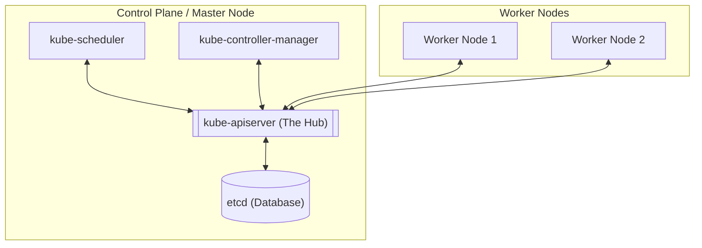
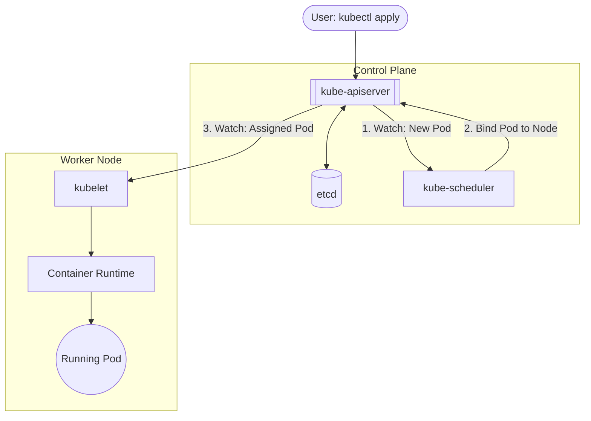

# Kubernetes Architecture – Core Concepts Explained

## 1. Introduction

Kubernetes (K8s) is a **container orchestration platform** used to manage:

* Application deployment
* Scaling
* Networking
* Self-healing and recovery

To use Kubernetes confidently in **DevOps and production**, you must understand **how its internal components work together**.

---

## 2. High-Level Kubernetes Architecture

Kubernetes follows a **Control Plane – Worker Node** architecture.

* **Control Plane** → Makes decisions
* **Worker Nodes** → Run applications

### High-Level Architecture (Mermaid)



---

## 3. Control Plane Components (The Brain)

### 3.1 kube-apiserver (Gateway)

**What it does:**

* Entry point for all cluster operations
* Handles requests from:

  * `kubectl`
  * CI/CD pipelines
  * UI / API clients

**Key facts:**

* Exposes REST APIs
* Validates and authenticates requests
* Reads/writes cluster state to `etcd`

Example:

```bash
kubectl get pods
```

➡ Request → API Server → etcd → Response

---

### 3.2 etcd (Cluster Database)

**What it does:**

* Distributed **key-value store**
* Stores the **entire cluster state**

**Stores:**

* Pods
* Deployments
* Services
* ConfigMaps
* Secrets
* Node data

**Production rule:**

> If `etcd` is lost → cluster is lost
> Always back it up

---

### 3.3 kube-scheduler (Placement Engine)

**What it does:**

* Decides **which node a Pod should run on**

**Scheduling decisions based on:**

* CPU & memory availability
* Node selectors
* Taints & tolerations
* Affinity rules

> Scheduler **does NOT run pods**
> It only assigns them

---

### 3.4 kube-controller-manager (State Enforcer)

**What it does:**

* Ensures **desired state = actual state**

Example:

* Desired replicas = 3
* One pod crashes
* Controller automatically creates a new pod

**Important controllers:**

* Deployment controller
* ReplicaSet controller : Take responsible for the pod self healing.
* Node controller : Check the Node Heart beat for every 5 sec wait for 40 sec to mark unreachable and wait for 5 minutes before taking any eviction action.

---

## 4. Worker Node Components (Execution Layer)

Worker nodes are where **your applications actually run**.

### 4.1 kubelet (Node Agent)

**What it does:**

* Runs on every worker node
* Communicates with API Server
* Ensures containers are running as defined

**Responsibilities:**

* Starts pods
* Restarts failed containers
* Reports node health

---

### 4.2 Container Runtime

**What it does:**

* Runs containers inside pods

**Common runtimes:**

* containerd
* CRI-O
* Docker (via containerd)

Minikube default:

```
containerd
```

---

### 4.3 kube-proxy (Networking Brain)

**What it does:**

* Handles **Service networking**
* Load-balances traffic to pods

**Implements:**

* ClusterIP
* NodePort
* iptables / IPVS rules

---

## 5. Pod – Smallest Deployable Unit

### What is a Pod?

A Pod is:

* One or more containers
* Shared network (same IP)
* Shared storage (volumes)

Example use case:

* App container
* Sidecar (logging, proxy)

---

## 6. Pod Creation Flow (Critical for Interviews)

### Pod Lifecycle Flow (Mermaid)



---

## 7. Kubernetes Objects (High-Level)

| Object     | Purpose            |
| ---------- | ------------------ |
| Pod        | Run containers     |
| Deployment | Manage replicas    |
| ReplicaSet | Maintain pod count |
| Service    | Expose application |
| ConfigMap  | Configuration      |
| Secret     | Sensitive data     |

---

## 8. Single-Node vs Multi-Node Cluster

### Minikube (Learning)

* Control Plane + Worker on same node
* Ideal for practice and demos

### Production Cluster

* Multiple control plane nodes
* Multiple worker nodes
* High availability (HA)

---

## 9. DevOps Perspective (Why This Matters)

Understanding architecture helps you:

* Debug pod failures
* Fix scheduling issues
* Optimize resources
* Design HA systems
* Explain Kubernetes confidently in interviews

---

## 10. Verification Commands (Hands-On)

```bash
kubectl get nodes
kubectl get pods -A
kubectl describe node <node-name>
kubectl get componentstatuses
```

---

## 11. Interview Gold Summary

* API Server is the gateway
* etcd stores cluster state
* Scheduler places pods
* Controllers maintain state
* kubelet runs workloads
* kube-proxy manages networking

---

## 12. Golden Rule (Memorize This)

> **Nothing happens in Kubernetes without the API Server**
