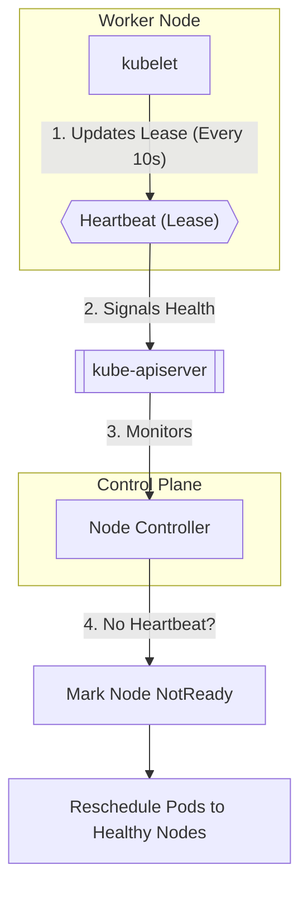

# How the Kubernetes Control Plane Communicates with Worker Nodes

## Purpose of This Document

This document explains **one specific concept only**:

> **How instructions and status flow between the Kubernetes control plane and worker nodes**

No object definitions, no YAML, no deployments — only **communication mechanics**.

---

## 1. Core Communication Principle

> **All communication between the control plane and worker nodes happens exclusively through the Kubernetes API Server**

There is **no direct communication** between:

* Scheduler → nodes
* Controllers → containers
* Control plane components → container runtime

Everything is **API-driven**.

---

## 2. Direction of Communication

Kubernetes communication is **bi-directional** but **asymmetric in responsibility**.

### Control Plane → Worker Nodes

* Defines **desired state**
* Describes *what should exist*
* Never directly starts or stops containers

### Worker Nodes → Control Plane

* Reports **actual state**
* Describes *what is currently running*
* Continuously sends status updates

---

## 3. Communication Model (Pull-Based)

Kubernetes uses a **pull-based communication model**, not push-based.

### Conceptual View



### Key Idea

> Worker nodes **pull instructions** by watching the API Server instead of the control plane pushing commands.

This design:

* Scales efficiently
* Works across NAT and firewalls
* Reduces security exposure
* Avoids tight coupling

---

## 4. Why There Is No Direct Push

The control plane:

* Does **not** open connections to nodes
* Does **not** execute commands remotely
* Does **not** depend on node reachability

Worker nodes are responsible for:

* Watching assigned workloads
* Acting on changes
* Reporting results

---

## 5. Step-by-Step Communication Flow (Pod Example)

### Logical Sequence

```
1. Desired state submitted
2. State stored centrally
3. Assignment decided
4. Node observes assignment
5. Node executes workload
6. Node reports status
```

### Explained Simply

1. A desired state is submitted to the cluster
2. The control plane stores it as truth
3. Scheduling decisions are made
4. A node **detects** that it has been assigned work
5. The node starts the workload locally
6. The node continuously reports status back

> The control plane **never directly contacts** a node to start work.

---

## 6. Continuous State Reconciliation

Communication in Kubernetes is **continuous**, not one-time.

```text
Desired State  ⇄  Actual State
```

* Control plane defines **what should exist**
* Worker nodes report **what actually exists**
* Kubernetes continuously compares both
* Differences are automatically corrected

This reconciliation loop enables:

* Self-healing
* Auto-restarts
* Rescheduling
* Fault tolerance

---

## 7. Network & Transport (High Level)

* Communication uses **HTTPS**
* Encrypted using **TLS**
* Fully authenticated and authorized
* Uses REST + long-running watch connections

Important security property:

> Worker nodes do **not** require inbound open ports from the control plane.

---

## 8. Failure Behavior (Communication-Focused)

### Worker Node Stops Communicating

* Node is marked unhealthy
* Workloads may be rescheduled
* Desired state remains unchanged

### Control Plane Becomes Unreachable

* No new changes can be applied
* Existing workloads continue running
* Cluster becomes effectively read-only

---

## 9. Why This Design Matters

This communication model enables:

* Massive horizontal scaling
* Secure clusters behind firewalls
* Loose coupling of components
* High resilience to partial failures

---

## 10. Key Takeaways

* All communication is **API-centric**
* Worker nodes **pull**, not receive pushes
* Desired vs actual state drives all behavior
* Continuous reconciliation maintains health
* Failures are detected via communication gaps

---

If you want next (recommended progression):

* Control plane internal communication
* kubelet deep-dive
* Watch vs poll mechanics
* Failure scenarios with timelines
* Interview Q&A based on this document

Just say the word.
