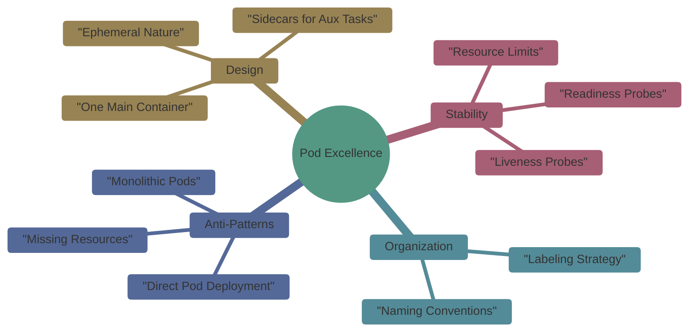

# Mastering Kubernetes Pods: Fundamentals & Best Practices

## 1. The Pod Philosophy

Pods are the **smallest atomic unit** in Kubernetes. To manage them effectively, we must move from simply "running a container" to "managing a production-grade workload."

### Core Mind Map



---

## 2. The Golden Manifest: Best Practices in Action

This single YAML incorporates all the best practices: **Labels, Resource Management, and Health Checks.**

```yaml
apiVersion: v1
kind: Pod
metadata:
  name: web-production-pod
  labels:
    app: web-server
    env: production
    tier: frontend
spec:
  containers:
  - name: nginx-container
    image: nginx:1.25-alpine
    ports:
    - containerPort: 80
    
    # Resource Management: Prevents Node Starvation
    resources:
      requests:
        cpu: "100m"     # Guaranteed 0.1 CPU
        memory: "128Mi" # Guaranteed 128MB RAM
      limits:
        cpu: "500m"     # Max 0.5 CPU
        memory: "512Mi" # Max 512MB RAM
    
    # Health Monitoring: Self-Healing & Traffic Control
    livenessProbe:      # Restarts if container hangs
      httpGet:
        path: /
        port: 80
      initialDelaySeconds: 15
      periodSeconds: 20
    readinessProbe:     # Only sends traffic if container is ready
      httpGet:
        path: /
        port: 80
      initialDelaySeconds: 5
      periodSeconds: 10
```

---

## 3. Comparative Analysis: Patterns vs. Anti-Patterns

| Category | Best Practice | Anti-Pattern | Result of Anti-Pattern |
| --- | --- | --- | --- |
| **Structure** | Single main container per Pod. | Multiple unrelated apps in one Pod. | Hard to scale and debug. |
| **Resources** | Defined Requests & Limits. | No resource boundaries set. | Node crashes (Out of Memory). |
| **Health** | Active Liveness/Readiness Probes. | Relying on "Process Running" status. | Service sends users to broken Pods. |
| **Config** | ConfigMaps and Secrets. | Hardcoded IPs and credentials. | Security risk; zero flexibility. |
| **Deployment** | Managed via **Deployments**. | Creating Pods directly (`kubectl run`). | No auto-healing if Pod dies. |

---

## 4. Hands-On Lab: Validating the Standards

### Task A: The "Search & Rescue" (Labels)

Apply your Pod and use selectors to find it. This mimics how a Service finds its targets.

```bash
# Apply the Golden Manifest
kubectl apply -f production-pod.yaml

# Search using specific labels
kubectl get pods -l app=web-server,env=production

```

### Task B: Deep Inspection (Probes & Resources)

Verify that your boundaries and health checks are active.

```bash
# Look for the 'Resources' and 'Conditions' sections
kubectl describe pod web-production-pod

```

### Task C: The Stress Test (Anti-Pattern Simulation)

1. **The Crash Test:** Intentionally break your app path.
2. **Observation:** Watch the `RESTARTS` column in `kubectl get pods`.
3. **The Lesson:** Without a **Liveness Probe**, the Pod would stay "Running" but useless. With the probe, Kubernetes automatically restarts it.

---

## 5. Summary Checklist

* [ ] **Is it focused?**    One main app per pod.
* [ ] **Is it identified?** At least 3 labels (`app`, `env`, `tier`).
* [ ] **Is it bounded?**    CPU/Memory requests and limits set.
* [ ] **Is it observable?** Probes configured for health.
* [ ] **Is it managed?**    Intended for a Deployment, not a standalone Pod.
