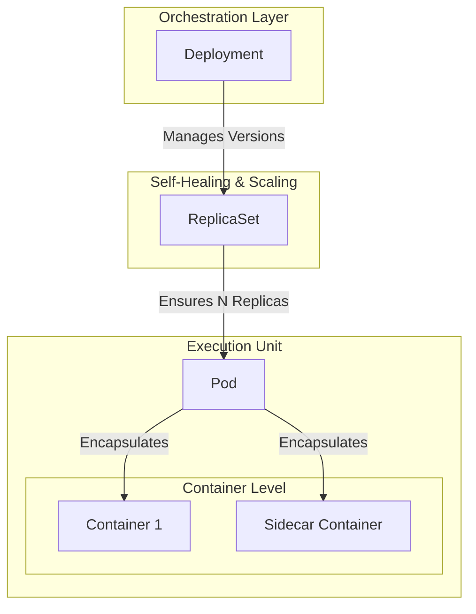
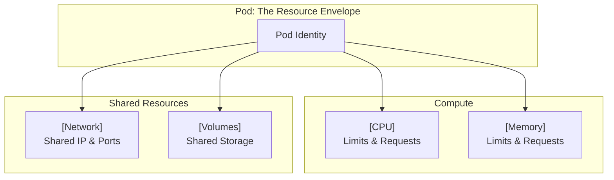
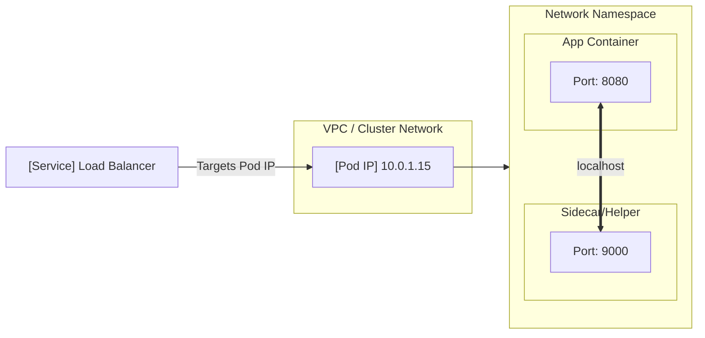
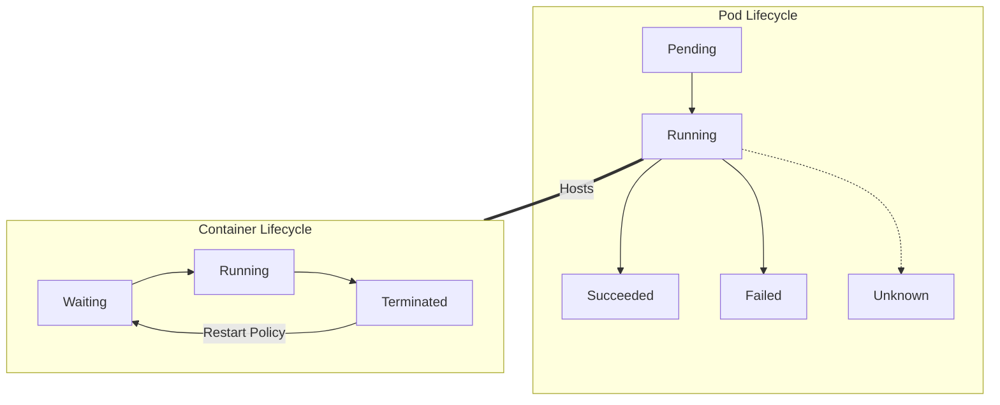
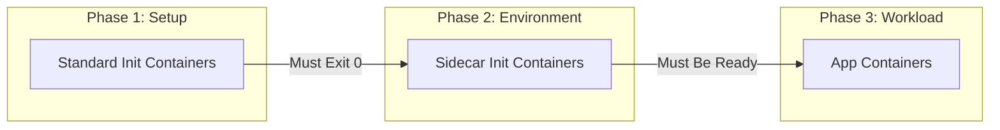
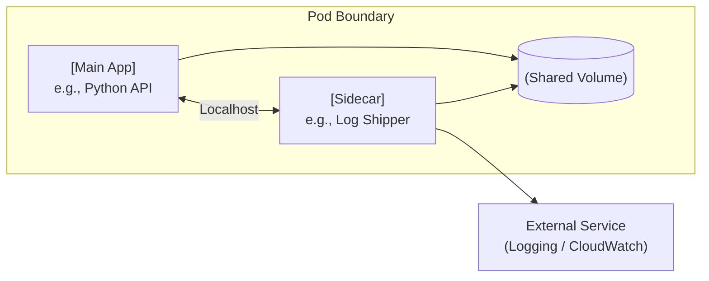
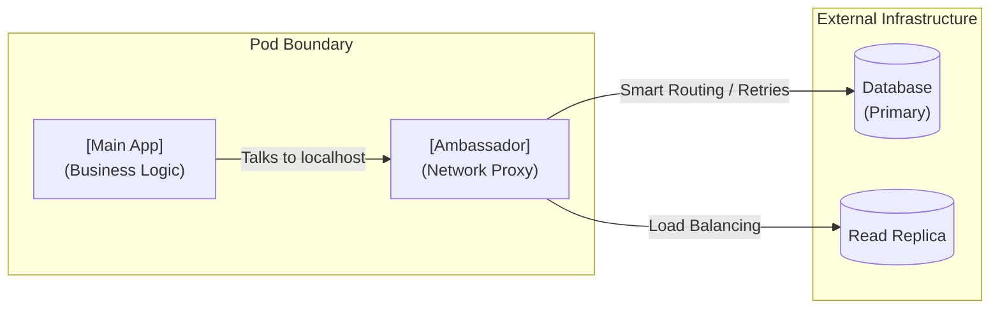
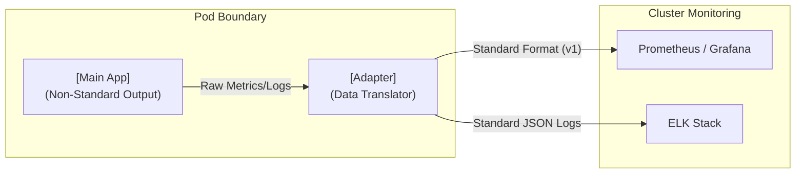

# Kubernetes Pods Basics

## 1. What Is a Pod

A **Pod** is the **smallest deployable unit in Kubernetes**.

Kubernetes **never runs containers directly**. It schedules, manages, and replaces **Pods**, and Pods contain containers.

A Pod represents **one unit of work**.

---

## 2. Simple Mental Model



Kubernetes reasons about **Pods**, not containers.

---
## 3. Core Characteristics of a Pod

* One Pod = one workload identity
* One Pod can run:

  * One container (default and recommended)
  * Multiple containers (tightly coupled only)
* Pods are **ephemeral**
* Pod recreation always means **new IP, new UID**

---

## 4. Pod vs Container

### Container

* Runtime execution unit
* Runs a single process
* Managed by Docker or containerd
* Kubernetes-unaware

### Pod

* Kubernetes scheduling unit
* Wraps one or more containers
* Provides shared network and storage
* Has a single lifecycle

### Comparison

| Aspect  | Container     | Pod                |
| ------- | ------------- | ------------------ |
| Scope   | Runtime       | Kubernetes         |
| Network | Per container | Shared Pod IP      |
| Storage | Isolated      | Shared volumes     |
| Scaling | Manual        | Controller-managed |

Rule:

> You scale Pods. You debug Pods. You replace Pods.

---

## 5. Pod Attributes 

* **CPU**: Requested and limited per container, enforced at Pod level
* **Memory**: Shared pressure domain, OOM affects the Pod
* **Network**: Single IP, shared localhost
* **Volumes**: Shared filesystem across containers

<br>


---

## 6. Pod Networking Model

* One Pod = one IP
* Containers communicate via `localhost`
* Port conflicts must be avoided
* Service targets Pods, not containers


---
## 7. Pod Lifecycle

In Kubernetes, there is a distinction between the status of the **Pod** (the host) and the status of the **Containers** (the processes) running inside it.

---

### Pod Lifecycle (Phases)

* **Pending:** The Pod is accepted by the cluster, but the image is still pulling or the Pod is waiting to be scheduled to a Node.
* **Running:** The Pod is bound to a Node, and at least one container is still running or starting.
* **Succeeded:** All containers in the Pod have finished their job successfully (Exit Code 0) and will not restart.
* **Failed:** All containers have terminated, and at least one container failed (Non-zero Exit Code).
* **Unknown:** The state cannot be determined (usually due to a network error between the Master and the Node).

---

### Container Lifecycle (States)

1. **Waiting:** The container is not running yet (e.g., pulling the image or waiting for a "PostStart" hook).
2. **Running:** The container is executing without issues.
3. **Terminated:** The container has stopped running, either because it finished its task or because it crashed.
*

---


---
## 8. Types of Containers in a Pod

### 1. Init Containers

* Run **before** app containers
* Execute sequentially
* Must complete successfully

> **Use cases** : DB migrations , Config generation, Permission setup

### 2. App Containers

* Main workload
* Long-running
* Business logic

### 3. Helper Containers (Sidecars)

* Support app container
* Same lifecycle as app
* Examples: logging, proxy, metrics

### Startup Order



---

## 9. Single-Container Pods

### Definition

One Pod running exactly one container.

> **When to Use** : Microservices, APIs, Batch workers, CronJobs

### Benefits

* Lowest complexity
* Clean scaling
* Clear ownership

### Example

```yaml
apiVersion: v1
kind: Pod
metadata:
  name: nginx-single-pod
spec:
  containers:
  - name: nginx
    image: nginx:latest
    ports:
    - containerPort: 80
```

---

## 10. Multi-Container Pods

### Definition

One Pod running multiple containers with shared lifecycle.

### Constraints

* Must start together
* Must stop together
* Must share data or network

---

## 11. Multi-Container Pod Patterns

1. Sidecar Pattern
2. Ambassador Pattern
3. Adapter Pattern

### 1. Sidecar Pattern

* App + helper
* Logging, monitoring, syncing



### 2. Ambassador Pattern

* App delegates networking
* Service mesh, API proxy


### Adapter Pattern

* Data transformation
* Metrics normalization



---

## 12. Multi-Container Pod Example

```yaml
apiVersion: v1
kind: Pod
metadata:
  name: sidecar-pod
spec:
  volumes:
  - name: shared-logs
    emptyDir: {}
  containers:
  - name: main-app
    image: alpine
    command: ["/bin/sh","-c"]
    args: ["while true; do date >> /var/log/app.log; sleep 5; done"]
    volumeMounts:
    - name: shared-logs
      mountPath: /var/log
  - name: log-sidecar
    image: busybox
    command: ["/bin/sh","-c"]
    args: ["tail -f /var/log/app.log"]
    volumeMounts:
    - name: shared-logs
      mountPath: /var/log
```

---

## 13. Single vs Multi-Container Pods

| Aspect         | Single         | Multi               |
| -------------- | -------------- | ------------------- |
| Complexity     | Low            | Medium              |
| Default choice | Yes            | No                  |
| Debugging      | Simple         | Harder              |
| Use case       | Most workloads | Tight coupling only |

---

## 14. Core Pod Commands

```bash
kubectl get pods
kubectl describe pod <pod-name>
kubectl get pods -o wide
kubectl delete pod <pod-name>
```

---

## 15. Why Pods Matter

* All controllers create Pods
* Networking attaches to Pods
* Storage mounts to Pods
* Failures manifest at Pod level
