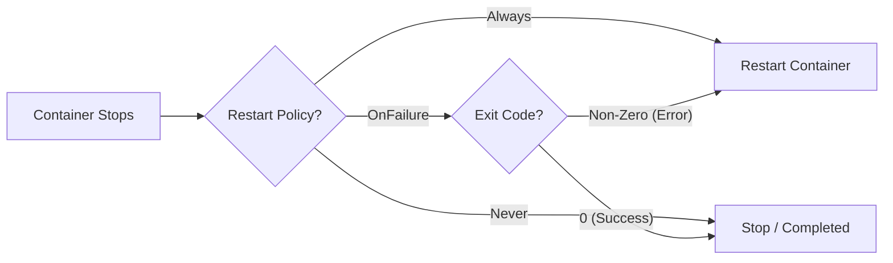
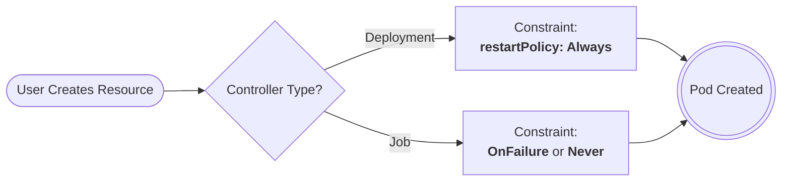

# Kubernetes Pod Restart Policy

---

# 1. Core Concept

`restartPolicy` defines **what kubelet does when a container stops**.

It is defined at the **Pod level**:

```yaml
spec:
  restartPolicy: <value>
```

It applies to **all containers inside that Pod**.

Exit code drives behavior:

* `0` → Success
* Non-zero → Failure

---

# 2. The Three Restart Policies

| Policy    | Behavior                      | When to Use           |
| --------- | ----------------------------- | --------------------- |
| Always    | Restart no matter what        | Long-running services |
| OnFailure | Restart only on non-zero exit | Batch jobs            |
| Never     | Do not restart                | One-time execution    |

---

# 3. How Kubernetes Decides



Decision is local to the **kubelet on that node**.

---

# 4. Default Behavior

If not specified:

```
restartPolicy = Always
```

This matches long-running service behavior.

---

# 5. Real YAML Examples

## 5.1 Always (Default)

```yaml
apiVersion: v1
kind: Pod
metadata:
  name: web-app
spec:
  containers:
  - name: nginx
    image: nginx
  restartPolicy: Always
```

Used for APIs, web servers, background services.

---

## 5.2 OnFailure

```yaml
apiVersion: v1
kind: Pod
metadata:
  name: batch-task
spec:
  containers:
  - name: job
    image: busybox
    command: ["sh","-c","exit 1"]
  restartPolicy: OnFailure
```

Restarts only when exit code ≠ 0.

---

## 5.3 Never

```yaml
apiVersion: v1
kind: Pod
metadata:
  name: one-time-script
spec:
  containers:
  - name: script
    image: busybox
    command: ["sh","-c","echo done"]
  restartPolicy: Never
```

Container runs once and stops permanently.

---

# 6. Backoff Mechanism

If a container keeps crashing:

Kubernetes uses **exponential backoff**:

```
10s → 20s → 40s → 80s ...
```

This prevents CPU overload from rapid restart loops.

CrashLoopBackOff means:

* Container failed
* Restart attempted
* Backoff delay active

---

# 7. Controller Constraints

Restart policy behavior changes under controllers.

| Controller | Allowed restartPolicy    |
| ---------- | ------------------------ |
| Pod        | Always, OnFailure, Never |
| Deployment | Always only              |
| Job        | OnFailure, Never         |
| CronJob    | OnFailure, Never         |

Reason:

* Deployments manage long-running workloads.
* Jobs manage finite workloads.

---

# 8. Controller Interaction Diagram



Deployments override to Always.

---

# 9. Practical Observation

## Success Case

```bash
kubectl run success --image=busybox --restart=Never -- sh -c "exit 0"
kubectl get pods
```

Status: `Completed`
No restart.

---

## Failure Case

```bash
kubectl run fail --image=busybox --restart=OnFailure -- sh -c "exit 1"
kubectl get pods
```

RESTARTS column increases.

---

# 10. Troubleshooting

Check state:

```bash
kubectl describe pod <name>
```

Check previous crash logs:

```bash
kubectl logs <name> --previous
```

Inspect container state fields:

* Last State
* Exit Code
* Restart Count

---

# 11. Operational Understanding

RestartPolicy controls **container lifecycle**, not Pod recreation.

If the Pod itself is deleted:

* Deployment recreates it.
* Job recreates it depending on completion logic.

Container restarts ≠ Pod rescheduling.

---

# 12. Mental Model

* Scheduler places Pods.
* Kubelet manages containers.
* RestartPolicy is enforced by kubelet.
* Controllers manage Pod objects.

Clear separation:

```
Scheduler → Placement
Kubelet → Restart logic
Controller → Pod lifecycle
```

That is the full control chain governing container restarts.
