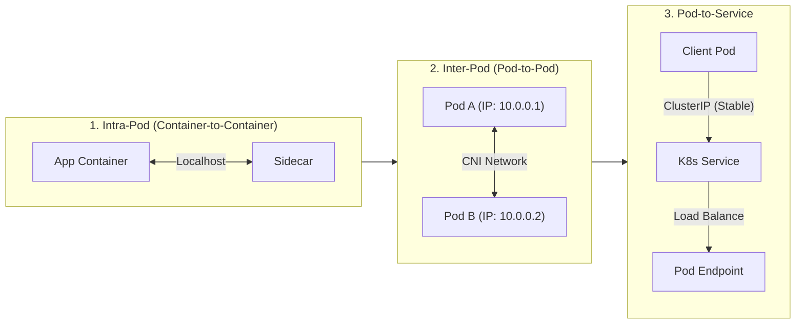
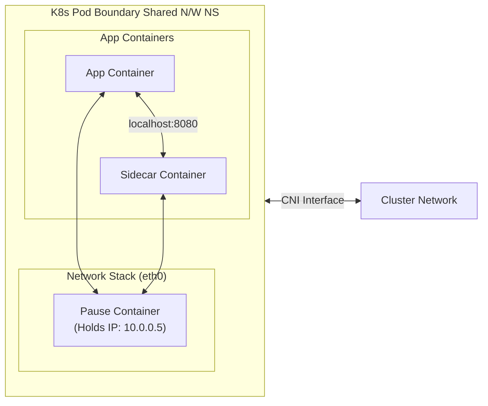
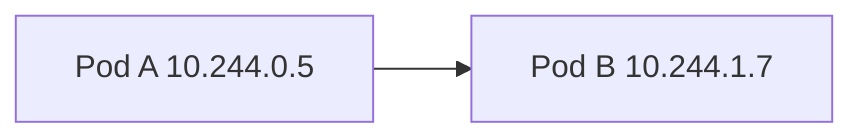
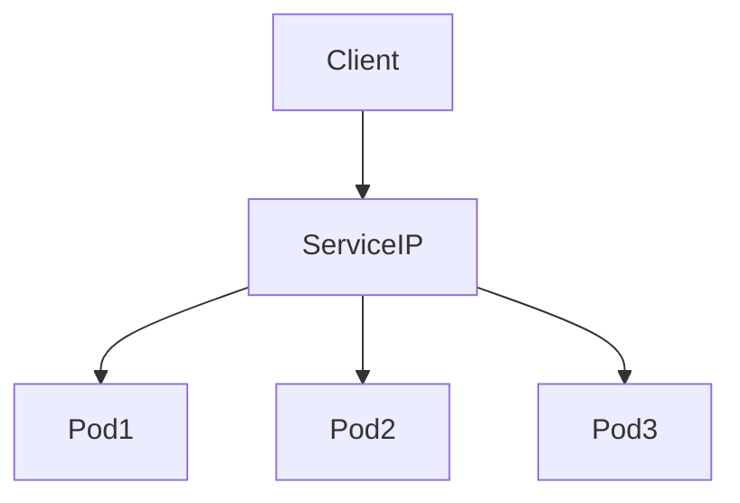
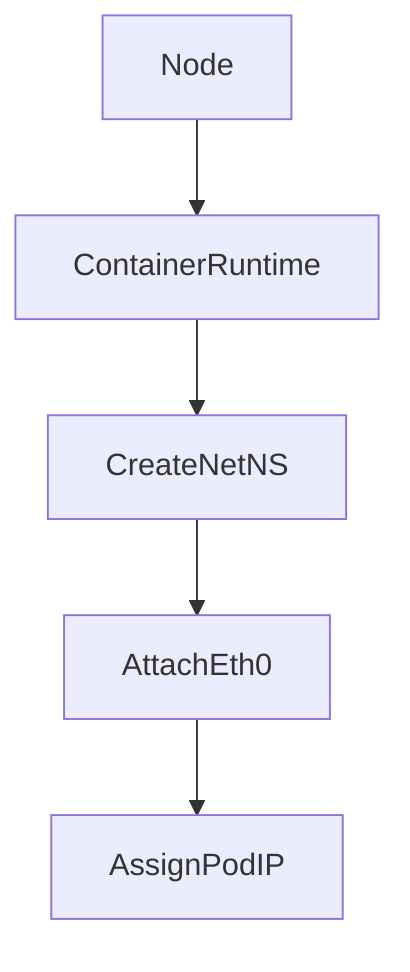
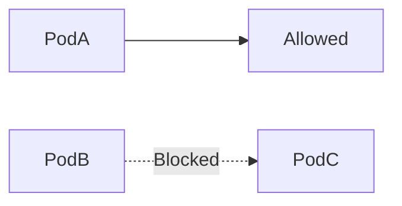

# Kubernetes Pod Networking

# 1. Kubernetes Network Model

Kubernetes follows one strict rule:

**Every Pod gets its own IP address.**

This enables:

* Direct Pod-to-Pod communication
* No NAT between Pods
* Flat cluster network

Core requirement:

1. Every Pod can reach every other Pod.
2. Communication works across nodes.
3. No IP translation between Pods.

---

# 2. Network Layers in Kubernetes

There are three communication layers.



---

# 3. Intra-Pod Networking

All containers in a Pod share:

* Same IP
* Same port space
* Same network namespace

They behave like processes on the same machine.

Example:

Container A running on port 8080
Container B calls:

```
curl http://localhost:8080
```

Why this works:



All containers attach to the same network namespace.

Constraint:

Two containers cannot bind to the same port inside one Pod.

---

# 4. Inter-Pod Networking (Pod to Pod)

Each Pod has a unique IP from the cluster CIDR.

Pods communicate directly using IP.



No NAT. No port mapping.

If Pod A connects to Pod B on port 80, it uses:

```
http://10.244.1.7:80
```

Works across nodes because the CNI configures routing.

---

# 5. Pod IP Is Ephemeral

Pod IPs are temporary.

They change when:

* Pod restarts
* Pod is rescheduled
* Deployment scales
* Node fails

Never hardcode Pod IPs.

Instead use Services.

---

# 6. Pod to Service Networking

A Service provides:

* Stable virtual IP
* Stable DNS name
* Load balancing across Pods



Service selects Pods using labels.

Example:

```
http://my-service.default.svc.cluster.local
```

This abstracts away changing Pod IPs.

---

# 7. How Networking Actually Works (CNI)

Kubernetes delegates networking to CNI plugins.

CNI responsibilities:

* Assign Pod IP
* Configure veth pair
* Setup routing
* Enable cross-node traffic

Common CNIs:

* Flannel → simple overlay
* Calico → routing + network policy
* Cilium → eBPF-based dataplane

Network plugin defines how packets move between nodes.

---

# 8. Inside a Pod Network Stack

When a Pod is created:



You will see:

* `lo` (loopback)
* `eth0` (Pod interface)

Check with:

```
kubectl exec -it <pod> -- ip addr
```

---

# 9. Practical Lab Flow

Create Pod:

```
kubectl run nginx --image=nginx
kubectl get pod nginx -o wide
```

Observe:

* Pod IP
* Node name

Test from another Pod:

```
kubectl run tester --image=busybox -it --rm -- sh
```

Inside tester:

```
ping <pod-ip>
wget -qO- <pod-ip>
```

Demonstrates flat networking.

---

# 10. Network Policies (Production Reality)

By default:

All Pods can talk to all Pods.

When NetworkPolicies are applied:

Traffic becomes restricted.



Calico or Cilium enforce policies.

Without policy → open network
With policy → explicit allow rules required

---

# 11. Common Failure Scenarios

Port Conflict
Two containers in one Pod use port 80 → one fails.

Hardcoded Pod IP
Pod restarts → new IP → connection breaks.

Missing Network Policy rule
Traffic silently dropped.

CNI misconfiguration
Cross-node routing fails.

---

# 12. Mental Model

* Pod = one IP
* Containers share that IP
* Pods talk directly
* Services give stable access
* CNI makes routing possible

Hierarchy:

```
Container → Pod → Service → Cluster Network
```

This structure enables scalable, flat, routable networking inside Kubernetes.

---
