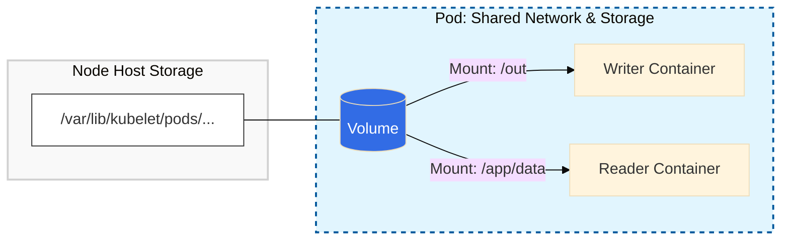

#  Kubernetes Storage Fundamentals: Pod Volumes

## 1. The Problem: Ephemeral Nature of Containers

By default, Kubernetes containers are **stateless**. If a process crashes or a container is restarted, the internal writable layer is wiped clean.

* **Container Restart:** Data is lost.
* **Pod Deletion:** Data is lost.
* **The Fix:** **Volumes**. They decouple storage from the container lifecycle, ensuring data survives container crashes.


## 2. Architecture & Visual Flow

A Volume acts as a bridge between the host storage and the Pod.




## 3. Storage Lifecycle Matrix

Understanding when data disappears is critical for choosing the right volume type.

Think of an `emptyDir` as a temporary locker in a gym (it's yours only while you are there), whereas a `PersistentVolume` is like a safety deposit box at a bank (it stays there even if you leave).

| Event | Container Writable Layer | Kubernetes Volume (`emptyDir`) | PersistentVolume (PV) |
| --- | --- | --- | --- |
| **Process Crash** | ✅ Kept | ✅ Kept | ✅ Kept |
| **Container Restart** | ❌ **Lost** | ✅ Kept | ✅ Kept |
| **Pod Deletion** | ❌ **Lost** | ❌ **Lost** | ✅ Kept |
| **Node Failure** | ❌ **Lost** | ❌ **Lost** | ✅ Kept |

---

## 4. Common Local Volume Types

### 4.1 `emptyDir` (The Scratchpad)

* **Lifecycle:** Tied strictly to the Pod. If the Pod is deleted, the data is gone.
* **Usage:** Created when a Pod is assigned to a node.
* **Best For:** Temporary caches, data processing buffers, or "Sidecar" patterns.

### 4.2 `hostPath` (The Node Link)

* **Lifecycle:** Mounts a file/directory from the **Host Node's** physical disk.
* **Risk:** If the Pod moves to a different node, it loses access to the data on the previous node.
* **Best For:** System-level agents (Logging, Monitoring) that need to read host-level files like `/var/log`.


## 5. Implementation: Multi-Container Data Sharing

In this scenario, we use one volume to connect two different containers.

```yaml
apiVersion: v1
kind: Pod
metadata:
  name: shared-volume-demo
spec:
  # 1. Define the Volume "Blueprint"
  volumes:
  - name: shared-storage
    emptyDir: {}

  containers:
  # 2. Container A: The Producer
  - name: writer-container
    image: alpine
    command: ["sh", "-c", "echo 'Hello from Writer' > /out/data.txt; sleep 3600"]
    volumeMounts:
    - name: shared-storage
      mountPath: /out

  # 3. Container B: The Consumer
  - name: reader-container
    image: alpine
    command: ["sh", "-c", "sleep 5; cat /app/data/data.txt; sleep 3600"]
    volumeMounts:
    - name: shared-storage
      mountPath: /app/data

```

---

## 6. Verification Lab

| Step | Action | Command |
| --- | --- | --- |
| **1** | Deploy the Pod | `kubectl apply -f pod.yaml` |
| **2** | Confirm Reader saw the data | `kubectl logs shared-volume-demo -c reader-container` |
| **3** | Manually inspect the volume | `kubectl exec -it shared-volume-demo -c writer-container -- ls /out` |

---

## 7. Key Takeaways & "Gotchas"

* **Volume Definition vs. Mounting:**
* `spec.volumes`: Defines **what** the storage is (e.g., emptyDir, hostPath).
* `spec.containers.volumeMounts`: Defines **where** it appears inside the container.


* **Permissions:** If you mount a volume as `readOnly: true` in one container, it can still be `readOnly: false` in another.
* **No Persistence:** Remember, `emptyDir` and `hostPath` are **not** for databases. They do not survive Pod deletion or Node migration.
