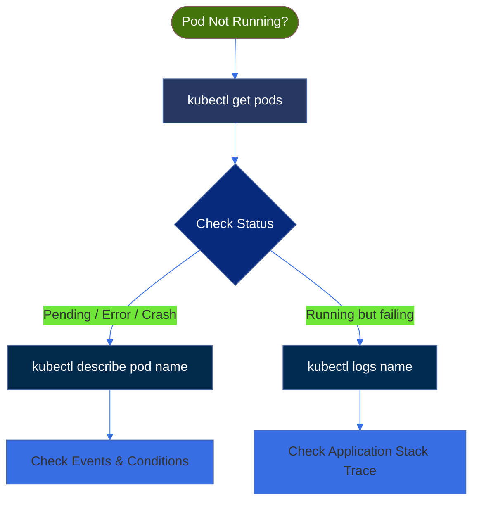

# Pod Creation and Management

## 1. Purpose of This Section

This section focuses on **how to work with Pods practically**:

* Create Pods
* View Pods
* Inspect Pods
* Access Pods
* Delete Pods

This is the **first real hands-on interaction** with Kubernetes.


## 2. Creating a Pod

### 2.1 Create a Pod Using YAML (Recommended)

Example `pod.yaml`:

```yaml
apiVersion: v1
kind: Pod
metadata:
  name: demo-pod
  labels:
    app: demo
spec:
  containers:
  - name: nginx
    image: nginx
    ports:
    - containerPort: 80
```

Create the Pod:

```bash
kubectl apply -f pod.yaml
```

### 2.2 Create a Pod Using Command Line (Quick Test)

```bash
kubectl run test-pod --image=nginx --restart=Never
```

> Not recommended for production — YAML is preferred.


## 3. Viewing Pods

### List Pods

```bash
kubectl get pods
```

### List Pods with More Details

```bash
kubectl get pods -o wide
```


## 4. Inspecting a Pod

### Describe Pod (Very Important)

```bash
kubectl describe pod demo-pod
```

Shows:

* Events
* Node assignment
* Container status
* Errors (if any)


### View Pod YAML (Live State)

```bash
kubectl get pod demo-pod -o yaml
```

## 5. Accessing a Pod

### View Container Logs

```bash
kubectl logs demo-pod
```

For multi-container Pod:

```bash
kubectl logs demo-pod -c nginx
```


### Exec Into a Running Pod

```bash
kubectl exec -it demo-pod -- /bin/sh
```

Use cases:

* Debugging
* Checking files
* Testing connectivity


## 6. Updating a Pod

 **Pods are immutable**

You **cannot** update:

* Image
* Ports
* Commands

To change:

```bash
kubectl delete pod demo-pod
kubectl apply -f pod.yaml
```


## 7. Deleting a Pod

### Delete a Specific Pod

```bash
kubectl delete pod demo-pod
```

### Force Delete (If Stuck)

```bash
kubectl delete pod demo-pod --force --grace-period=0
```


## 8. Common Pod Statuses You’ll See

| Status           | Meaning               |
| ---------------- | --------------------- |
| Pending          | Pod not scheduled     |
| Running          | Pod running           |
| Completed        | Finished successfully |
| CrashLoopBackOff | App crashing          |
| ImagePullBackOff | Image issue           |


## 9. Basic Troubleshooting Flow



This flow solves **80% of pod issues**.


## 10. Best Practices (Early Stage)

* Always use YAML
* Add labels from day one
* Use `kubectl describe` first when debugging
* Delete & recreate Pods for changes
* Use Deployments for real apps


## 11. Key Takeaways

 * Pods are created declaratively
 * YAML is the standard way
 * Pods are temporary and immutable
 * Logs and describe are your best friends
 * This is the foundation for all workloads
