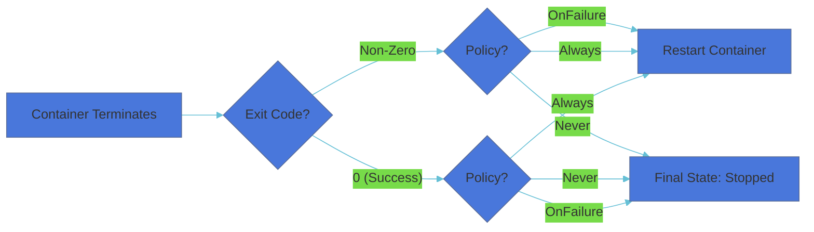

# Pod Restart Policy

## 1. What is Pod Restart Policy?

The Pod Restart Policy defines the lifecycle management of containers within a Pod. It determines the action Kubernetes takes when a container process terminates, whether due to a successful completion or an unexpected crash.

> **Key Rule:** The policy is defined at the **Pod level** (`spec.restartPolicy`), meaning it applies to all containers within that specific Pod.

## 2. Restart Policy Options

Kubernetes provides three specific policies to handle container exits:

| Policy | Description | Typical Use Case |
| :--- | :--- | :--- |
| `Always` | Restarts the container regardless of the exit code. | Web Servers, APIs (Nginx, Node.js) |
| `OnFailure` | Restarts only if the container exits with a non-zero exit code. | Database Migrations, Batch Jobs |
| `Never` | Does not restart the container under any circumstances. | One-off scripts, Logs collection |


## 3. Visual Workflow

The following diagram illustrates how the Kubelet decides whether to recreate a container based on its exit status:



## 4. Default Behavior and Implementation

By default, if no policy is specified, Kubernetes assumes **Always**.

### YAML Implementation

```yaml
apiVersion: v1
kind: Pod
metadata:
  name: monitor-app
spec:
  containers:
  - name: app
    image: nginx
  restartPolicy: OnFailure # Defined at the Pod level
```


## 5. Critical Technical Constraints

### Deployment vs. Pod Policy

A common point of confusion is how high-level controllers handle these policies:

* **Deployments/ReplicaSets:** These controllers expect applications to be "Always" running. Therefore, they **only support a restartPolicy of `Always**`.
* **Jobs/CronJobs:** These controllers are designed for tasks that complete. They **only support `OnFailure` or `Never**`.

| Controller | Allowed Policies |
| --- | --- |
| **Pod** | Always, OnFailure, Never |
| **Deployment** | Always (Only) |
| **Job** | OnFailure, Never |


## 6. Hands-On: Observe Restart Behavior

### Task 1: Success Completion (Never)

Create a Pod that finishes its task successfully and check its status.

```bash
# Create a pod that sleeps for 5 seconds then exits with code 0
kubectl run success-test --image=busybox --restart=Never -- sh -c "sleep 5; exit 0"

# Monitor the status
kubectl get pods success-test -w

```

**Observation:** The status will change from `Running` to `Completed`. It will NOT restart.

### Task 2: Failure Detection (OnFailure)

Create a Pod that crashes and see Kubernetes intervene.

```bash
# Create a pod that exits with an error (code 1)
kubectl run failure-test --image=busybox --restart=OnFailure -- sh -c "sleep 5; exit 1"

# Monitor the status
kubectl get pods failure-test
```

**Observation:** You will see the `RESTARTS` column increment. Kubernetes uses an **exponential back-off delay** (10s, 20s, 40s...) to prevent crashing containers from overloading the node.

## 7. Troubleshooting Commands

To inspect why a container restarted, use the following:

```bash
# Check the Restart Policy and current status
kubectl describe pod <pod-name>

# View logs from the previous (crashed) instance of the container
kubectl logs <pod-name> --previous

```

## 8. Summary Checklist

* The default policy is Always.
* Exit Code 0 means success; Non-zero means failure.
* Deployments require Always; Jobs require OnFailure/Never.
* RestartPolicy applies to all containers in the Pod.
