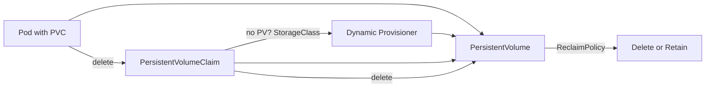

# Advanced Minikube Pod Lab

**Executive Summary:** This report provides a comprehensive guide to Kubernetes Pods on Minikube, covering Pod specifications, volume/persistent storage, and networking. Section (1) details **Pod attributes** (metadata, containers, initContainers, lifecycle hooks, probes, resources, environment variables, securityContext, scheduling fields, restartPolicy, image pulls, ephemeral containers, topology spread, DNS policy, etc.), with explanations, YAML examples, `kubectl` commands for creation, inspection, and cleanup. Section (2) covers **Volumes and PVCs**: core volume types (emptyDir, hostPath, ConfigMap, Secret, projected), PersistentVolumes (PV) with Minikube’s hostPath, StorageClasses, dynamic provisioning, PVC lifecycle, access modes (ReadWriteOnce/Many, ReadOnlyMany), volumeMode, reclaimPolicy, examples of RWO/RWX, subPath, CSI ephemeral volumes and snapshots. We show YAMLs, `kubectl` create/bind commands, test data persistence (including a StatefulSet example), and cleanup. Section (3) covers **Pod networking**: communication *within* a Pod (multi-container localhost), *between* Pods (same node via ClusterIP/Service, cross-node hypothetically), and service networking (ClusterIP, NodePort, LoadBalancer via `minikube tunnel`, headless service). We include DNS, NetworkPolicy (allow/deny) examples, port-forward, and Ingress (with Minikube’s ingress addon). For each demo we give YAMLs, step-by-step `kubectl` commands, tests (`curl`, `nslookup`, `netcat`), and logs/describe outputs. Troubleshooting notes and expected outcomes are provided. Tables compare key settings (volume types, access modes, restartPolicy, probe types). Mermaid diagrams illustrate the Pod lifecycle, volume/PVC binding, and networking flows. Sources include Kubernetes official docs and Minikube documentation.

## 1. Pod Specification (PodSpec) and Attributes 

A **Pod** is the smallest deployable unit in Kubernetes – a logical host for one or more containers【55†L1250-L1258】. All containers in a Pod share the same network namespace (IP address and ports) and can communicate via `localhost`【55†L1250-L1258】. Pods have metadata (name, namespace, labels/annotations) and a `spec` defining containers, initContainers, volumes, and other settings. The Pod spec supports many fields:

- **Metadata:** `metadata.name` gives the Pod a unique DNS-compatible name (e.g. `my-pod`【1†L1032-L1035】). `metadata.namespace` (default “default”) and `metadata.labels`/`metadata.annotations` are key-value tags. Labels allow selection (e.g. by Services or Deployments). Example:
  ```yaml
  apiVersion: v1
  kind: Pod
  metadata:
    name: pod-demo
    labels:
      app: demo
    annotations:
      purpose: test
  spec:
    containers:
      - name: c1
        image: busybox
        command: ["sh","-c","sleep 600"]
  ```
  Create and inspect:
  ```bash
  kubectl apply -f pod-demo.yaml
  kubectl get pod pod-demo --show-labels
  kubectl describe pod pod-demo
  ```
  Clean up: `kubectl delete pod pod-demo`.

- **Containers:** `spec.containers` is an array of container definitions. Each container needs a `name` and `image`. You can mount volumes (`volumeMounts`), set resource requests/limits, probes, env, securityContext, etc. Example:
  ```yaml
  spec:
    containers:
    - name: web
      image: nginx:1.21
      ports:
        - containerPort: 80
      resources:
        requests: {cpu: "100m", memory: "128Mi"}
        limits:   {cpu: "500m", memory: "256Mi"}
      env:
        - name: MY_ENV
          value: "hello"
  ```
  This creates an Nginx container with resource constraints and an environment variable. Inspect resources: `kubectl describe pod pod-demo` shows them.

- **InitContainers:** `spec.initContainers` runs containers sequentially *before* the main containers. They allow setup tasks (e.g. pulling configuration, waiting on services). Example:
  ```yaml
  spec:
    initContainers:
    - name: init-myservice
      image: busybox
      command: ["sh", "-c", "echo Init; sleep 2"]
    containers:
    - name: main
      image: busybox
      command: ["sh","-c","echo Main; sleep 3600"]
  ```
  Apply: `kubectl apply -f init-pod.yaml`. The Pod’s status shows initContainers completing before app containers start. Cleanup: delete the Pod.

- **Lifecycle Hooks:** The `lifecycle` field in a container allows `postStart` and `preStop` hooks (commands executed on start or before termination). Example:
  ```yaml
  spec:
    containers:
    - name: life
      image: busybox
      command: ["sh","-c","sleep 3600"]
      lifecycle:
        postStart:
          exec: { command: ["sh","-c","echo Pod started > /tmp/start.txt"] }
        preStop:
          exec: { command: ["sh","-c","echo Pod stopping > /tmp/stop.txt"] }
      volumeMounts:
        - name: tmpvol
          mountPath: /tmp
    volumes:
    - name: tmpvol
      emptyDir: {}
  ```
  The `postStart` writes to a file after the container starts, and `preStop` before it stops. After applying, `kubectl logs pod-demo` or `kubectl exec -it pod-demo -- cat /tmp/start.txt` shows the effect. Cleanup: delete Pod (the data in the emptyDir is ephemeral).

- **Probes (Liveness/Readiness/Startup):** Probes check container health. Kubernetes supports three probe types【45†L1830-L1840】【45†L1846-L1851】.  
  - `livenessProbe`: if it fails, the kubelet kills and restarts the container【45†L1834-L1839】.  
  - `readinessProbe`: if it fails, the Pod is removed from Service endpoints (it stops receiving traffic)【45†L1840-L1845】.  
  - `startupProbe`: used for slow-startup apps; other probes are disabled until it succeeds【45†L1846-L1851】.  
  Probe handlers can be `exec`, `httpGet`, or `tcpSocket`. Example YAML with HTTP and TCP probes:
  ```yaml
  spec:
    containers:
    - name: probe-demo
      image: registry.k8s.io/e2e-test-images/agnhost:2.40
      args: ["netexec","--http-port=8080"]
      livenessProbe:
        httpGet:
          path: /healthz
          port: 8080
        initialDelaySeconds: 3
        periodSeconds: 5
      readinessProbe:
        tcpSocket:
          port: 8080
        initialDelaySeconds: 2
        periodSeconds: 5
  ```
  Apply: `kubectl apply -f probe-pod.yaml`. Then monitor events: `kubectl describe pod probe-demo`. Failed liveness will restart the container; readiness failure will not restart but will exclude the Pod from Services. Clean up with `kubectl delete pod probe-demo`.

  **Probe Comparison Table:**

  | Probe Type     | Purpose                                     | Failure Action                                |
  | -------------- | ------------------------------------------- | --------------------------------------------- |
  | livenessProbe  | Checks if container is running/healthy.     | Failure kills container; restartPolicy applies【45†L1834-L1839】. |
  | readinessProbe | Checks if container is ready to serve.      | Failure removes Pod IP from Service endpoints【45†L1840-L1845】 (no restart). |
  | startupProbe   | Checks if container startup is complete.    | Disables other probes until success; failure kills container (like liveness)【45†L1846-L1851】. |

- **Resources (requests/limits):** Containers can specify `resources.requests` and `resources.limits` for CPU/memory. Requests influence scheduling; limits are enforced (CPU throttling, OOM kill)【55†L1301-L1310】. Example:
  ```yaml
  spec:
    containers:
    - name: busy
      image: busybox
      resources:
        requests: 
          cpu: "250m"
          memory: "64Mi"
        limits:
          cpu: "500m"
          memory: "128Mi"
      command: ["sh","-c","sleep 3600"]
  ```
  Inspect with `kubectl describe pod`. The scheduler uses the requests for placement; Kubernetes enforces limits at runtime.

- **Environment Variables:** Use `env` or `envFrom` to inject variables. Examples:
  ```yaml
  spec:
    containers:
    - name: env-demo
      image: busybox
      command: ["sh","-c","echo USER=$USER && echo NODE_NAME=$NODE_NAME && sleep 5"]
      env:
        - name: USER
          value: "minikube"
        - name: NODE_NAME
          valueFrom:
            fieldRef:
              fieldPath: spec.nodeName
  ```
  Kubernetes also supports `envFrom: configMapRef` or `secretRef` to load multiple values. The Downward API can expose Pod metadata (like namespace, labels) as env vars or files【10†L945-L954】. Apply and view: `kubectl logs env-demo-pod`.

- **ConfigMap/Secret Volumes:** You can mount a ConfigMap or Secret as a volume in a Pod【12†L1007-L1015】【12†L1037-L1041】. Example:
  ```yaml
  apiVersion: v1
  kind: ConfigMap
  metadata: {name: log-config}
  data:
    log_level: "INFO"
  ---
  apiVersion: v1
  kind: Pod
  metadata: {name: cm-pod}
  spec:
    containers:
    - name: cm-container
      image: busybox
      command: ["sh","-c","cat /etc/config/log_level.conf && sleep 5"]
      volumeMounts:
      - name: cfg
        mountPath: /etc/config
    volumes:
    - name: cfg
      configMap:
        name: log-config
        items:
        - key: log_level
          path: log_level.conf
  ```
  The ConfigMap’s `log_level` data is mounted at `/etc/config/log_level.conf`【12†L1016-L1025】【12†L1037-L1041】. Apply both: `kubectl apply -f cm-pod.yaml`. Inspect with `kubectl describe pod cm-pod`. Cleanup: `kubectl delete pod cm-pod` and `kubectl delete configmap log-config`.

- **SecurityContext:** You can set user/group IDs and other security settings at Pod or container level. Example (Pod-level):
  ```yaml
  spec:
    securityContext:
      runAsUser: 1000
      runAsGroup: 2000
      fsGroup: 3000
    containers:
    - name: secure
      image: busybox
      command: ["sh","-c","id && sleep 5"]
  ```
  This runs the container processes as UID 1000/GID 2000 and gives volumes owned by GID 3000. For container-level context you can set `privileged`, `capabilities`, `runAsNonRoot`, etc. E.g.:
  ```yaml
  spec:
    containers:
    - name: cap-demo
      image: busybox
      command: ["sh","-c","grep CapEff /proc/1/status && sleep 5"]
      securityContext:
        capabilities:
          add: ["NET_ADMIN"]
        privileged: false
  ```
  (Check capabilities by `/proc/$$/status` inside container). Apply and inspect `kubectl describe pod cap-demo`. Cleanup accordingly.

- **Host namespaces (hostNetwork/hostPID/hostIPC):** By default, pods have isolated namespaces. Setting `hostNetwork: true` makes the Pod share the host’s network namespace (host IP). Similarly `hostPID: true` or `hostIPC: true` share those namespaces with the host (useful for monitoring or privileged workloads). Example:
  ```yaml
  spec:
    hostNetwork: true
    containers:
    - name: net
      image: busybox
      command: ["sh","-c","netstat -tunlp && sleep 5"]
  ```
  This container will see host networking (e.g., all ports on host). Use with caution. Clean up after testing.

- **Node Selection and Scheduling:** `spec.nodeSelector`, `spec.affinity`, and `spec.tolerations` control pod placement. For example, to force a pod onto nodes with a label:
  ```yaml
  spec:
    nodeSelector:
      disktype: ssd
    containers: ...
  ```
  Or to prefer/avoid nodes or zones, use `affinity` rules. Tolerations allow scheduling on tainted nodes. Also `priorityClassName` can set priority. These features govern scheduling (see official docs for full usage).

- **PriorityClass:** Pods can request a priority by setting `priorityClassName`. This affects scheduling order and preemption. (Cluster admins define PriorityClasses). Example:
  ```yaml
  spec:
    priorityClassName: high-priority
    containers: ...
  ```

- **Restart Policy and Termination:** Pods support `spec.restartPolicy`: **Always**, **OnFailure**, or **Never**.  
  - **Always** (default) restarts containers regardless of exit status.  
  - **OnFailure** restarts only if exit status ≠ 0.  
  - **Never** never restarts exited containers.  
  (See table below.) Also `terminationGracePeriodSeconds` sets how long to wait for graceful shutdown. Example:
  ```yaml
  spec:
    restartPolicy: OnFailure
    terminationGracePeriodSeconds: 30
    containers: ...
  ```
  **restartPolicy** options are defined in [Pod lifecycle docs](#) (not cited here).  

  **restartPolicy Options Table:**

  | Option     | Behavior                                           |
  | ---------- | -------------------------------------------------- |
  | Always     | Always restart containers when they exit (default).|
  | OnFailure  | Restart only if containers exit with non-zero code.|
  | Never      | Do not restart containers after they exit.         |

- **Image Pull:** `imagePullPolicy` can be `Always`, `IfNotPresent`, or `Never`. By default, `Always` for `:latest` tags and `IfNotPresent` otherwise. `imagePullSecrets` can provide private registry credentials. Example:
  ```yaml
  spec:
    imagePullSecrets:
      - name: myregistrykey
    containers:
    - name: private
      image: myregistry/myimage:1.0
      imagePullPolicy: IfNotPresent
  ```

- **Ephemeral Containers:** Kubernetes supports **ephemeral containers** (v1.25+) for debugging existing Pods【38†L927-L936】. These are not specified in the Pod YAML; you add them at runtime (e.g. via `kubectl debug`). They do not restart automatically and have limited fields. Example flow:
  1. Create a Pod normally:
     ```bash
     kubectl run ephemeral-demo --image=nginx -- sleep 3600
     ```
  2. Add an ephemeral container:
     ```bash
     kubectl debug -it ephemeral-demo --image=busybox --target=ephemeral-demo -- /bin/sh
     ```
     This attaches a busybox shell to the running Pod.  
  3. Inspect: `kubectl describe pod ephemeral-demo` will show an entry under `Ephemeral Containers`.  
  4. Cleanup: `kubectl delete pod ephemeral-demo`.  
  Ephemeral containers are useful for troubleshooting dead pods【38†L927-L936】.

- **Topology Spread Constraints:** `spec.topologySpreadConstraints` can spread Pods across zones or nodes for availability【33†L919-L927】. For example:
  ```yaml
  spec:
    topologySpreadConstraints:
    - maxSkew: 1
      topologyKey: topology.kubernetes.io/zone
      whenUnsatisfiable: DoNotSchedule
      labelSelector:
        matchLabels: {app: web}
    containers: ...
  ```
  This ensures Pods with label `app=web` are evenly distributed across zones. (Advanced usage; skip for basic lab.)

- **SchedulerName:** `spec.schedulerName` can target a custom scheduler. By default it’s `default-scheduler`.

- **DNS Policy:** By default `dnsPolicy: ClusterFirst` uses cluster DNS. Other options: `ClusterFirstWithHostNet`, `Default` (node’s DNS), or `None`. Example: `dnsPolicy: Default`.

- **Share Process Namespace:** `shareProcessNamespace: true` allows containers in a Pod to see each other’s processes (for debugging). Use with care.

Each attribute above can be set in a Pod YAML. After creating Pods, use commands like: `kubectl apply -f <file>.yaml`, `kubectl get pods`, `kubectl describe pod <pod>`, `kubectl logs <pod> -c <container>`, `kubectl exec -it <pod> -c <container> -- <cmd>` to inspect behavior. Cleanup with `kubectl delete pod`.

## 2. Pods with Volumes and PVCs

Kubernetes volumes (ephemeral or persistent) allow data sharing and persistence【12†L949-L958】. Volumes are declared under `spec.volumes` and then mounted into containers via `volumeMounts`【12†L983-L993】. Key volume types:

- **emptyDir (Ephemeral):** An `emptyDir` volume is initially empty and lasts as long as the Pod does【14†L1067-L1074】. All containers in the Pod can read/write it, and it is erased when the Pod is removed【14†L1069-L1074】. Example (scratch space):
  ```yaml
  volumes:
    - name: scratch
      emptyDir: {}
  containers:
    - name: worker
      image: busybox
      command: ["sh","-c","echo data > /cache/file; sleep 5"]
      volumeMounts:
      - name: scratch
        mountPath: /cache
  ```
  Apply: `kubectl apply -f emptydir-pod.yaml`. Exec into pod before termination to verify `/cache/file`. After Pod deletion, data is gone.  

- **hostPath (Node-specific, Ephemeral):** A `hostPath` volume mounts a file or directory from the node’s filesystem into the Pod【14†L1189-L1197】. For example:
  ```yaml
  volumes:
    - name: host-vol
      hostPath:
        path: /tmp/host-data
        type: DirectoryOrCreate
  containers:
    - name: hostpath-demo
      image: busybox
      command: ["sh","-c","echo hello > /mnt/hello; sleep 5"]
      volumeMounts:
      - name: host-vol
        mountPath: /mnt
  ```
  This shares the host’s `/tmp/host-data` with the container. **Warning:** hostPath bypasses isolation and can be a security risk【14†L1189-L1197】. After testing, delete Pod with `kubectl delete pod`.

- **configMap (Ephemeral):** Shown above. A ConfigMap mounted as a volume is read-only and contains the data from the ConfigMap【12†L1007-L1015】. Similar for **Secret** volumes: secret data as files. Example:
  ```yaml
  apiVersion: v1
  kind: Secret
  metadata: {name: secret-data}
  type: Opaque
  stringData:
    secret.txt: "s3cr3t"
  ---
  apiVersion: v1
  kind: Pod
  metadata: {name: secret-pod}
  spec:
    containers:
    - name: secret-container
      image: busybox
      command: ["sh","-c","cat /etc/secret/secret.txt && sleep 5"]
      volumeMounts:
      - name: sec-vol
        mountPath: /etc/secret
    volumes:
    - name: sec-vol
      secret:
        secretName: secret-data
  ```
  Create the Secret and Pod, then `kubectl logs secret-pod` to see the secret text. Clean up after.

- **downwardAPI (Ephemeral):** A `downwardAPI` volume exposes pod fields as files. E.g. `metadata.name`, `metadata.namespace`, labels, etc. (Not covered in depth here; see docs.)

- **projected (Ephemeral):** A `projected` volume can combine multiple volume sources (ConfigMap, Secret, downwardAPI, serviceAccountToken) into one. Example:
  ```yaml
  volumes:
    - name: proj
      projected:
        sources:
        - configMap:
            name: log-config
        - secret:
            name: secret-data
  ```
  (Mount and use similarly.)

- **PersistentVolume (PV) & PersistentVolumeClaim (PVC):** PersistentVolumes are cluster resources representing durable storage【50†L59-L64】. On Minikube, the default provisioner uses `hostPath` behind the scenes【19†L50-L58】. A PVC is a request for storage【50†L67-L70】. You can either create a static PV or rely on dynamic provisioning with a StorageClass.

  **Static PV Example:**  
  ```yaml
  apiVersion: v1
  kind: PersistentVolume
  metadata:
    name: pv-local
  spec:
    capacity: {storage: 1Gi}
    accessModes: ["ReadWriteOnce"]
    hostPath:
      path: /data/minikube/pv-local
  ```
  This PV uses hostPath on the Minikube VM (Minikube preserves `/data` by default【19†L60-L69】). Create it: `kubectl apply -f pv-local.yaml`.

  **PVC Example:**  
  ```yaml
  apiVersion: v1
  kind: PersistentVolumeClaim
  metadata:
    name: pvc-local
  spec:
    accessModes: ["ReadWriteOnce"]
    resources: {requests: {storage: 500Mi}}
    storageClassName: ""    # "" means no storageClass, bind to static PV
  ```
  After `kubectl apply -f pvc-local.yaml`, the PVC will bind to the available PV (`pv-local`) based on matching size and access mode【50†L79-L88】. Check: `kubectl get pv,pvc`.

  **Dynamic Provisioning:** Minikube includes a dynamic hostPath provisioner【19†L93-L101】. You can use the default StorageClass (likely `standard` or none) by omitting `storageClassName` or specifying it. Example:
  ```bash
  kubectl get storageclass   # see default StorageClass (minikube dynamic hostpath)
  ```
  Then a simple PVC:
  ```yaml
  kind: PersistentVolumeClaim
  apiVersion: v1
  metadata: {name: dynamic-pvc}
  spec:
    accessModes: ["ReadWriteOnce"]
    resources: {requests: {storage: 1Gi}}
  ```
  Apply: `kubectl apply -f dynamic-pvc.yaml`. If successful, a new PV is created and bound to the PVC. (`kubectl get pv,pvc` will show them bound.)

  **Using PV/PVC in a Pod:**  
  ```yaml
  apiVersion: v1
  kind: Pod
  metadata: {name: pvc-pod}
  spec:
    containers:
    - name: app
      image: busybox
      command: ["sh","-c","echo hello > /mnt/data/file; sleep 5"]
      volumeMounts:
      - name: data
        mountPath: /mnt/data
    volumes:
    - name: data
      persistentVolumeClaim:
        claimName: pvc-local  # or dynamic-pvc
  ```
  After applying, exec into `pvc-pod` and verify `/mnt/data/file`. Delete the Pod (`kubectl delete pod pvc-pod`), then recreate it with the same PVC; the file persists (since PV persists beyond Pod life). This demonstrates data persistence.

  **Access Modes and Reclaim Policies:**  
  - AccessModes: 
    - `ReadWriteOnce` (RWO): mount RW by a single node (common for hostPath/local PV)【50†L67-L70】.  
    - `ReadOnlyMany` (ROX): mount read-only by many nodes (NFS, etc).  
    - `ReadWriteMany` (RWX): mount RW by many nodes (some distributed or network filesystems).  
  - volumeMode: `Filesystem` (default) or `Block` (raw block device).  
  - reclaimPolicy: what happens when PVC is deleted. Options: `Retain`, `Delete`, `Recycle`【50†L109-L117】. For dynamically provisioned PVs, the StorageClass default reclaim policy is usually `Delete`【50†L132-L134】 (meaning delete the underlying storage).  
  We demonstrate RWO by default. RWX is not supported by hostPath; to test RWX on Minikube, you would need a multi-node NFS or CSI that supports RWX. (Alternatively, use the CSI HostPath driver addon which can simulate RWX.)

  **SubPath:** You can mount a sub-directory of a volume into a container path using `subPath`. Example:
  ```yaml
  volumeMounts:
  - name: data
    mountPath: /mnt/data1
    subPath: dir1
  - name: data
    mountPath: /mnt/data2
    subPath: dir2
  ```
  This mounts `PVC/volume/dir1` and `dir2` separately. Useful to isolate sub-directories. 

  **CSI Ephemeral Volumes:** Using the CSI HostPath driver (addon `csi-hostpath-driver`), you can define **ephemeral CSI volumes** directly in Pod specs (not via PVC) for testing, but this is advanced.

  **Snapshots:** Minikube supports volume snapshots if you enable the `csi-hostpath-driver` and `volumesnapshots` addons【22†L75-L83】. After enabling, you can `VolumeSnapshotClass` and create `VolumeSnapshot` objects. (Detailed steps are in [the CSI HostPath tutorial]【22†L75-L83】; not repeated here.)

  **Comparison of Volume Types:** Below is a summary of common volume types:

  | Volume Type         | Ephemeral/Persistent | Description                                            |
  | ------------------- | -------------------- | ------------------------------------------------------ |
  | **emptyDir**        | Ephemeral (pod-local) | Created empty on pod start; shared between containers; deleted with pod【14†L1069-L1074】. |
  | **hostPath**        | Ephemeral/Persistent | Mounts a host file/directory into pod【14†L1189-L1197】. (Not portable; local to node.) |
  | **ConfigMap/Secret**| Ephemeral (pod-local) | Injects ConfigMap or Secret as files (read-only)【12†L1007-L1015】【12†L1037-L1041】. |
  | **PersistentVolume**| Persistent           | Abstracts durable storage (NFS, hostPath, cloud disks); exists beyond pod life【50†L59-L64】. |
  | **CSI volume**      | Persistent           | Uses CSI drivers for external storage (e.g. CSI HostPath). Supports snapshots/addons【22†L75-L83】. |
  | **Projected**       | Ephemeral (pod-local) | Combines multiple sources (ConfigMap, Secret, Downward API). |

  **Access Modes Comparison:**

  | AccessMode      | Description                             |
  | --------------- | --------------------------------------- |
  | ReadWriteOnce   | RW by a single node at a time. Default for hostPath/local PV. |
  | ReadOnlyMany    | RO by many nodes. E.g. NFS share.       |
  | ReadWriteMany   | RW by many nodes. E.g. network storage like Gluster/FlexVolume. |

  **Lifecycle:** When a PVC is created, Kubernetes control-plane binds it to a matching PV (static or dynamic)【50†L90-L94】. The flow is: PVC request → (if StorageClass specified) dynamic provisioning → PV created → PVC bound → Pod using PVC → Pod terminates (data stays on PV). A *Reclaim Policy* on PV (Retain/Delete) determines cleanup.  

  **Cleanup:** Delete any PVC/PV and Pods when done (e.g. `kubectl delete pod,pvc,pv myapp`). By default, a dynamically provisioned PV will be deleted with its PVC (if StorageClass is default-delete)【50†L132-L134】. Static PVs (Retain by default) must be manually cleaned if desired.

  **StatefulSet Example:** To demonstrate PVCs in a higher-level workload, create a StatefulSet:
  ```yaml
  apiVersion: apps/v1
  kind: StatefulSet
  metadata: {name: web-ss}
  spec:
    serviceName: web-svc
    replicas: 2
    selector:
      matchLabels: {app: web}
    template:
      metadata:
        labels: {app: web}
      spec:
        containers:
        - name: web
          image: nginx
          volumeMounts:
          - name: web-data
            mountPath: /usr/share/nginx/html
    volumeClaimTemplates:
    - metadata:
        name: web-data
      spec:
        accessModes: ["ReadWriteOnce"]
        resources: {requests: {storage: 100Mi}}
  ```
  This will create 2 pods (`web-ss-0`, `web-ss-1`), each with its own PVC and PV. Verify volumes and test that data written in one replica doesn’t appear in the other (since RWO).

## 3. Pod Networking

**Intra-Pod Networking:** All containers in a Pod share the same IP and port space【55†L1250-L1258】. For example, a Pod with two containers can have one container listen on a port and the other access it via `localhost`. Example:
```yaml
apiVersion: v1
kind: Pod
metadata: {name: localhost-demo}
spec:
  containers:
  - name: web
    image: nginx
    ports: [{containerPort: 80}]
  - name: curl
    image: curlimages/curl
    command: ["sh","-c","sleep 3600"]
```
After `kubectl apply -f intra-pod.yaml`, exec into the `curl` container: `kubectl exec -it localhost-demo -c curl -- curl http://localhost:80`. It should fetch the Nginx default page (intra-pod traffic on localhost). Cleanup: delete the Pod.

**Inter-Pod Networking (ClusterIP):** By default, Pods have unique IPs and can reach each other using cluster network. Typically, you expose a Pod via a Service to allow other Pods to reach it by a stable DNS name. Example:
1. **Server Pod & Service:**  
   ```yaml
   apiVersion: v1
   kind: Pod
   metadata:
     name: server
     labels: {app: net-server}
   spec:
     containers:
     - name: net-server
       image: hashicorp/http-echo
       args: ["-text=Hello from server"]
       ports:
       - containerPort: 5678
   ---
   apiVersion: v1
   kind: Service
   metadata: {name: server-svc}
   spec:
     selector: {app: net-server}
     ports: [{port: 80, targetPort: 5678}]
   ```
   `kubectl apply -f server.yaml`. This creates a Service `server-svc` (ClusterIP) mapping port 80 to Pod’s port 5678.

2. **Client Pod:**  
   ```yaml
   apiVersion: v1
   kind: Pod
   metadata: {name: client}
   spec:
     containers:
     - name: client
       image: busybox
       command: ["sh","-c","sleep 3600"]
   ```
   `kubectl apply -f client.yaml`. Once both are running, exec into client:  
   ```bash
   kubectl exec -it client -- nslookup server-svc
   kubectl exec -it client -- wget -qO- http://server-svc
   ```
   This should resolve `server-svc` and print “Hello from server”. If it hangs, check `kubectl describe` for issues. Cleanup: `kubectl delete pod server client svc server-svc`.

   *Note:* By default Minikube is single-node, so this is on same node. DNS resolution works because cluster DNS (CoreDNS) is enabled.

**Cross-Node (Multi-node Minikube):** By default Minikube is single-node. If you start multiple Minikube nodes (`minikube start -n 3 --driver=docker`), Pods can be scheduled across nodes. The above Service-based connectivity will still work across nodes. (However, advanced networking policies and cross-node Pod communication require a multi-node cluster and a network plugin.)

**Services:**  
- **ClusterIP (default):** As above, internal to cluster.  
- **NodePort:** Exposes Service on a port (usually 30000-32767) on each node’s IP. In Minikube:  
  ```bash
  kubectl create deployment hello --image=k8s.gcr.io/echoserver:1.4
  kubectl expose deployment hello --type=NodePort --port=8080
  kubectl get svc hello
  ```
  The output shows a `NODE-PORT` (e.g. 31123). You can access it via Minikube’s IP:  
  ```
  minikube ip   # e.g. 192.168.99.100
  curl http://$(minikube ip):31123
  ```
  Or simply use `minikube service hello --url` to get a URL【16†L116-L125】, which sets up a local tunnel.  
- **LoadBalancer:** In cloud clusters, a LoadBalancer gets an external IP. In Minikube, use `type: LoadBalancer` and then `minikube tunnel` to simulate it. Example:
  ```bash
  kubectl expose deployment hello --type=LoadBalancer --port=80
  minikube tunnel
  kubectl get svc hello
  ```
  The SERVICE will show an EXTERNAL-IP (local tunnel). Test with `curl`.

- **Headless Service (ClusterIP: None):** A Service with `clusterIP: None` creates DNS records for each Pod but does not load-balance. Often used with StatefulSets. Example:
  ```yaml
  apiVersion: v1
  kind: Service
  metadata: {name: headless-svc}
  spec:
    clusterIP: None
    selector: {app: myapp}
    ports: [{port: 1234}]
  ```
  This gives each Pod a DNS entry like `pod-index.headless-svc.default.svc.cluster.local`.

**DNS:** Kubernetes’ DNS (CoreDNS) automatically creates DNS entries for Services and Pods【31†L918-L927】. A Pod’s `/etc/resolv.conf` search path includes `<namespace>.svc.cluster.local`. Thus a Pod can resolve `myservice` or `myservice.namespace` to the ClusterIP. For example, in the client above, `nslookup server-svc` returns the service IP.

**NetworkPolicies:** Controls Pod-to-Pod traffic by namespace, labels, ports. By default, all traffic is allowed (no policy). A NetworkPolicy can _restrict_ ingress/egress. Example (deny all ingress to a namespace):
```yaml
apiVersion: networking.k8s.io/v1
kind: NetworkPolicy
metadata: {name: default-deny-ingress}
spec:
  podSelector: {}   # select all pods
  policyTypes: ["Ingress"]
```
This policy matches all pods but has no `ingress` rules, so it blocks all incoming traffic to those pods. *Note:* Minikube’s default CNI (`kindnet`) does **not** enforce NetworkPolicies【18†L70-L79】. To use NetworkPolicy, install a CNI that supports it (e.g. `minikube addons enable calico`). If enabled, verify with `kubectl apply -f policy.yaml` and test connectivity (blocked/allowed) between pods. (Refer to Kubernetes docs for policy details【18†L94-L102】.)

**Port-Forwarding:** You can forward a local port to a pod/Service:  
```bash
kubectl port-forward pod/pod-demo 8080:80
curl http://localhost:8080
```
This is a quick way to access a Pod’s port without creating a Service.

**Ingress:** An Ingress defines external HTTP(S) access rules【24†L831-L839】. Minikube has an NGINX Ingress controller addon. Example workflow (from Kubernetes ingress tutorial):  
1. `minikube addons enable ingress`【24†L873-L881】.  
2. Deploy two apps:  
   ```bash
   kubectl create deployment web1 --image=gcr.io/google-samples/hello-app:1.0
   kubectl expose deployment web1 --port=8080
   kubectl create deployment web2 --image=gcr.io/google-samples/hello-app:2.0
   kubectl expose deployment web2 --port=8080
   ```  
3. Create an Ingress that routes based on hostname or path:
   ```yaml
   apiVersion: networking.k8s.io/v1
   kind: Ingress
   metadata: {name: example-ingress}
   spec:
     ingressClassName: nginx
     rules:
     - host: example.com
       http:
         paths:
         - path: /web1
           pathType: Prefix
           backend:
             service:
               name: web1
               port: {number: 8080}
         - path: /web2
           pathType: Prefix
           backend:
             service:
               name: web2
               port: {number: 8080}
   ```
   Apply: `kubectl apply -f ingress.yaml`.  
4. Access via minikube tunnel or editing `/etc/hosts`:  
   ```
   minikube tunnel   # run in separate terminal for LoadBalancer; for ingress, ensure /etc/hosts example.com → minikube ip
   curl --resolve "example.com:80:$(minikube ip)" http://example.com/web1
   ```
   You should see “Hello from version: 1.0” for web1 and similar for web2. (See [29†L978-L1004], [29†L1060-L1068] for a full example.) Cleanup with `kubectl delete ingress example-ingress` and pods/services.

**Service Mesh (optional):** Advanced users may install Istio or Linkerd on Minikube to experiment with service meshes. (Beyond scope here; see respective docs.)

**Network Troubleshooting:** Use `kubectl logs`, `kubectl describe`, and pod-level tools (`nslookup`, `netcat`, `ping` from a debug container) to diagnose. Example: `kubectl exec -it client -- nslookup server-svc.default.svc.cluster.local` should return service IP. If not, check CoreDNS pods and logs. For Ingress issues, ensure `minikube tunnel` is running or `/etc/hosts` is set correctly.

**Comparisons:**

- **Volume Types:** See table above.  
- **Access Modes:** See table above.  
- **RestartPolicy:** See table above.  
- **Probe Types:** See table above.

**Mermaid Diagrams:** The following illustrate key flows (pseudocode since rendering may vary):

```mermaid
flowchart TD
  subgraph PodLifecycle [Pod Lifecycle]
    A[Create Pod (Pending)] --> B[Scheduled on Node]
    B --> C[Containers Starting]
    C --> D{Containers Running?}
    D -- All Ready --> E[Running]
    D -- Fail (non-zero) --> F[Terminated]
    E --> G[Request Delete/Container Exit]
    G --> H[Termination Grace]
    H --> I[Shutdown (Success/Failure)]
    I --> J[Pod Completed]
  end
```



```mermaid
flowchart LR
  ClientPod -->|ClusterIP| Service[ClusterIP Service] --> TargetPod[Target Pod]
  subgraph "DNS"
    DNS[CoreDNS]
    ClientPod -- DNS Query --> DNS
    DNS -- Resolves --> Service
  end
  InternetClient -- NodePort or LB --> Service
  InternetClient -->|Ingress Host| Ingress
  Ingress --> Service
```

These diagrams conceptually show Pod state transitions, PVC binding flow, and networking paths.

**Cleanup:** Remove all resources after exercises to free resources. For example:  
```bash
kubectl delete pod,svc,ingress,deploy,sts --all
kubectl delete pvc --all
kubectl delete pv --all
minikube addons disable ingress
```

**Sources:** Kubernetes official docs【1†L948-L956】【12†L983-L993】【14†L1069-L1074】【14†L1189-L1197】【45†L1830-L1840】【45†L1846-L1851】【50†L59-L67】【50†L79-L88】【55†L1250-L1258】 and Minikube documentation【16†L116-L125】【18†L70-L79】【19†L50-L58】【22†L75-L83】 were used for definitions, examples, and recommended practices. These sources ensure up-to-date and accurate information for Kubernetes v1.28+ on Minikube.
