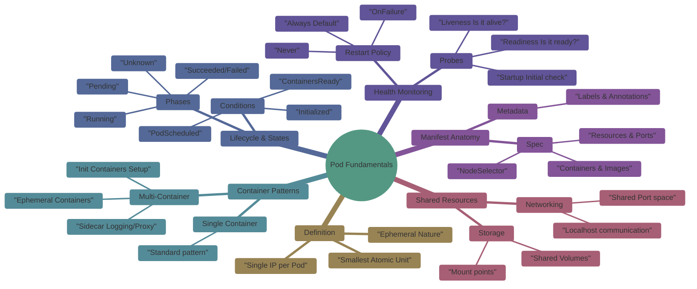

# Pod Overview
---

```mermaid
%%{init: {'theme': 'base', 'themeVariables': { 'primaryColor': '#a1cbbeff', 'primaryTextColor': '#333', 'primaryBorderColor': '#333', 'lineColor': '#aba0a0ff' }}}%%
mindmap
  root((Pod Fundamentals))
    Definition
      "Smallest Atomic Unit"
      "Ephemeral Nature"
      "Single IP per Pod"
    
    Shared Resources
      Networking
        "Localhost communication"
        "Shared Port space"
      Storage
        "Shared Volumes"
        "Mount points"
    
    Container Patterns
      Single Container
        "Standard pattern"
      Multi-Container
        "Sidecar Logging/Proxy"
        "Init Containers Setup"
        "Ephemeral Containers"

    Lifecycle & States
      Phases
        "Pending"
        "Running"
        "Succeeded/Failed"
        "Unknown"
      Conditions
        "PodScheduled"
        "Initialized"
        "ContainersReady"

    Health Monitoring
      Restart Policy
        "Always Default"
        "OnFailure"
        "Never"
      Probes
        "Liveness Is it alive?"
        "Readiness Is it ready?"
        "Startup Initial check"

    Manifest Anatomy
      Metadata
        "Labels & Annotations"
      Spec
        "Containers & Images"
        "Resources & Ports"
        "NodeSelector"
```        
