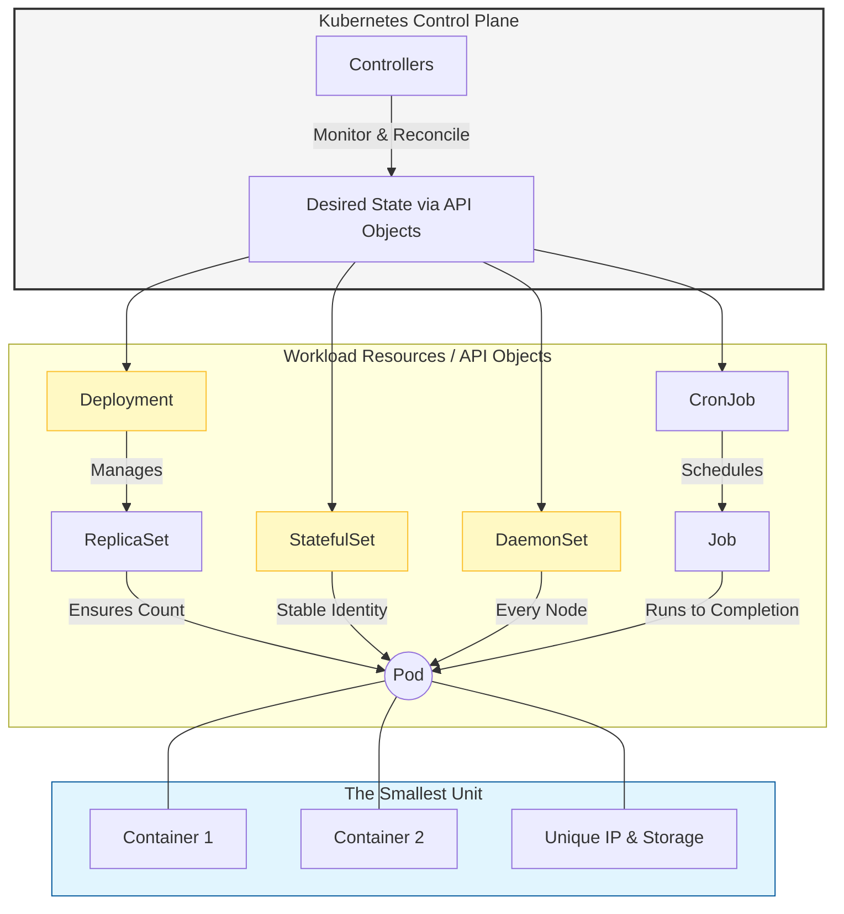
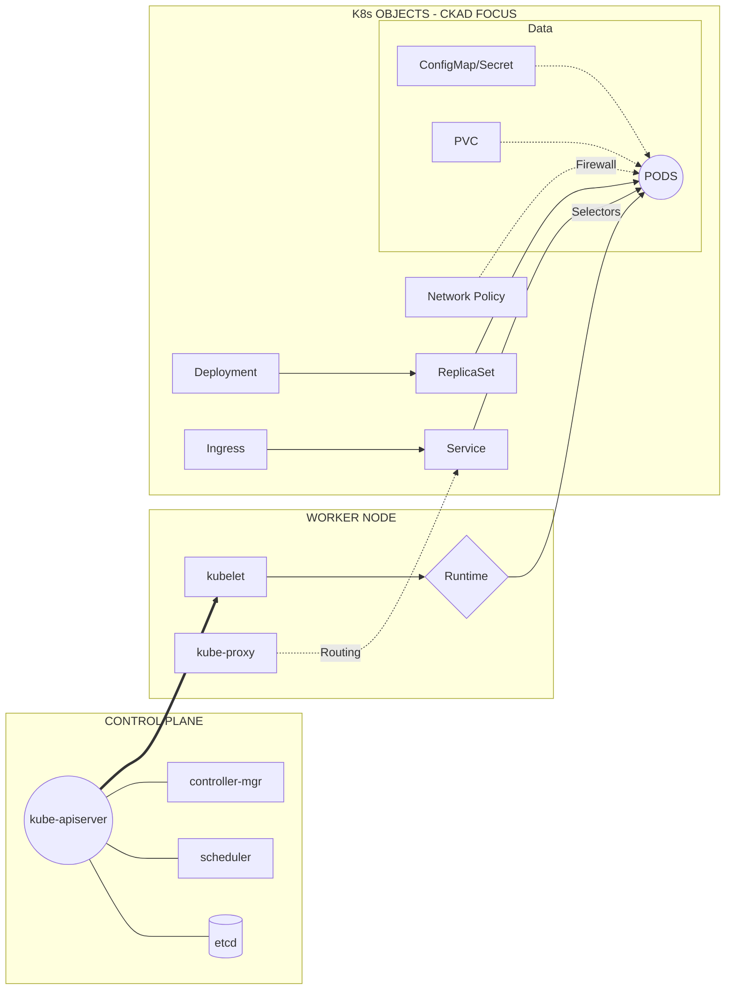

# 01 - Workload Management Concepts

## 1. What Is Workload Management ?

In Kubernetes, a **Workload** is an application running on your cluster. Instead of managing individual Pods (which are ephemeral), you use **Workload Resources** to manage sets of Pods on your behalf.

* **Problem:** Managing thousands of individual Pods manually is impossible.
* **Solution:** Controllers (Workload Resources) reconcile the `Actual State` (what is running) with your `Desired State` (what you want).


### Why Workload Management Is Needed

| Feature |  Without Workload Management |  With Workload Management |
| --- | --- | --- |
| **Stability** | `CRITICAL` Services crash under load; no self-healing. | `STABLE` Automatic restarts and health monitoring. |
| **Resource Usage** | `INEFFICIENT` Apps "fight" for CPU/RAM; waste of money. | `OPTIMIZED` Intelligent placement based on limits. |
| **Scaling** | `MANUAL` Scaling is slow, human-heavy, and error-prone. | `AUTOMATED` Horizontal scaling based on real-time traffic. |
| **Consistency** | `CHAOTIC` Different versions running on different nodes. | `CONSISTENT` Declarative state ensures uniform updates. |
| **Cost** | `HIGH` Over-provisioning to avoid crashes. | `EFFICIENT` Right-sizing based on actual demand. |

### Key Takeaways for Students

1. **Manual is the Enemy:** In modern DevOps, manual intervention is a failure point. Workload management automates the "Ops" in DevOps.
2. **Declarative vs. Imperative:** Without management, you tell the system *what to do* (Imperative). With it, you tell the system *how it should look* (Declarative).
3. **Optimization:** It’s the difference between a "noisy neighbor" taking all your server memory and a "governed neighborhood" where everyone has their own fence.


---


## 2. Core Concepts
* Pods : The smallest deployable unit in Kubernetes, a Pod wraps one or more containers, storage resources, a unique network IP, and options that govern how the containers run.

* Controllers : These are control loops within the Kubernetes control plane that monitor the current state of the cluster and work to move it towards the desired state defined in the API objects (e.g., ensuring a specified number of Pod replicas are always running)

* Workload Resources (API Objects) : Instead of managing individual Pods directly, you use higher-level resources that configure the controllers. These include: 
   1. **Deployment:** The industry standard for **Stateless** apps. It manages **ReplicaSets** to handle rolling updates and rollbacks.
   2. **StatefulSet:** For apps needing **Unique Identity**. Provides stable hostnames (e.g., `db-0`, `db-1`) and dedicated storage per pod.
   4. **Job:** Runs a Pod until a specific task completes (e.g., a database migration).
   5. **CronJob:** A Job that runs on a recurring **time-based schedule** (Linux crontab format).
   6. **DaemonSet:** Ensures **every node** (or a subset) runs exactly one copy of a Pod. Ideal for log collectors or monitoring agents.





| Concept          | Kubernetes Object |
| ---------------- | ----------------- |
| Stateless App    | Deployment        |
| Stateful App     | StatefulSet       |
| Batch Job        | Job               |
| Scheduled Job    | CronJob           |
| Node-level Agent | DaemonSet         |
| Autoscaling      | HPA / VPA         |

---
## 3. Key Workload Management Concepts

### 3.1 Scheduling
- Decides **where** a workload runs
- Based on CPU, memory, constraints, affinity rules

### 3.2 Scaling
- **Horizontal Scaling**: Increase/decrease instances
- **Vertical Scaling**: Increase/decrease resources

### 3.3 Resource Allocation
- CPU and memory **requests** and **limits**
- Prevents noisy neighbor problems

### 3.4 Availability & Restart Policies
- Auto-restart on failure
- Self-healing behavior

### 3.5 Lifecycle Management
- Create → Update → Scale → Delete
- Rolling updates and rollbacks

---

## 4. Visual Architecture

The relationship between the **Deployment Controller** and the worker nodes.




## 7. Sample Workload Definition (Deployment)

```yaml
apiVersion: apps/v1
kind: Deployment
metadata:
  name: sample-app
spec:
  replicas: 3
  selector:
    matchLabels:
      app: sample
  template:
    metadata:
      labels:
        app: sample
    spec:
      containers:
      - name: app
        image: nginx
        resources:
          requests:
            cpu: "100m"
            memory: "128Mi"
          limits:
            cpu: "500m"
            memory: "256Mi"
```
---

## 5. Cheat Sheet: Essential Commands

| Category | Command | Description |
| --- | --- | --- |
| **Observation** | `kubectl get deploy,sts,ds,job,cronjob` | **List all workloads** in the current namespace. |
| **Observation** | `kubectl get pods -l app=<label>` | Filter and **view pods** belonging to a specific workload. |
| **Inspection** | `kubectl describe deployment <name>` | View detailed configuration and **lifecycle events**. |
| **Inspection** | `kubectl explain deployment` | View the **official API schema** and field definitions. |
| **Scaling** | `kubectl scale deployment <name> --replicas=X` | Manually **increase or decrease** the pod count. |
| **Updates** | `kubectl rollout status deployment <name>` | Watch the **live progress** of a rolling update. |
| **Updates** | `kubectl rollout restart deployment <name>` | Trigger a **rolling restart** of all pods in a deployment. |
| **Rollbacks** | `kubectl rollout history deployment <name>` | View the **revision history** (previous versions). |
| **Rollbacks** | `kubectl rollout undo deployment <name>` | **Revert** to the previous stable version immediately. |
| **Performance** | `kubectl top pods` | Check real-time **CPU and Memory usage** per pod. |

---

## 5. Best Practices (Official K8s Standards)

1. **Declarative Management:** Use `kubectl apply` with YAML files. Avoid `kubectl run` (imperative) for production.
2. **Replication Logic:** Never create a Pod directly ("Naked Pod"). It will not restart if the node fails.
3. **Storage Strategy:** Use **StatefulSets** if your app requires the same volume to follow the same pod after a restart.
4. **Health Checks:** Always implement `Liveness` and `Readiness` probes to avoid sending traffic to broken pods.


