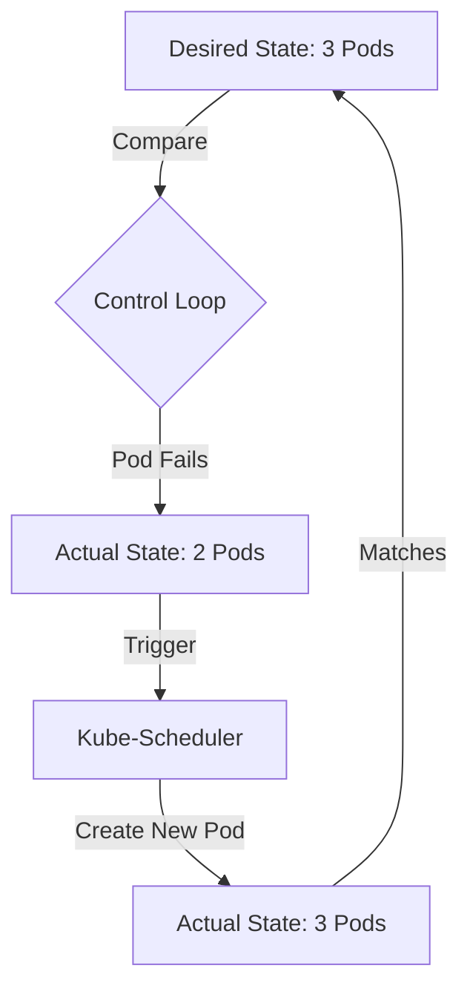

# 02 - Self-Healing Demo: Hands-on Laboratory

This guide demonstrates the **Self-Healing** capabilities of Kubernetes. In this lab, we will witness how Kubernetes automatically replaces failed Pods to maintain the desired state.

## Basic Definition

**Self-Healing** is the ability of a cluster to detect a failed container or node and automatically reschedule it to a healthy state without human intervention.

* **The Problem:** In traditional setups, if a server crashes at 2:00 AM, the app stays down until an engineer fixes it.
* **The Solution:** Kubernetes monitors the cluster 24/7. If a Pod is deleted or a process crashes, the **Deployment Controller** immediately creates a replacement.


##  Core Concepts to Cover

1. **Desired vs. Actual State:** How K8s reconciles differences.
2. **Automatic Rescheduling:** What happens when a Pod is manually killed.

##  Visual Architecture

The "Control Loop" (Watch, Diff, Act) that drives self-healing.


3. Probes

##  Hands-on Example: The Self-Healing Manifest

Create a file named `self-healing-demo.yaml`. This deployment uses an Nginx image and defines 3 replicas.

```yaml
apiVersion: apps/v1
kind: Deployment
metadata:
  name: self-healing-demo
  labels:
    app: web-server
spec:
  replicas: 3
  selector:
    matchLabels:
      app: web-server
  template:
    metadata:
      labels:
        app: web-server
    spec:
      containers:
      - name: nginx
        image: nginx:1.25
        ports:
        - containerPort: 80

```
##  Cheat Sheet: Lab Steps

| Step | Command | What it proves |
| --- | --- | --- |
| **1. Deploy** | `kubectl apply -f self-healing-demo.yaml` | Creates the desired state (3 pods). |
| **2. Watch** | `kubectl get pods -w` | Opens a live stream of pod status. |
| **3. Sabotage** | `kubectl delete pod <pod-name>` | Manually "killing" a pod to simulate failure. |
| **4. Observe** | Check the watch terminal | You will see a new pod starting immediately. |
| **5. Verify** | `kubectl get deployments` | Shows that `AVAILABLE` count returns to 3. |

---

##  Best Practices for Self-Healing

1. **Use Liveness Probes:** Don't just check if the container is "running"; check if the app inside is actually responding to requests.
2. **Avoid `RestartPolicy: Never`:** For production workloads, ensure the restart policy is set to `Always` (default for Deployments).
3. **Resource Requests:** Always set CPU/Memory requests so Kubernetes can find a node with enough "room" to heal the pod onto.
4. **Multi-AZ Clusters:** Distribute pods across multiple zones so that if a whole data center fails, Kubernetes heals the pods in a different zone.
