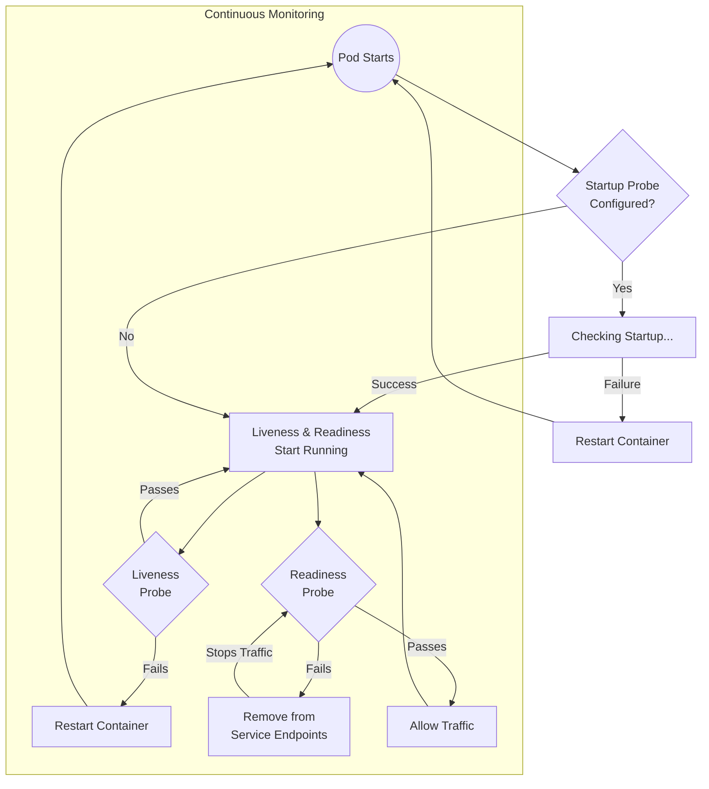

##  Probes in Kubernetes (Self-Healing Enhancer)

Self-healing does **not rely only on Pod crashes**.
Kubernetes also uses **Probes** to detect unhealthy applications **even when the container process is still running**.

### 1. Why Probes Matter

Without probes:

* A container may be **running but frozen**
* Kubernetes thinks everything is fine
* Users experience downtime

With probes:

* Kubernetes actively **checks application health**
* Automatically **restarts or removes unhealthy Pods**


## 2. Types of Probes

### 1. Startup Probe (Slow Boot Apps)

* Used for applications that take time to start
* Prevents premature restarts
* 
### 2. Liveness Probe (Self-Healing Trigger)

* Detects **dead or stuck applications**
* If it fails → **Pod is restarted**

### 3. Readiness Probe (Traffic Control)

* Detects if app is **ready to accept traffic**
* If it fails → Pod is **removed from Service**


### Probes – Comparison Table

| Aspect                         | **Liveness Probe**                          | **Readiness Probe**                                    | **Startup Probe**                                       |
| ------------------------------ | ------------------------------------------- | ------------------------------------------------------ | ------------------------------------------------------- |
| **Purpose**                    | Checks if the container is *alive*          | Checks if the container is *ready to receive traffic*  | Checks if the application has *finished starting up*    |
| **Main Question It Answers**   | “Should Kubernetes restart this container?” | “Should this pod receive traffic?”                     | “Has the app started yet?”                              |
| **When It Runs**               | Continuously during container lifetime      | Continuously during container lifetime                 | Only during application startup                         |
| **What Happens on Failure**    | Container is **restarted**                  | Pod is **removed from Service endpoints** (no traffic) | Container is **restarted**                              |
| **Effect on Pod Status**       | Pod stays running, container restarts       | Pod becomes `NotReady`                                 | Pod stays in `Pending/Running` until startup succeeds   |
| **Traffic Impact**             | No direct traffic control                   | Traffic **stops** being sent to the pod                | No traffic until startup completes                      |
| **Typical Use Case**           | App is stuck, deadlocked, or unrecoverable  | App is alive but temporarily unable to handle requests | Slow-starting apps (large JVM apps, migrations, caches) |
| **Runs Together With Others?** | Yes                                         | Yes                                                    | Disables liveness & readiness until it succeeds         |
| **Common Checks**              | `/health`, process check                    | `/ready`, DB connectivity                              | `/startup`, warm-up completion                          |
| **Failure Threshold Meaning**  | Restart container                           | Mark pod unready                                       | Restart container if startup takes too long             |
| **Introduced In Kubernetes**   | Early versions                              | Early versions                                         | Kubernetes 1.16+                                        |

---

### Probe Types (used by all three)

| Probe Type     | Description                         | Example            |
| -------------- | ----------------------------------- | ------------------ |
| **HTTP GET**   | Calls an HTTP endpoint              | `/healthz`         |
| **TCP Socket** | Checks if a port is open            | Port `8080`        |
| **Exec**       | Runs a command inside the container | `cat /tmp/healthy` |


### Simple Mental Model

* **Startup probe**:
  *“Wait, don’t judge me yet — I’m still starting.”*

* **Liveness probe**:
  *“Am I completely broken? If yes, restart me.”*

* **Readiness probe**:
  *“I’m alive, but am I ready to handle traffic right now?”*


##  How Probes Fit into Self-Healing


---

##  3. Extended Manifest: Self-Healing with Probes

> **Note:** This is an **extended version** of the same deployment, now enhanced with probes.

Create a new file named `self-healing-demo-with-probes.yaml`.

```yaml
apiVersion: apps/v1
kind: Deployment
metadata:
  name: self-healing-demo
  labels:
    app: web-server
spec:
  replicas: 3
  selector:
    matchLabels:
      app: web-server
  template:
    metadata:
      labels:
        app: web-server
    spec:
      containers:
      - name: nginx
        image: nginx:1.25
        ports:
        - containerPort: 80

        livenessProbe:
          httpGet:
            path: /
            port: 80
          initialDelaySeconds: 10
          periodSeconds: 5
          failureThreshold: 3

        readinessProbe:
          httpGet:
            path: /
            port: 80
          initialDelaySeconds: 5
          periodSeconds: 5
```

---

## 4. Probe-Based Failure Demo (Optional Lab)

| Step      | Command                                                         | What it proves             |
| --------- | --------------------------------------------------------------- | -------------------------- |
| Deploy    | `kubectl apply -f self-healing-demo-with-probes.yaml`           | Probes are active          |
| Break App | `kubectl exec -it <pod> -- rm /usr/share/nginx/html/index.html` | App becomes unhealthy      |
| Observe   | `kubectl get pods -w`                                           | Pod restarts automatically |
| Verify    | `kubectl describe pod <pod>`                                    | Shows probe failure events |

---


## . Key Takeaway

> **Self-Healing = Controllers + Probes**

* Controllers fix **missing Pods**
* Probes fix **broken applications**
* Together, they deliver **true zero-touch recovery**
