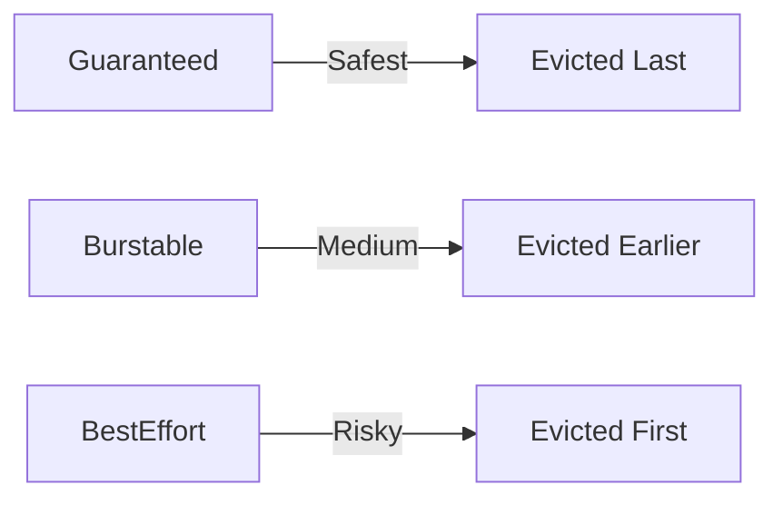

# 04 – Resource Requests & Limits (CPU and Memory)

## 1. What Are Resource Requests and Limits?

**Resource Requests and Limits** define **how much CPU and memory a container needs and is allowed to use** in Kubernetes.

They are a **core part of workload management, scheduling, and self-healing**.

### Plain-English Meaning

- **Request** → *Minimum guaranteed resources*
- **Limit** → *Maximum allowed resources*

### Why This Concept Exists

**The Problem:**
- One container can consume all CPU or memory
- Other applications slow down or crash (noisy neighbor problem)
- Scheduler doesn’t know where to place Pods safely

**The Solution:**
Kubernetes uses **requests** for scheduling decisions and **limits** for runtime enforcement.

---

## 2. Core Concepts (Pillars)

- **CPU Requests**
- **CPU Limits**
- **Memory Requests**
- **Memory Limits**
- **QoS (Quality of Service) Classes**
- **OOMKill & Throttling**

---

## 3. How Kubernetes Uses Requests & Limits

### Scheduler Phase
- Scheduler looks only at **requests**
- Chooses a node with enough available CPU & memory

### Runtime Phase
- **CPU limit** → throttling
- **Memory limit** → container killed (OOMKill)

---

## 4. Visual Architecture – Resource Enforcement Flow

```mermaid
flowchart LR
    A[Pod Spec with Req. & Limits] --> B[Kube-Scheduler]
    B --> C[Node Selected]
    C --> D[Container Runtime]
    D -->|CPU Exceeds Limit| E[CPU Throttling]
    D -->|Memory Exceeds Limit| F[OOM Kill]
    F --> G[Pod Restart]
````

---

## 5. CPU vs Memory (Critical Difference)

| Resource | What Happens When Limit Exceeded |
| -------- | -------------------------------- |
| CPU      | Throttled (slowed down)          |
| Memory   | Process killed (OOMKill)         |

> Memory limits are **hard limits**.
> CPU limits are **soft limits**.

---

## 6. Sample Pod with Requests & Limits

```yaml
apiVersion: v1
kind: Pod
metadata:
  name: resource-demo
spec:
  containers:
  - name: app
    image: nginx
    resources:
      requests:
        cpu: "100m"
        memory: "128Mi"
      limits:
        cpu: "500m"
        memory: "256Mi"
```

---

## 7. Understanding CPU Units

| Unit   | Meaning         |
| ------ | --------------- |
| `1`    | 1 full CPU core |
| `500m` | 0.5 CPU         |
| `100m` | 0.1 CPU         |

---

## 8. Quality of Service (QoS) Classes

Kubernetes assigns a QoS class automatically.

| QoS Class      | Condition                          | Stability |
| -------------- | ---------------------------------- | --------- |
| **Guaranteed** | Requests = Limits for CPU & Memory | Highest   |
| **Burstable**  | Requests < Limits                  | Medium    |
| **BestEffort** | No requests or limits              | Lowest    |



---

## 9. Cheat Sheet – Essential Commands

```bash
# View resource usage
kubectl top pods
kubectl top nodes

# Describe pod resources
kubectl describe pod <pod-name>

# Check QoS class
kubectl get pod <pod-name> -o jsonpath='{.status.qosClass}'

# Find OOMKilled pods
kubectl get pods --field-selector=status.phase=Failed

# View events related to resource issues
kubectl get events --sort-by=.metadata.creationTimestamp
```

---

## 10. Real Failure Scenarios

### Scenario 1: No Limits

* One pod consumes all memory
* Node becomes unstable
* Multiple pods crash

### Scenario 2: Limit Too Low

* App exceeds memory
* Container gets OOMKilled
* Pod restarts repeatedly (CrashLoopBackOff)

---

## 11. Best Practices (Production-Grade)

1. **Always define requests**
2. **Set memory limits carefully**
3. **Avoid CPU limits for latency-sensitive apps**
4. **Use monitoring before tuning values**

---

## 12. DevOps Exam Tip (CKA / CKAD)

> Scheduler uses **requests**, not limits.

If a node has:

* 1 CPU free
* Pod requests 2 CPU -->  Pod will **NOT** be scheduled.

---

## 13. Key Takeaway

> **Requests decide placement**
> **Limits decide survival**

Mastering this concept prevents:

* Node crashes
* Pod starvation
* Unexpected downtime
* Cloud cost explosions


