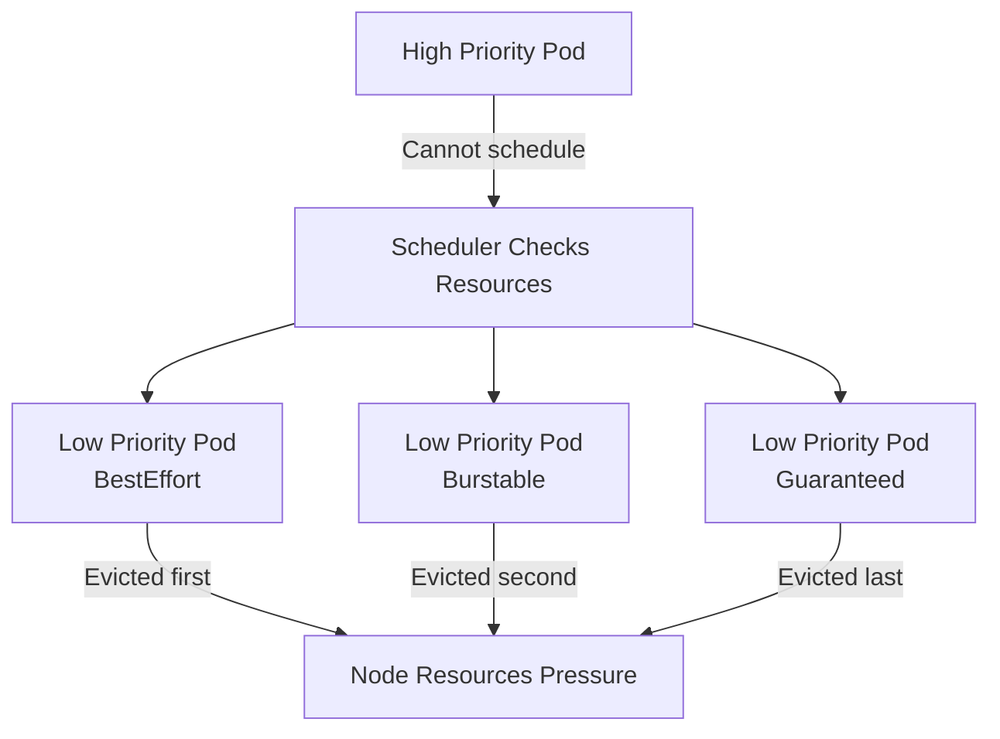
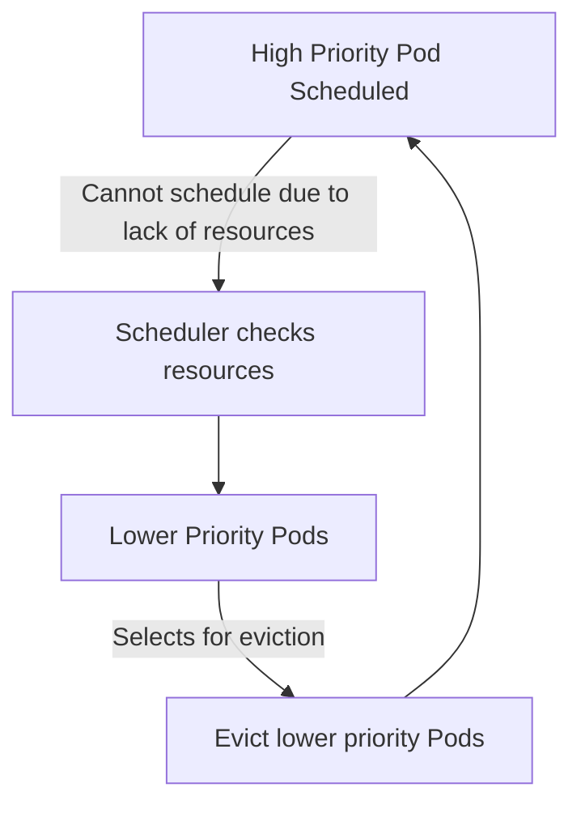

# Kubernetes QoS, Preemption & Eviction (Complete Beginner Guide)

## 1. What is QoS (Quality of Service) in Kubernetes?

**QoS** defines **how “important” a Pod is in terms of resource guarantees**.
It helps the **scheduler and kubelet** decide:

* Which Pods can be **preempted** for higher-priority Pods
* Which Pods can be **evicted first** under **node resource pressure**

---

### 1.1 QoS Classes

Kubernetes assigns Pods to **3 QoS classes**, based on **resource requests and limits**:

| QoS Class      | Criteria                                              | Notes                                            |
| -------------- | ----------------------------------------------------- | ------------------------------------------------ |
| **Guaranteed** | CPU & memory **requests = limits** for all containers | Most protected; rarely evicted                   |
| **Burstable**  | Some requests < limits                                | Medium protection; can be evicted under pressure |
| **BestEffort** | No requests or limits set                             | Lowest priority; evicted first                   |

---

### 1.2 How QoS is Calculated

1. Check **CPU & memory requests and limits** for all containers.
2. Assign QoS class:

* **Guaranteed** → All containers have **requests = limits**
* **Burstable** → Some containers have **requests < limits**
* **BestEffort** → No requests or limits

**Example:**

```yaml
containers:
- name: app
  image: nginx
  resources:
    requests:
      memory: "100Mi"
      cpu: "100m"
    limits:
      memory: "100Mi"
      cpu: "100m"
```

* This Pod is **Guaranteed** because requests = limits.

```yaml
containers:
- name: app
  image: nginx
  resources:
    requests:
      memory: "100Mi"
      cpu: "100m"
    limits:
      memory: "200Mi"
      cpu: "200m"
```

* This Pod is **Burstable** because requests < limits.

```yaml
containers:
- name: app
  image: nginx
```

* This Pod is **BestEffort** because no requests or limits set.

---

## 2. How QoS Affects Eviction

When the node is under **memory or CPU pressure**:

* **Eviction order**:

```
1. BestEffort Pods
2. Burstable Pods (based on usage)
3. Guaranteed Pods (last)
```

* **Higher QoS = safer from eviction**
* **Lower QoS = first to go under resource pressure**

---

## 3. How QoS Interacts with Preemption

* **Preemption** happens when **high-priority Pod cannot schedule**.
* Scheduler can evict **lower-priority Pods**.
* **QoS class** determines **which Pod is chosen first** for eviction:

```
BestEffort < Burstable < Guaranteed
```

* If multiple Pods have the same priority, **QoS decides eviction order**.

---

## 4. Hands-On: QoS Examples

### 4.1 Guaranteed Pod

```yaml
apiVersion: v1
kind: Pod
metadata:
  name: guaranteed-pod
spec:
  containers:
  - name: app
    image: nginx
    resources:
      requests:
        memory: "100Mi"
        cpu: "100m"
      limits:
        memory: "100Mi"
        cpu: "100m"
```

### 4.2 Burstable Pod

```yaml
apiVersion: v1
kind: Pod
metadata:
  name: burstable-pod
spec:
  containers:
  - name: app
    image: nginx
    resources:
      requests:
        memory: "50Mi"
        cpu: "50m"
      limits:
        memory: "100Mi"
        cpu: "100m"
```

### 4.3 BestEffort Pod

```yaml
apiVersion: v1
kind: Pod
metadata:
  name: besteffort-pod
spec:
  containers:
  - name: app
    image: nginx
```

---

## 5. Preemption + Eviction + QoS (Mermaid Diagram)



**Explanation:**

1. Node under pressure triggers **eviction process**.
2. Scheduler checks **priority & QoS** for all Pods.
3. Eviction order:

   * Low-priority, BestEffort Pods
   * Burstable Pods
   * Guaranteed Pods (least likely to be evicted)
4. High-priority Pods may **preempt lower-priority Pods** if necessary.

---

## 6. Key Takeaways for Beginners

* **PriorityClass** → decides which Pod is more important.
* **QoS Class** → decides which Pod can survive **node pressure**.
* **Preemption** → frees resources **before scheduling** a high-priority Pod.
* **Eviction** → removes Pods **after they are running** due to resource limits.
* Always set **resource requests & limits** to control QoS.
* Guaranteed Pods + High Priority = safest Pods in cluster.

---

## 1. What is Pod Priority?

**Pod Priority** determines **which Pods are more important** when resources are limited in a cluster.

* Higher priority Pods get **scheduled first**.
* Lower priority Pods may be **evicted** to free resources.

**Analogy:**

* Think of a hotel with limited rooms:

  * VIP guests get rooms first
  * Regular guests get rooms only if available
  * If overbooked, regular guests are asked to leave

---

### 1.1 How Priority is Calculated

* Kubernetes uses **PriorityClass** objects.
* Each Pod is assigned a **priority value** (integer).
* Higher numbers = higher priority

**Example Values:**

| Priority Class          | Value      | Notes                             |
| ----------------------- | ---------- | --------------------------------- |
| system-cluster-critical | 2000000000 | Reserved for system-critical pods |
| system-node-critical    | 2000001000 | Reserved for node-critical pods   |
| high                    | 1000       | High importance apps              |
| medium                  | 500        | Default importance                |
| low                     | 100        | Low priority apps                 |

---

### 1.2 Setting Priority for a Pod

#### PriorityClass YAML

```yaml
apiVersion: scheduling.k8s.io/v1
kind: PriorityClass
metadata:
  name: high-priority
value: 1000
globalDefault: false
description: "High priority application pods"
```

#### Pod YAML with Priority

```yaml
apiVersion: v1
kind: Pod
metadata:
  name: high-priority-pod
spec:
  priorityClassName: high-priority
  containers:
  - name: app
    image: nginx
```

**Explanation:**

* `priorityClassName` links the Pod to a PriorityClass.
* Scheduler uses this to decide **which Pod to schedule first** under resource pressure.

---

## 2. What is Preemption?

**Preemption** occurs **before scheduling**:

* When a **high-priority Pod cannot be scheduled** due to resource shortage,
* Kubernetes **evicts lower-priority Pods** to make room.

**Analogy:**

* A VIP guest arrives at a full hotel → the manager moves a regular guest to another hotel to free a room.

---

### 2.1 Preemption Flow (Mermaid Diagram)



**Explanation:**

1. High-priority Pod wants to schedule.
2. Scheduler checks available resources.
3. If insufficient, identifies low-priority Pods to evict.
4. Evicts Pods → frees resources → schedules high-priority Pod.

---

## 3. What is Eviction?

**Eviction** occurs **after a Pod is running**:

* Kubernetes **removes Pods** when:

  * Node is under memory or disk pressure
  * Node becomes unschedulable
  * Pod exceeds its resource limits

**Types of Eviction:**

1. **Node Pressure Eviction**

   * Triggered when CPU, memory, or disk pressure exists.

2. **Graceful Pod Eviction**

   * Scheduler marks Pod as `Terminating`
   * Sends SIGTERM to container
   * Grace period for shutdown

---

### 3.1 Eviction vs Preemption

| Aspect  | Preemption                                    | Eviction                               |
| ------- | --------------------------------------------- | -------------------------------------- |
| When    | Before Pod is scheduled                       | After Pod is running                   |
| Trigger | High-priority Pod cannot be scheduled         | Node resource pressure / Pod violation |
| Action  | Removes lower-priority Pods to free resources | Removes Pods to relieve node pressure  |
| Scope   | Scheduler                                     | Kubelet                                |

---

## 4. How Priority and Eviction Work Together

1. **Pod Priority** determines **who gets scheduled first**.
2. **Preemption** can **evict lower-priority Pods** for high-priority Pods.
3. **Eviction** frees resources when **node is under pressure**, regardless of priority.
4. High-priority Pods are **less likely to be evicted**.

---

### 4.1 Real-Life Analogy

* Cloud cluster = hotel
* Pods = guests
* Priority = VIP status
* Preemption = bumping low-priority guests before they check in
* Eviction = asking guests to leave if hotel resources are exhausted

---

## 5. Hands-On Examples

### 5.1 Create PriorityClass

```bash
kubectl apply -f - <<EOF
apiVersion: scheduling.k8s.io/v1
kind: PriorityClass
metadata:
  name: high-priority
value: 1000
globalDefault: false
description: "High priority pod"
EOF
```

### 5.2 Schedule High and Low Priority Pods

#### Low-Priority Pod

```yaml
apiVersion: v1
kind: Pod
metadata:
  name: low-pod
spec:
  priorityClassName: ""
  containers:
  - name: app
    image: nginx
    resources:
      requests:
        memory: "100Mi"
      limits:
        memory: "200Mi"
```

#### High-Priority Pod

```yaml
apiVersion: v1
kind: Pod
metadata:
  name: high-pod
spec:
  priorityClassName: high-priority
  containers:
  - name: app
    image: nginx
    resources:
      requests:
        memory: "150Mi"
      limits:
        memory: "300Mi"
```

### 5.3 Simulate Preemption

* Start `low-pod` first to occupy resources.
* Then create `high-pod`.
* Observe that Kubernetes **evicts the low-priority Pod** to schedule the high-priority Pod.

```bash
kubectl apply -f low-pod.yaml
kubectl apply -f high-pod.yaml
kubectl get pods
```

---

### 6. Key Points for Beginners

* **PriorityClass** determines importance.
* **Preemption** happens **before scheduling**.
* **Eviction** happens **during runtime** due to node pressure.
* Always **set resource requests and limits** to allow fair scheduling.
* Minikube can be used to **simulate preemption** with multiple Pods.
