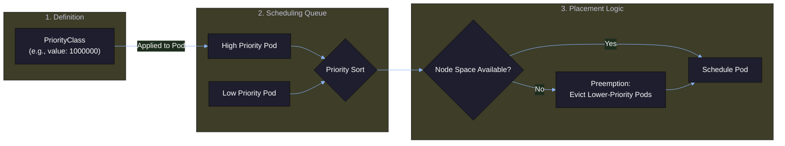
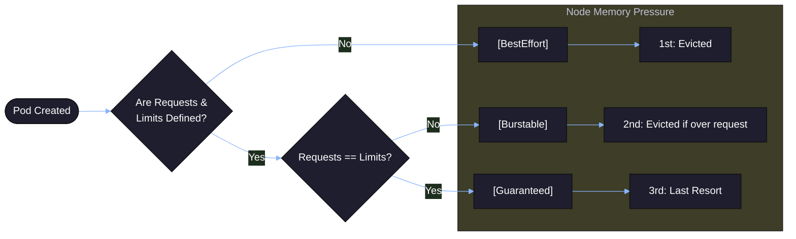
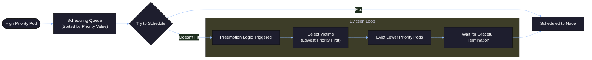
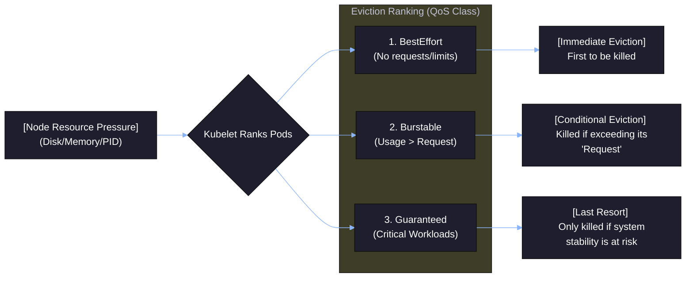
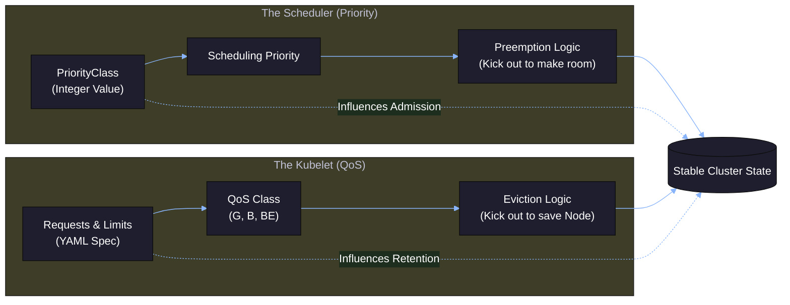

# Kubernetes Priority, QoS, Preemption & Eviction

---

# 1. Pod Priority

## 1.1 What It Is

Pod Priority defines **importance for scheduling**.

* Higher value → scheduled first
* Lower value → removed first when needed

Priority is defined using a `PriorityClass`.

---

## 1.2 Priority Flow



---

## 1.3 PriorityClass Example

```yaml
apiVersion: scheduling.k8s.io/v1
kind: PriorityClass
metadata:
  name: high-priority
value: 1000
globalDefault: false
description: "High priority workloads"
```

Pod using it:

```yaml
apiVersion: v1
kind: Pod
metadata:
  name: high-pod
spec:
  priorityClassName: high-priority
  containers:
  - name: app
    image: nginx
```

Higher `value` = higher scheduling preference.

---
# 2. QoS (Quality of Service)

* QoS determines **how protected a Pod is under resource pressure**.
* QoS is based only on **CPU and Memory requests and limits**.

---

## 2.1 QoS Classes

| QoS Class  | Condition                            | Protection Level |
| ---------- | ------------------------------------ | ---------------- |
| Guaranteed | requests = limits for all containers | Highest          |
| Burstable  | requests < limits                    | Medium           |
| BestEffort | No requests or limits                | Lowest           |

---

## 2.2 QoS Calculation Logic



---
## 2.3 Examples

### Guaranteed

```yaml
resources:
  requests:
    memory: "100Mi"
    cpu: "100m"
  limits:
    memory: "100Mi"
    cpu: "100m"
```

Requests equal limits → Guaranteed

---

### Burstable

```yaml
resources:
  requests:
    memory: "100Mi"
  limits:
    memory: "200Mi"
```

Requests less than limits → Burstable

---

### BestEffort

```yaml
containers:
- name: app
  image: nginx
```

No requests or limits → BestEffort

---
# 3. Preemption

Preemption happens **before scheduling**.

When a high-priority Pod cannot be scheduled due to lack of resources, Kubernetes removes lower-priority Pods to free space.

---

## 3.1 Preemption Flow



> Preemption is controlled by the **scheduler**.

---
# 4. Eviction

Eviction happens **after a Pod is running**.

Triggered by:

* Memory pressure
* Disk pressure
* Node instability

Handled by **kubelet**, not scheduler.

---

## 4.1 Eviction Order Based on QoS

Eviction priority:

1. BestEffort
2. Burstable
3. Guaranteed

### Eviction flow


---

# 5. Preemption vs Eviction

| Aspect    | Preemption                | Eviction             |
| --------- | ------------------------- | -------------------- |
| When      | Before scheduling         | After running        |
| Trigger   | High priority Pod blocked | Node pressure        |
| Component | Scheduler                 | Kubelet              |
| Based On  | Priority                  | QoS + resource usage |

---
# 6. How Everything Connects



* Priority decides **who gets scheduled first**.
* Preemption removes lower priority Pods.
* QoS decides **who survives node pressure**.
* Eviction removes Pods under resource pressure.

---

# 7. Operational Understanding

High priority + Guaranteed QoS = most protected workload.

No limits + low priority = first to be removed.

Always define:

* CPU requests
* Memory requests
* CPU limits
* Memory limits
* PriorityClass for critical workloads

This ensures predictable scheduling, stable production behavior, and controlled failure handling.
