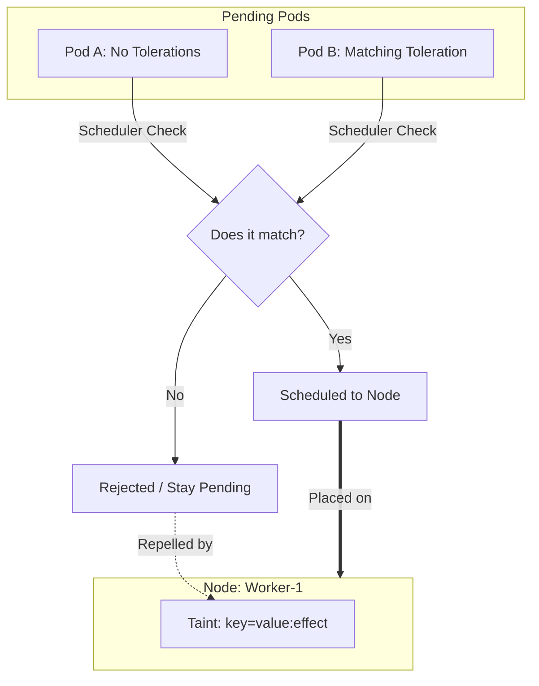

# 06 – Taints and Tolerations Fundamentals

**Taints and Tolerations** control **which Pods can run on which Nodes**.

They provide **Node-level protection** and **strict scheduling control**.

---

# 1. What Are Taints and Tolerations?

* **Taint (Node-side rule)**
  Applied on a **Node** to repel Pods.

* **Toleration (Pod-side permission)**
  Applied on a **Pod** to allow it onto a tainted Node.

> **Taints repel Pods. Tolerations allow Pods.**

---

# 2. Why Taints and Tolerations Exist

By default, Kubernetes schedules Pods on **any available Node**.

This causes problems when:

* Control-plane Nodes should not run apps
* Infra workloads need dedicated Nodes
* GPU / high-memory Nodes must be protected
* Critical system Pods must be isolated

Taints and Tolerations solve this by enforcing **explicit scheduling rules**.

---

# 3. Core Concepts (How It Works)

Taints and Tolerations are built on **four key concepts**:

1. **Taint Key–Value–Effect**
2. **Toleration Matching**
3. **Scheduling Effects**
4. **Node Protection**

---

## 1. Taint Structure (Key–Value–Effect)

A taint has **three parts**:

```
key=value:effect
```

### Example

```bash
kubectl taint nodes node1 role=infra:NoSchedule
```

Meaning:

* Node = `node1`
* Key = `role`
* Value = `infra`
* Effect = `NoSchedule`

> Pods without matching toleration will be rejected.

---

## 2. Toleration Matching (Pod Permission)

A Pod must **explicitly tolerate** the taint.

### Example Toleration

```yaml
tolerations:
- key: "role"
  operator: "Equal"
  value: "infra"
  effect: "NoSchedule"
```

This tells Kubernetes:

> “This Pod is allowed on Nodes tainted with `role=infra:NoSchedule`”

---

## 3. Taint Effects (Very Important)

There are **three taint effects**:

| Effect             | Behavior                       |
| ------------------ | ------------------------------ |
| `NoSchedule`       | New Pods will not be scheduled |
| `PreferNoSchedule` | Avoid scheduling if possible   |
| `NoExecute`        | Existing Pods are evicted      |

---

### Effect Comparison

| Effect           | Existing Pods | New Pods |
| ---------------- | ------------- | -------- |
| NoSchedule       | Allowed       | Blocked  |
| PreferNoSchedule | Allowed       | Avoided  |
| NoExecute        | Evicted       | Blocked  |

---

## 4. Node Protection Model

Taints **protect Nodes**, not Pods.

* Nodes decide who can enter
* Pods must request permission
* No toleration → no access

> **This is the opposite of nodeSelector**, which is Pod-driven.

---

# 4. Taints and Tolerations Architecture


---

# 5. When to Use Taints and Tolerations

Use them when you need:

* Dedicated Nodes for infra workloads
* Protection for control-plane Nodes
* Isolation of critical services
* Controlled scheduling in large clusters

---

# 6. Common Use Cases

| Scenario            | Why                 |
| ------------------- | ------------------- |
| Control-plane Nodes | Prevent app Pods    |
| Infra Nodes         | Logging, monitoring |
| GPU Nodes           | ML workloads only   |
| Security Nodes      | Restricted access   |

---

# 7. Tainting a Node

### Add a Taint

```bash
kubectl taint nodes node1 env=prod:NoSchedule
```

### View Taints

```bash
kubectl describe node node1
```

### Remove a Taint

```bash
kubectl taint nodes node1 env=prod:NoSchedule-
```

---

# 8. Pod with Toleration (Minimal YAML)

```yaml
apiVersion: v1
kind: Pod
metadata:
  name: tolerated-pod
spec:
  tolerations:
  - key: "env"
    operator: "Equal"
    value: "prod"
    effect: "NoSchedule"
  containers:
  - name: nginx
    image: nginx:1.25
```

---

# 9. Special Case: NoExecute Taint

`NoExecute` evicts **already running Pods**.

### Example

```bash
kubectl taint nodes node1 maintenance=true:NoExecute
```

Pods without toleration:

* Immediately evicted

Pods with toleration:

* Can stay (optionally with time limit)

### Toleration with Timeout

```yaml
tolerations:
- key: "maintenance"
  operator: "Equal"
  value: "true"
  effect: "NoExecute"
  tolerationSeconds: 300
```

> Pod stays for **5 minutes**, then evicted.

---

# 10. Taints vs NodeSelector vs Affinity

| Feature            | Taints | NodeSelector | Node Affinity |
| ------------------ | ------ | ------------ | ------------- |
| Applied on         | Node   | Pod          | Pod           |
| Controls access    | Yes    | No           | No            |
| Enforces isolation | Yes    | Weak         | Medium        |
| Supports eviction  | Yes    | No           | No            |

> **Taints = strongest scheduling control**

---

# 11. DaemonSets and Taints

DaemonSets often need to run on **tainted Nodes**.

Example:

* Control-plane Nodes
* Infra Nodes

Without tolerations:

* DaemonSet Pods will not run

---

# 12. Common Mistakes

* Forgetting to add tolerations
* Using PreferNoSchedule for strict isolation
* Mixing nodeSelector and taints incorrectly
* Accidentally evicting critical Pods with NoExecute

---

# 13. Best Practices

1. Use `NoSchedule` for isolation
2. Use `NoExecute` carefully
3. Always document taints
4. Pair taints with labels
5. Test scheduling behavior

# 15. Key Takeaway

> **Taints protect Nodes. Tolerations grant access.**

If you understand this, you can:

* Control scheduling precisely
* Protect critical Nodes
* Design production-grade clusters
