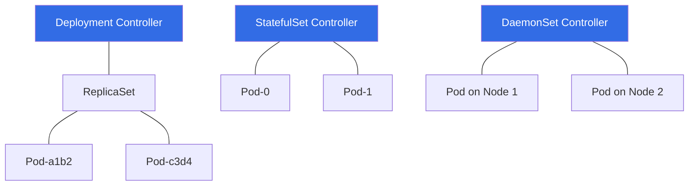

# 01 - Workload Management Concepts

## 1. Basic Definition

In Kubernetes, a **Workload** is an application running on your cluster. Instead of managing individual Pods (which are ephemeral), you use **Workload Resources** to manage sets of Pods on your behalf.

* **Problem:** Managing thousands of individual Pods manually is impossible.
* **Solution:** Controllers (Workload Resources) reconcile the `Actual State` (what is running) with your `Desired State` (what you want).

---

## 2. Core Concepts (Workload API)

1. **Deployment:** The industry standard for **Stateless** apps. It manages **ReplicaSets** to handle rolling updates and rollbacks.
2. **StatefulSet:** For apps needing **Unique Identity**. Provides stable hostnames (e.g., `db-0`, `db-1`) and dedicated storage per pod.
3. **DaemonSet:** Ensures **every node** (or a subset) runs exactly one copy of a Pod. Ideal for log collectors or monitoring agents.
4. **Job:** Runs a Pod until a specific task completes (e.g., a database migration).
5. **CronJob:** A Job that runs on a recurring **time-based schedule** (Linux crontab format).

---

## 3. Visual Architecture

The relationship between the **Deployment Controller** and the worker nodes.

---

## 4. Cheat Sheet: Essential Commands

| Command | Short Description |
| --- | --- |
| `kubectl get deployments` | List all deployments. |
| `kubectl rollout history` | View the revision history of a deployment. |
| `kubectl rollout undo` | Revert to a previous stable version. |
| `kubectl scale --replicas=X` | Increase/decrease pod count instantly. |
| `kubectl get pods -l app=nginx` | Find pods using a specific **Label**. |
| `kubectl explain deployment` | View the official doc schema for a resource. |

---

## 5. Best Practices (Official K8s Standards)

1. **Declarative Management:** Use `kubectl apply` with YAML files. Avoid `kubectl run` (imperative) for production.
2. **Replication Logic:** Never create a Pod directly ("Naked Pod"). It will not restart if the node fails.
3. **Storage Strategy:** Use **StatefulSets** if your app requires the same volume to follow the same pod after a restart.
4. **Health Checks:** Always implement `Liveness` and `Readiness` probes to avoid sending traffic to broken pods.

