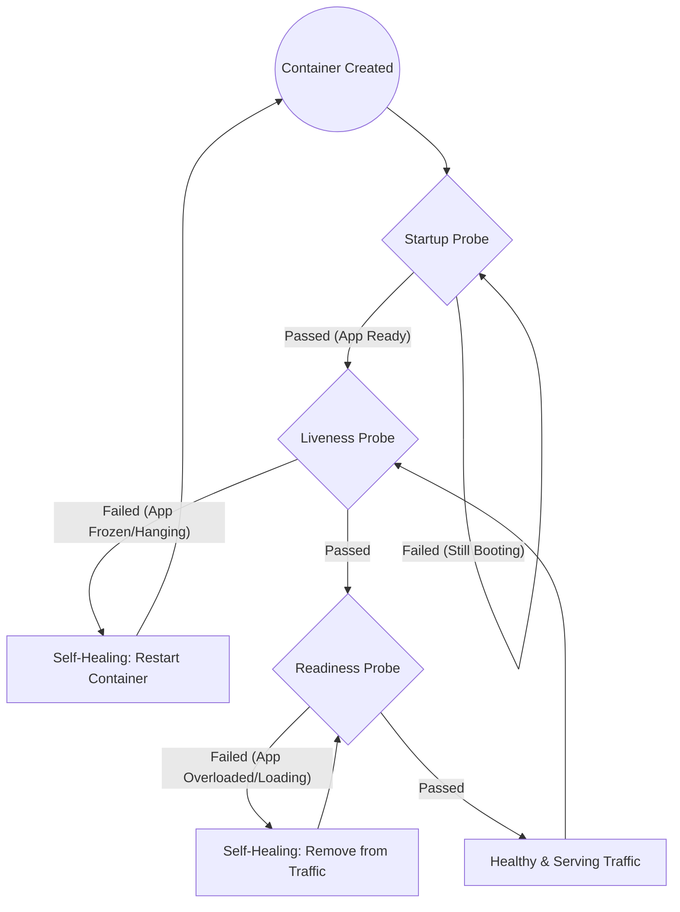

##  Probes in Kubernetes (Self-Healing Enhancer)

Self-healing does **not rely only on Pod crashes**.
Kubernetes also uses **Probes** to detect unhealthy applications **even when the container process is still running**.

### 1. Why Probes Matter

Without probes:

* A container may be **running but frozen**
* Kubernetes thinks everything is fine
* Users experience downtime

With probes:

* Kubernetes actively **checks application health**
* Automatically **restarts or removes unhealthy Pods**


## 2. Types of Probes

### 1. Liveness Probe (Self-Healing Trigger)

* Detects **dead or stuck applications**
* If it fails → **Pod is restarted**

### 2. Readiness Probe (Traffic Control)

* Detects if app is **ready to accept traffic**
* If it fails → Pod is **removed from Service**

### 3. Startup Probe (Slow Boot Apps)

* Used for applications that take time to start
* Prevents premature restarts


##  How Probes Fit into Self-Healing



---

##  3. Extended Manifest: Self-Healing with Probes

> **Note:** This is an **extended version** of the same deployment, now enhanced with probes.

Create a new file named `self-healing-demo-with-probes.yaml`.

```yaml
apiVersion: apps/v1
kind: Deployment
metadata:
  name: self-healing-demo
  labels:
    app: web-server
spec:
  replicas: 3
  selector:
    matchLabels:
      app: web-server
  template:
    metadata:
      labels:
        app: web-server
    spec:
      containers:
      - name: nginx
        image: nginx:1.25
        ports:
        - containerPort: 80

        livenessProbe:
          httpGet:
            path: /
            port: 80
          initialDelaySeconds: 10
          periodSeconds: 5
          failureThreshold: 3

        readinessProbe:
          httpGet:
            path: /
            port: 80
          initialDelaySeconds: 5
          periodSeconds: 5
```

---

## 4. Probe-Based Failure Demo (Optional Lab)

| Step      | Command                                                         | What it proves             |
| --------- | --------------------------------------------------------------- | -------------------------- |
| Deploy    | `kubectl apply -f self-healing-demo-with-probes.yaml`           | Probes are active          |
| Break App | `kubectl exec -it <pod> -- rm /usr/share/nginx/html/index.html` | App becomes unhealthy      |
| Observe   | `kubectl get pods -w`                                           | Pod restarts automatically |
| Verify    | `kubectl describe pod <pod>`                                    | Shows probe failure events |

---

## 5. Common Probe Mistakes (Exam + Production)

* Probing `/health` when endpoint doesn’t exist
* Very aggressive probe intervals (causes flapping)
* No `initialDelaySeconds` for slow-start apps
* Same logic for readiness and liveness

---

## 6. Key Takeaway

> **Self-Healing = Controllers + Probes**

* Controllers fix **missing Pods**
* Probes fix **broken applications**
* Together, they deliver **true zero-touch recovery**
