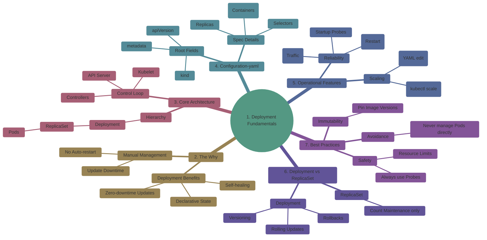
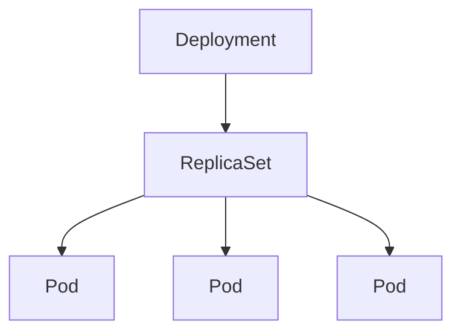
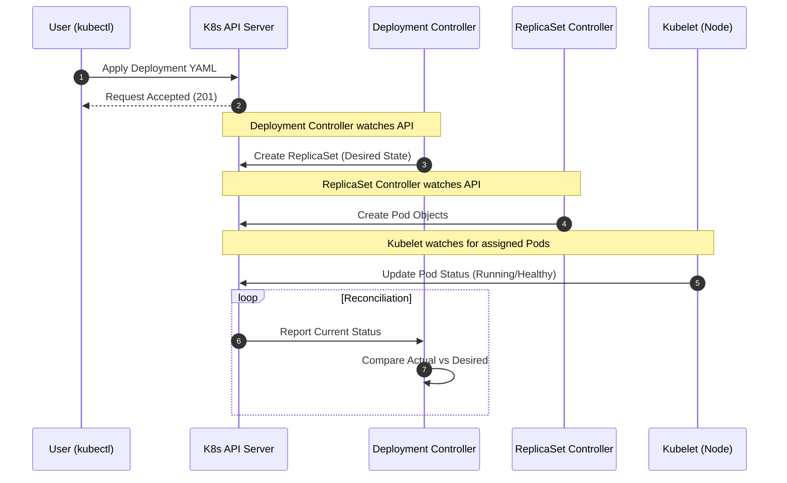

# 04 – Deployment Fundamentals

A Deployment ensures that the **desired number of identical Pods are always running** and automatically handles **updates, rollbacks, scaling, and self-healing**.
## 1. What Is a Deployment?

A **Deployment** is a Kubernetes object that provides **declarative management of Pods** for `stateless applications`.

It defines:

* How many Pods should run
* Which container image/version to use
* How updates are performed
* How failures are handled

---

## Overview



---
## 2. Why Deployments Exist


| Without Deployments     | With Deployments             |
| ----------------------- | ---------------------------- |
| Manual Pod creation     | Self-healing                 |
| No auto-restart         | Automatic Pod recovery       |
| Downtime during updates | Rolling updates              |
| No rollback mechanism   | Rollbacks                    |
| No scaling support      | Scaling                      |
| Imperative management   | Declarative state management |

---

## 3. Core Concepts (Pillars)

* **Desired State** – The target configuration defined in YAML that Kubernetes continuously tries to maintain.
* **Deployment Controller** – A control loop that monitors Deployments and ensures the desired state is met.
* **ReplicaSet** – Ensures the specified number of identical Pods are always running.
* **Pods** – The smallest deployable unit in Kubernetes that runs one or more containers.
* **Rolling Updates** – Gradually replaces old Pods with new ones without downtime.
* **Rollback** – Reverts a Deployment to a previous stable version.
* **Scaling** – Adjusting the number of running Pods up or down.
* **Self-Healing** – Automatic replacement of failed or deleted Pods.
* **Health Probes** – Checks used by Kubernetes to determine container health and readiness.


## 4. Deployment Architecture (Relationship)



> You **never manage Pods or ReplicaSets directly** when using Deployments.

---

## 5. Deployment Control Loop

### Key Points

| Component | Role |
| --- | --- |
| **Deployment** | Handles rolling updates and rollbacks. |
| **ReplicaSet** | Ensures the correct number of pod copies are running. |
| **Pod** | The smallest deployable unit (the actual container). |
| **Reconciliation** | The continuous process of making "Actual State" = "Desired State." |

---


---

## 6. Minimal Deployment YAML

```yaml
apiVersion: apps/v1
kind: Deployment
metadata:
  name: nginx-deployment
spec:
  replicas: 3
  selector:
    matchLabels:
      app: nginx
  template:
    metadata:
      labels:
        app: nginx
    spec:
      containers:
      - name: nginx
        image: nginx:1.25
        ports:
        - containerPort: 80
```

## Key Fields Explained

| Field    | Purpose                  |
| -------- | ------------------------ |
| replicas | Desired Pod count        |
| selector | Links Deployment to Pods |
| template | Pod definition           |
| image    | Application version      |

---

## 7. Scaling a Deployment

### Imperative

```bash
kubectl scale deployment nginx-deployment --replicas=5
```

### Declarative

```yaml
spec:
  replicas: 5
```

---

## 8. Self-Healing Behavior

If a Pod crashes or is deleted:

* ReplicaSet recreates Pod
* Deployment ensures desired state

```bash
kubectl delete pod <pod-name>
```

---

## 9. Health Probes (Critical Concept)

| Probe     | Purpose           |
| --------- | ----------------- |
| Liveness  | Restart container |
| Readiness | Control traffic   |
| Startup   | Slow-start apps   |

> **Running ≠ Healthy**

---

## 10. ReplicaSet with FAILED Probes

### replicaset-failed-probes.yaml

```yaml
apiVersion: apps/v1
kind: ReplicaSet
metadata:
  name: nginx-rs-failed-probes
spec:
  replicas: 2
  selector:
    matchLabels:
      app: nginx-rs-failed
  template:
    metadata:
      labels:
        app: nginx-rs-failed
    spec:
      containers:
      - name: nginx
        image: nginx:1.25
        ports:
        - containerPort: 80
        livenessProbe:
          httpGet:
            path: /healthz
            port: 80
        readinessProbe:
          httpGet:
            path: /ready
            port: 80
```

### Observations

* Pods restart
* ReplicaSet keeps pod count
* No rollback or version control

---

## 11. ReplicaSet with PASSED Probes

### replicaset-passed-probes.yaml

```yaml
apiVersion: apps/v1
kind: ReplicaSet
metadata:
  name: nginx-rs-passed-probes
spec:
  replicas: 2
  selector:
    matchLabels:
      app: nginx-rs-passed
  template:
    metadata:
      labels:
        app: nginx-rs-passed
    spec:
      containers:
      - name: nginx
        image: nginx:1.25
        ports:
        - containerPort: 80
        livenessProbe:
          httpGet:
            path: /
            port: 80
        readinessProbe:
          httpGet:
            path: /
            port: 80
```

---

## 12. Deployment with FAILED Probes

```yaml
apiVersion: apps/v1
kind: Deployment
metadata:
  name: nginx-failed-probes
spec:
  replicas: 2
  selector:
    matchLabels:
      app: nginx-failed
  template:
    metadata:
      labels:
        app: nginx-failed
    spec:
      containers:
      - name: nginx
        image: nginx:1.25
        ports:
        - containerPort: 80
        livenessProbe:
          httpGet:
            path: /healthz
            port: 80
        readinessProbe:
          httpGet:
            path: /ready
            port: 80
```

### Behavior

* Readiness fails → no traffic
* Liveness fails → restart
* Deployment maintains replicas

---

## 13. Deployment with PASSED Probes

```yaml
apiVersion: apps/v1
kind: Deployment
metadata:
  name: nginx-passed-probes
spec:
  replicas: 2
  selector:
    matchLabels:
      app: nginx-passed
  template:
    metadata:
      labels:
        app: nginx-passed
    spec:
      containers:
      - name: nginx
        image: nginx:1.25
        ports:
        - containerPort: 80
        livenessProbe:
          httpGet:
            path: /
            port: 80
        readinessProbe:
          httpGet:
            path: /
            port: 80
```

---

## 14. Verification Commands

```bash
kubectl apply -f file.yaml
kubectl get pods -w
kubectl describe pod <pod-name>
kubectl get rs
kubectl rollout status deployment <name>
```

---

## 15. Deployment vs ReplicaSet

| Feature         | ReplicaSet | Deployment |
| --------------- | ---------- | ---------- |
| Pod count       | Yes        | Yes        |
| Self-healing    | Yes        | Yes        |
| Rolling updates | No         | Yes        |
| Rollback        | No         | Yes        |
| Versioning      | No         | Yes        |

> **Deployment owns ReplicaSet**

---

## 16. Common Mistakes

* Managing Pods directly
* Using `latest` tag
* Missing probes
* No resource limits
* Wrong selectors

---

## 17. Best Practices

1. Use Deployments for stateless apps
2. Pin image versions
3. Always configure probes
4. Use resource requests/limits
5. Use rolling updates
