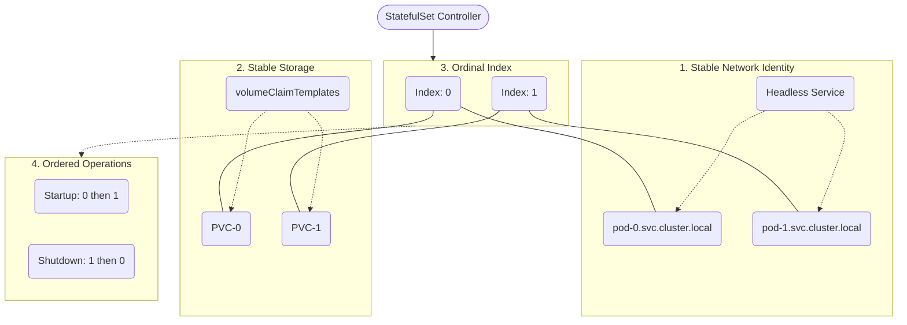

# 05 – StatefulSet Fundamentals

A **StatefulSet** is used to manage **stateful applications** where 
* **identity,
* **stable storage,**
* **ordered behavior matter**.

---

# 1. What Is a StatefulSet?

A **StatefulSet** is a Kubernetes workload object that manages Pods with:

* **Stable network identity**
* **Stable persistent storage**
* **Ordered creation, update, and deletion**

It is mainly used for **stateful applications** like databases and clustered systems.

---

# 2. Why StatefulSets Exist

To understand **StatefulSets**, it only need to understand **four core components working together**. 

These components give StatefulSets their **unique behavior**.
* 1. Stable Network Identity (Headless Service)
* 2. Stable Storage (volumeClaimTemplates)
* 3. Ordinal Index (Pod Numbers)
* 4. Ordered Operations (Lifecycle Control)

    ## **1. Stable Network Identity (Headless Service)**

    StatefulSets **require a Headless Service** (`clusterIP: None`).

    This service:
    
    * Creates a **unique DNS record for each Pod**
    * Allows Pods to **talk directly to each other**
    * Is critical for **databases and clustered applications**
    
    ### Pod DNS Format
    
    ```
    <pod-name>.<headless-service-name>.<namespace>.svc.cluster.local
    
    mysql-0.mysql-headless.default.svc.cluster.local
    ```
    
    
    > Each Pod keeps the **same hostname even after restart**
    
    ---
    
    ## **2. Stable Storage (volumeClaimTemplates)**
    
    StatefulSets use `volumeClaimTemplates` to provide **dedicated storage per Pod**.
    
    * Each Pod gets **its own PVC**
    * Storage is **not shared**
    * When a Pod is recreated, it **reconnects to the same disk**
    
    ### Example
    
    | Pod     | PVC         |
    | ------- | ----------- |
    | mysql-0 | pvc-mysql-0 |
    | mysql-1 | pvc-mysql-1 |
    
    > If `mysql-1` crashes, it comes back with **the same data**
    
    ---
    
    ## **3. Ordinal Index (Pod Numbers)**
    
    StatefulSet Pods are numbered:
    
    ```
    0, 1, 2, ... N-1
    ```
    
    This number controls:
    
    * Pod **name**
    * Pod **DNS identity**
    * Pod **storage identity**
    * Pod **startup and shutdown order**
    
    ### Example Pod Names
    
    ```
    mysql-0
    mysql-1
    mysql-2
    ```
    
    > The ordinal number is permanent for that Pod identity
    
    ---
    
    ## **4. Ordered Operations (Lifecycle Control)**
    
    Unlike Deployments, StatefulSets operate in a **strict order**.
    
    ### Pod Creation Order
    
    ```
    pod-0 → pod-1 → pod-2
    ```
    
    * Next Pod starts **only after** the previous Pod is **Running and Ready**
    
    ### Pod Deletion Order
    
    ```
    pod-2 → pod-1 → pod-0
    ```
    
    * Last Pod created is **deleted first** (LIFO)
    
    ---


# 3 . StatefulSet Architecture (Relationship)



> **StatefulSet = Stable identity + Stable storage + Ordered behavior**

---

# 4. When to Use StatefulSet

Use StatefulSet when your application needs:

* **Stable hostname (DNS)**
  Each Pod keeps a **fixed, predictable DNS name** across restarts, allowing other Pods or clients to always reach the same instance.

* **Persistent data per Pod**
  Every Pod has its **own dedicated storage** that remains intact even if the Pod is restarted or rescheduled.

* **Leader–follower architecture**
  A system design where **one Pod acts as the leader** (handles writes/coordination) and **others act as followers** (replication/reads).

* **Ordered scaling**
  Pods are **created and removed in a strict sequence** (0 → N on scale-up, N → 0 on scale-down) to maintain consistency.

* **Safe rolling updates**
  Pods are updated **one at a time in order**, ensuring data safety and application stability during upgrades.


### Common Examples

* MySQL
* PostgreSQL
* MongoDB
* Kafka
* Zookeeper
* Redis (clustered)

---


> Each Pod has **its own storage** and **never shares PVCs**

---


# 5. Minimal StatefulSet YAML

```yaml
apiVersion: apps/v1
kind: StatefulSet
metadata:
  name: nginx-sts
spec:
  serviceName: nginx-headless
  replicas: 3
  selector:
    matchLabels:
      app: nginx
  template:
    metadata:
      labels:
        app: nginx
    spec:
      containers:
      - name: nginx
        image: nginx:1.25
        ports:
        - containerPort: 80
  volumeClaimTemplates:
  - metadata:
      name: data
    spec:
      accessModes: ["ReadWriteOnce"]
      resources:
        requests:
          storage: 1Gi
```

---

# 6. Key Fields Explained

| Field                | Purpose                    |
| -------------------- | -------------------------- |
| serviceName          | Headless Service for DNS   |
| replicas             | Number of Pods             |
| selector             | Matches Pods               |
| template             | Pod definition             |
| volumeClaimTemplates | Per-Pod persistent storage |

---

# 7. Headless Service (Mandatory)

StatefulSet **requires a Headless Service**.

```yaml
apiVersion: v1
kind: Service
metadata:
  name: nginx-headless
spec:
  clusterIP: None
  selector:
    app: nginx
  ports:
  - port: 80
```

> Without this, StatefulSet DNS will **not work**

---

# 8. Scaling a StatefulSet

```bash
kubectl scale statefulset nginx-sts --replicas=5
```

Behavior:

* New Pods created **in order**
* Each new Pod gets a **new PVC**

---

# 9. Self-Healing Behavior

If a Pod crashes:

* Pod is recreated with **same name**
* Same PVC is reattached
* Data remains intact

Example:

```bash
kubectl delete pod nginx-sts-1
```

Result:

```
nginx-sts-1 recreated with same storage
```

---

# 10. Rolling Updates in StatefulSet

By default:

* Updates happen **one Pod at a time**
* Starts from **highest ordinal**
* Maintains application stability

```bash
kubectl rollout status statefulset nginx-sts
```

---

# 11. Common Mistakes

* Using StatefulSet without Headless Service
* Expecting shared storage
* Using StatefulSet for stateless apps
* Deleting PVCs accidentally
* Not understanding ordered behavior

---

# 12. Best Practices

1. Use StatefulSet **only when identity matters**
2. Always create a Headless Service
3. Use volumeClaimTemplates correctly
4. Backup data regularly
5. Test scaling and recovery behavior

