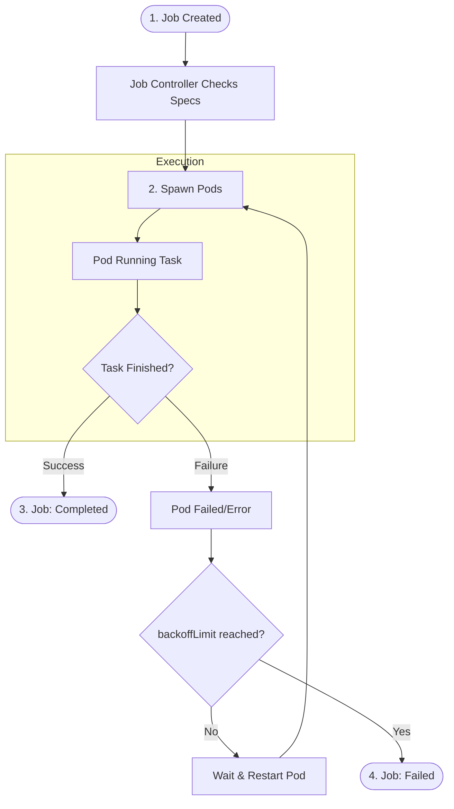

# Job Fundamentals (Kubernetes)

A **Job** is used to run **one-time or batch tasks** in Kubernetes and ensure they **complete successfully**.

---

## 1. What Is a Job?

A **Job** is a Kubernetes workload object that:

* Runs a Pod **to completion**
* Retries automatically if the Pod fails
* Stops once the task is **successfully finished**

> Unlike Deployments, Jobs are **not long-running services**.

---

## 2. Why Jobs Exist

Jobs are needed for tasks that:

* Must **finish once**
* Should **retry on failure**
* Do not need continuous running

Examples:

* Database migration
* Backup tasks
* Report generation
* One-time scripts

---

## 3. Job vs Deployment (Quick View)

| Deployment            | Job                 |
| --------------------- | ------------------- |
| Runs continuously     | Runs once and exits |
| Restarts Pods forever | Stops after success |
| Used for services     | Used for tasks      |
| Long-running          | Short-lived         |

---

## 4. How a Job Works (Simple Flow)

1. Job creates a Pod
2. Pod runs the task
3. If task **fails** → Job retries
4. If task **succeeds** → Job completes

---

## 5. Key Job Concepts

### Pod Completion

* Job tracks **exit status**
* Exit code `0` → Success
* Non-zero → Failure → Retry

---

### Restart Policy

Jobs use:

```yaml
restartPolicy: OnFailure
```

Meaning:

* Retry only when the container fails
* Do not restart after success

---

### Backoff Limit

Controls retries:

```yaml
backoffLimit: 3
```

* Job retries **up to 3 times**
* After that → Job marked **Failed**

---

## 6. Job Types (Beginner Level)

### Single Job (Default)

* One Pod
* One successful completion

Example:

* Run a shell script once

---

### Parallel Job (Basic Idea)

* Multiple Pods run in parallel
* Used for batch processing

(Not required for beginners initially)

---

## 7. Minimal Job YAML

```yaml
apiVersion: batch/v1
kind: Job
metadata:
  name: hello-job
spec:
  backoffLimit: 2
  template:
    spec:
      restartPolicy: OnFailure
      containers:
      - name: hello
        image: busybox
        command: ["sh", "-c", "echo Hello Kubernetes"]
```

---

## 8. Running and Checking a Job

Create the Job:

```bash
kubectl apply -f job.yaml
```

Check status:

```bash
kubectl get jobs
```

Check Pod logs:

```bash
kubectl logs job/hello-job
```

Expected output:

```
Hello Kubernetes
```

---

## 9. Job Completion States

| Status   | Meaning                    |
| -------- | -------------------------- |
| Running  | Pod executing              |
| Complete | Task finished successfully |
| Failed   | Retries exceeded           |

---

## 10. When to Use a Job

Use Job when:

* Task must **finish once**
* Retrying on failure is required
* No service or load balancer needed

Do NOT use Job for:

* APIs
* Web servers
* Background daemons

---

## 11. Common Mistakes

* Using Job for long-running services
* Missing `restartPolicy`
* Forgetting to check logs
* High `backoffLimit` without reason

---

## 12. Best Practices

1. Keep Jobs **short-lived**
2. Set reasonable retry limits
3. Clean up completed Jobs
4. Log output properly
5. Use CronJob for scheduled runs

---

### One-Line Summary

> **Job = Run once, retry on failure, exit on success**

---


# Flow chart of Job


