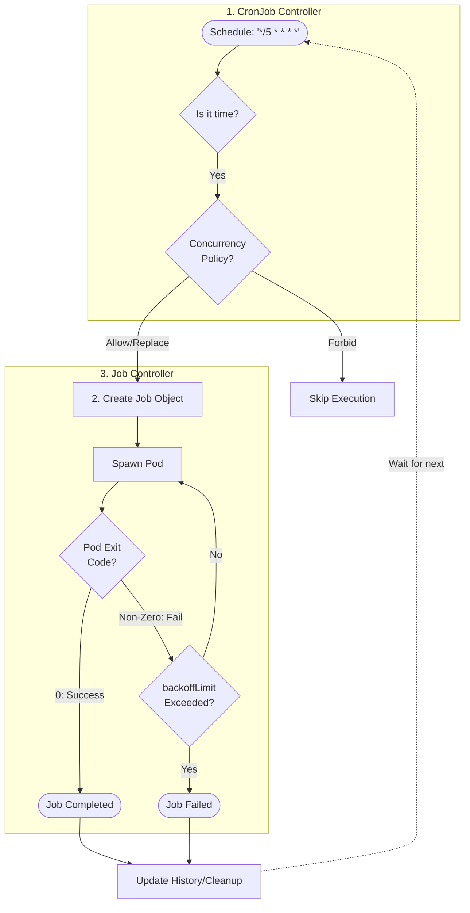

# 1. What Is a CronJob?

A **CronJob** in Kubernetes runs **Jobs on a scheduled basis**, similar to Linux `cron`.

It defines:

* **What task to run** (Job spec)
* **When to run it** (schedule)
* **How many retries** (backoffLimit)
* **Concurrency policy** (how overlapping runs are handled)
---

# 2. Why CronJobs Exist

Without CronJobs, you would need to:

* Manually trigger Jobs every time
* Write external scripts to run tasks on schedule

With CronJobs:

* Jobs run **automatically** at specified times
* Failures are retried according to your specification
* You can define concurrency rules

---

# 3. Core Concepts

* **Schedule** – Cron expression defining when the Job runs
* **Job Template** – The actual task to execute
* **Concurrency Policy** – Rules for handling overlapping executions (`Allow`, `Forbid`, `Replace`)
* **Starting Deadline** – Optional: how late the Job can start if missed
* **Backoff Limit** – How many retries before marking Job as failed

---

# 4. CronJob Lifecycle



### How to Read

* CronJob triggers a **Job** at a scheduled time
* Job creates **Pod(s)** to run the task
* Pod success → Job completes
* Pod failure → Job retries until `backoffLimit`
* CronJob triggers the next Job according to the schedule

---

# 5. Minimal CronJob YAML Example

```yaml
apiVersion: batch/v1
kind: CronJob
metadata:
  name: hello-cron
spec:
  schedule: "*/5 * * * *" # every 5 minutes
  jobTemplate:
    spec:
      template:
        spec:
          containers:
          - name: hello
            image: busybox
            args:
            - /bin/sh
            - -c
            - date; echo "Hello from CronJob"
          restartPolicy: OnFailure
```

> This CronJob runs **every 5 minutes**, prints the date and message, and retries if it fails.

---

# 6. Key Fields Explained

| Field                     | Purpose                                                                    |
| ------------------------- | -------------------------------------------------------------------------- |
| `schedule`                | Cron expression for Job execution                                          |
| `jobTemplate`             | Template for the Job to run                                                |
| `restartPolicy`           | Pod restart behavior (`OnFailure` or `Never`)                              |
| `concurrencyPolicy`       | What to do if previous Job is still running (`Allow`, `Forbid`, `Replace`) |
| `startingDeadlineSeconds` | Optional: max delay to start a Job                                         |

---

# 7. Verification Commands

```bash
# Create CronJob
kubectl apply -f cronjob.yaml

# List CronJobs
kubectl get cronjob

# View Jobs created by CronJob
kubectl get jobs

# Watch Pods created by Jobs
kubectl get pods -w

# Describe CronJob
kubectl describe cronjob <name>
```

---

# 8. Common Mistakes

* Using CronJob for long-running tasks
* Ignoring `concurrencyPolicy` → overlapping Jobs
* Setting too small `startingDeadlineSeconds` → Jobs skipped
* Not setting `restartPolicy` → failed Pods not retried

---

# 9. Best Practices

1. Use CronJobs for **short, repeatable tasks**
2. Always define `restartPolicy: OnFailure`
3. Set `concurrencyPolicy` based on your use case
4. Monitor Jobs created by CronJob to ensure execution
5. Avoid running multiple heavy Jobs simultaneously
