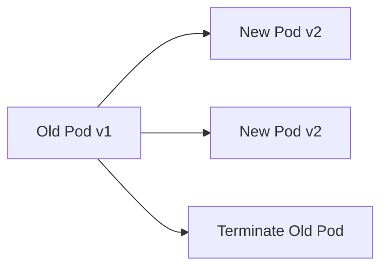

````md
# 04 – Deployment Fundamentals in Kubernetes

## 1. What Is a Deployment?

A **Deployment** is a Kubernetes object that provides **declarative management of Pods** for stateless applications.

It tells Kubernetes:
- **How many Pods** should be running
- **Which container image** to use
- **How updates should happen**
- **How to recover from failures**

### Plain-English Definition

> A Deployment ensures that **the desired number of identical Pods are always running**, and it **automatically handles updates, rollbacks, and self-healing**.

---

## 2. Why Deployments Exist

### The Problem (Without Deployments)

- Manual Pod creation
- No automatic restart or replacement
- Risky updates (downtime)
- No rollback mechanism

### The Solution (With Deployments)

Deployments provide:
- **Self-healing**
- **Rolling updates**
- **Rollback to previous versions**
- **Scaling**
- **Declarative state management**

---

## 3. Core Concepts (Pillars)

- **Desired State**
- **ReplicaSet**
- **Pods**
- **Rolling Updates**
- **Rollback**
- **Scaling**
- **Self-Healing**

---

## 4. Deployment Architecture (Relationship View)

```mermaid
flowchart TD
    A[Deployment] --> B[ReplicaSet]
    B --> C[Pod 1]
    B --> D[Pod 2]
    B --> E[Pod 3]
````

> ⚠️ You **never manage ReplicaSets or Pods directly** when using Deployments.

---

## 5. Deployment Control Loop (How It Works)

```mermaid
sequenceDiagram
    participant U as User
    participant D as Deployment Controller
    participant R as ReplicaSet
    participant P as Pods

    U->>D: Apply Deployment YAML
    D->>R: Create / Update ReplicaSet
    R->>P: Create Pods
    P-->>D: Report Status
    D->>R: Reconcile Desired State
```

---

## 6. Basic Deployment YAML (Minimal)

```yaml
apiVersion: apps/v1
kind: Deployment
metadata:
  name: nginx-deployment
spec:
  replicas: 3
  selector:
    matchLabels:
      app: nginx
  template:
    metadata:
      labels:
        app: nginx
    spec:
      containers:
      - name: nginx
        image: nginx:1.25
        ports:
        - containerPort: 80
```

---

## 7. Key Fields Explained

| Field        | Purpose                  |
| ------------ | ------------------------ |
| `replicas`   | Desired number of Pods   |
| `selector`   | Links Deployment to Pods |
| `template`   | Pod definition           |
| `image`      | Application version      |
| `containers` | Runtime configuration    |

---

## 8. Scaling a Deployment

### Manual Scaling

```bash
kubectl scale deployment nginx-deployment --replicas=5
```

### Declarative Scaling

```yaml
spec:
  replicas: 5
```

---

## 9. Rolling Updates (Zero Downtime)

Deployments update Pods **gradually**, not all at once.



### Update Strategy (Default)

```yaml
strategy:
  type: RollingUpdate
  rollingUpdate:
    maxUnavailable: 1
    maxSurge: 1
```

---

## 10. Rollback (Safety Net)

### View History

```bash
kubectl rollout history deployment nginx-deployment
```

### Rollback to Previous Version

```bash
kubectl rollout undo deployment nginx-deployment
```

---

## 11. Self-Healing with Deployments

If a Pod crashes or is deleted:

* Deployment detects mismatch
* ReplicaSet creates a new Pod
* Desired state is restored automatically

```bash
kubectl delete pod <pod-name>
```

---

## 12. Cheat Sheet – Essential Commands

```bash
# Create deployment
kubectl apply -f deployment.yaml

# List deployments
kubectl get deployments

# Describe deployment
kubectl describe deployment <name>

# Watch rollout
kubectl rollout status deployment <name>

# Restart deployment
kubectl rollout restart deployment <name>

# Scale deployment
kubectl scale deployment <name> --replicas=3

# Delete deployment
kubectl delete deployment <name>
```

---

## 13. Common Mistakes (Beginner → Production)

* ❌ Managing Pods directly instead of Deployment
* ❌ Missing or incorrect `selector`
* ❌ Using `latest` image tag
* ❌ No resource requests/limits
* ❌ No probes

---

## 14. Best Practices (Production-Ready)

1. **Always use Deployments for stateless apps**
2. **Pin image versions (avoid `latest`)**
3. **Use rolling updates**
4. **Enable probes and resource limits**

---

## 15. Exam Tip (CKA / CKAD)

> Deployments manage **ReplicaSets**, not Pods directly.

If a Pod is deleted:

* Deployment → ReplicaSet → New Pod

---

## 16. Key Takeaway

> **Deployment = Desired State + Self-Healing + Safe Updates**

If you understand Deployments well, you already understand:

* Scaling
* Rollouts
* Rollbacks
* High availability

---

## 17. What’s Next?

Recommended next topics:

* ReplicaSet deep dive
* StatefulSet vs Deployment
* RollingUpdate vs Recreate strategy
* HPA with Deployments

---

```

If you want, next I can add:
- 🔥 **Deployment rolling update failure demo**
- 📉 **CrashLoopBackOff troubleshooting**
- 🎓 **CKA/CKAD Deployment exam questions**
- 🧪 **Blue-Green & Canary deployments in K8s**

Just tell me, **Jhon Wick** 👊
```
