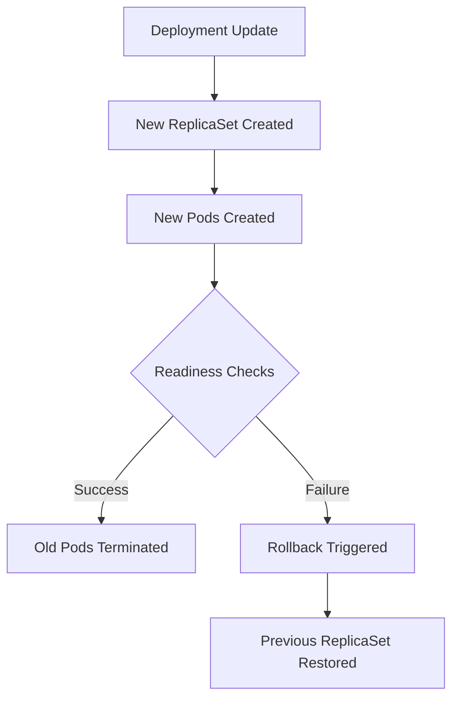

# 03 – Rollouts and Rollbacks in Kubernetes

## Overview

In Kubernetes, **rollouts and rollbacks** are mechanisms that allow you to **safely deploy new versions of applications** and **revert to a previous stable version** if something goes wrong.

This capability is **critical in production** to ensure:

* Zero or minimal downtime
* Fast recovery from faulty deployments
* Controlled application upgrades

Kubernetes manages rollouts and rollbacks primarily through **Deployments**.

---

## What Is a Rollout?

A **rollout** is the process of **updating Pods to a new version** of an application.

When you:

* Update a container image
* Change environment variables
* Modify resource limits
* Update configuration

Kubernetes creates a **new ReplicaSet** and gradually replaces old Pods with new ones.

---

## What Is a Rollback?

A **rollback** is the process of **reverting a Deployment to a previous revision**.

This is used when:

* Application crashes after deployment
* Readiness probes fail
* Performance degrades
* Bugs are detected in production

Kubernetes stores **revision history**, making rollbacks fast and reliable.

---

## Rollout and Rollback Flow




---

## Key Kubernetes Objects Involved

| Object             | Role                           |
| ------------------ | ------------------------------ |
| Deployment         | Manages rollouts and rollbacks |
| ReplicaSet         | Maintains Pod replicas         |
| Pod                | Runs the application           |
| kubelet            | Executes Pod lifecycle         |
| Controller Manager | Handles state reconciliation   |

---

## Basic Rollout Example

### Sample Deployment

```yaml
apiVersion: apps/v1
kind: Deployment
metadata:
  name: nginx-deploy
spec:
  replicas: 3
  selector:
    matchLabels:
      app: nginx
  template:
    metadata:
      labels:
        app: nginx
    spec:
      containers:
      - name: nginx
        image: nginx:1.25
```

---

### Apply Deployment

```bash
kubectl apply -f deployment.yaml
```

---

## Triggering a Rollout

### Update Image Version

```bash
kubectl set image deployment/nginx-deploy nginx=nginx:1.26
```

This triggers:

* New ReplicaSet creation
* Gradual Pod replacement

---

### Check Rollout Status

```bash
kubectl rollout status deployment/nginx-deploy
```

---

## Viewing Rollout History

```bash
kubectl rollout history deployment/nginx-deploy
```

### Output Example

```text
REVISION  CHANGE-CAUSE
1         Initial deploy
2         Updated nginx image
```

---

## Rolling Back a Deployment

### Rollback to Previous Revision

```bash
kubectl rollout undo deployment/nginx-deploy
```

---

### Rollback to a Specific Revision

```bash
kubectl rollout undo deployment/nginx-deploy --to-revision=1
```

---

## Rollout Strategy (Important Concept)

By default, Kubernetes uses **RollingUpdate** strategy.

### RollingUpdate Parameters

| Parameter      | Description                        |
| -------------- | ---------------------------------- |
| maxUnavailable | Max Pods allowed to be unavailable |
| maxSurge       | Extra Pods allowed during update   |

### Example

```yaml
strategy:
  type: RollingUpdate
  rollingUpdate:
    maxUnavailable: 1
    maxSurge: 1
```

This ensures **zero downtime deployments**.

---

## Failure Scenario (Real-World)

### What Happens If:

* Image is broken
* App fails readiness probe

Result:

* Rollout **pauses**
* Pods stay in `CrashLoopBackOff`
* Old Pods may still be serving traffic

### Check Deployment State

```bash
kubectl describe deployment nginx-deploy
```

---

## Pause and Resume Rollouts

### Pause Rollout

```bash
kubectl rollout pause deployment/nginx-deploy
```

### Resume Rollout

```bash
kubectl rollout resume deployment/nginx-deploy
```

Used for:

* Manual verification
* Canary-style deployments

---

## Rollouts vs Rollbacks (Quick Comparison)

| Rollout                | Rollback                 |
| ---------------------- | ------------------------ |
| Deploy new version     | Revert to old version    |
| Creates new ReplicaSet | Uses previous ReplicaSet |
| Used during upgrades   | Used during failures     |
| Forward movement       | Recovery mechanism       |

---

## Common Production Commands (Must-Know)

```bash
kubectl rollout status deployment/<name>
kubectl rollout history deployment/<name>
kubectl rollout undo deployment/<name>
kubectl set image deployment/<name> <container>=<image>
kubectl describe deployment <name>
```

---

## Why Rollouts & Rollbacks Matter in DevOps

* Enable **safe application upgrades**
* Reduce downtime during releases
* Allow **instant recovery** from bad deployments
* Core concept behind **CI/CD pipelines**
* Foundation for **canary and blue-green deployments**

> **No rollbacks = no production confidence**

---

## Interview-Level Takeaways

* Rollouts create new ReplicaSets
* Rollbacks reuse old ReplicaSets
* Kubernetes stores revision history
* Readiness probes control rollout success
* Deployment controller ensures desired state

---

## One-Line DevOps Summary

> **Rollouts move you forward safely. Rollbacks save you when things break. Kubernetes gives you both.** 
