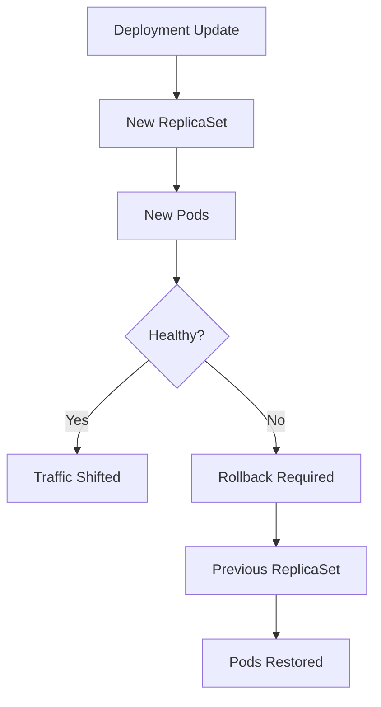

# Rollback-guide.md

## Kubernetes Rollback Guide (Production Recovery Playbook)

---

## Why Rollbacks Matter

In production, **not every deployment succeeds**.

A rollback is your **emergency brake** when:

* Applications crash after release
* Pods enter `CrashLoopBackOff`
* Readiness probes fail
* Latency or error rate increases
* Configuration changes break the app

> **Fast rollback = minimal downtime**

---

## When to Roll Back (Decision Triggers)

Rollback immediately if you observe:

* HTTP status ≠ 200
* Pods failing readiness/liveness probes
* High restart count
* Application errors in logs
* Alerts triggered after deployment

---

## Rollback Architecture (How It Works)



---

## Step 1: Identify Deployment State

```bash
kubectl get deployments
kubectl get pods
```

Check for:

* `CrashLoopBackOff`
* `ImagePullBackOff`
* Pods not READY

---

## Step 2: Check Rollout Status

```bash
kubectl rollout status deployment/<deployment-name>
```

If rollout is:

* **stuck**
* **failing**
* **timed out**

➡ Proceed to rollback.

---

## Step 3: View Rollout History

```bash
kubectl rollout history deployment/<deployment-name>
```

### Example Output

```text
REVISION  CHANGE-CAUSE
1         Initial stable version
2         Image updated to v2
3         Config change
```

---

## Step 4: Perform Rollback

### Rollback to Previous Version

```bash
kubectl rollout undo deployment/<deployment-name>
```

This restores the **last known good ReplicaSet**.

---

### Rollback to a Specific Revision

```bash
kubectl rollout undo deployment/<deployment-name> --to-revision=1
```

Used when:

* Multiple bad releases occurred
* You know exactly which version was stable

---

## Step 5: Verify Rollback Success

```bash
kubectl rollout status deployment/<deployment-name>
kubectl get pods
```

Confirm:

* Pods are `Running`
* All Pods are `READY`
* Restart count stabilizes

---

## Pause Rollout (Before Rollback)

If rollout is partially complete:

```bash
kubectl rollout pause deployment/<deployment-name>
```

This prevents:

* Further Pod replacement
* Additional impact

---

## Resume After Fix

```bash
kubectl rollout resume deployment/<deployment-name>
```

---

## Common Rollback Failure Scenarios

### Image Failure

```text
ImagePullBackOff
CrashLoopBackOff
```

**Fix:** Rollback to previous image version.

---

### Configuration Failure

```text
App starts but fails health checks
```

**Fix:** Rollback config change or Secret.

---

### Resource Exhaustion

```text
OOMKilled
```

**Fix:** Rollback resource limits.

---

## Rollback Safety Best Practices

* Always set **revision history limit**

```yaml
spec:
  revisionHistoryLimit: 5
```

* Use **readiness probes**
* Roll back **before scaling**
* Verify logs after rollback

---

## Commands You Must Memorize (Interview + Prod)

```bash
kubectl rollout undo deployment/<name>
kubectl rollout history deployment/<name>
kubectl rollout status deployment/<name>
kubectl rollout pause deployment/<name>
kubectl rollout resume deployment/<name>
```

---

## Linux & systemd Analogy (Easy Memory Trick)

| Linux systemd    | Kubernetes             |
| ---------------- | ---------------------- |
| Restart service  | Rollback deployment    |
| Previous binary  | Previous ReplicaSet    |
| systemctl status | kubectl rollout status |

---

## Post-Rollback Checklist

* Application responding
* Error rate reduced
* Alerts resolved
* Logs stable
* Root cause identified

---

## One-Line DevOps Rule

> **If rollout hurts production, rollback first — analyze later.**

---

## Final Thought

Rollbacks are not failures.
They are **proof of mature DevOps engineering**.

**Fast rollback = high confidence releases**
