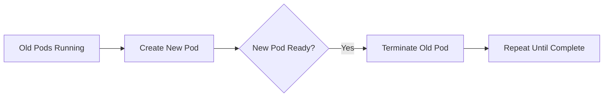
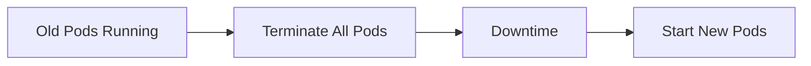
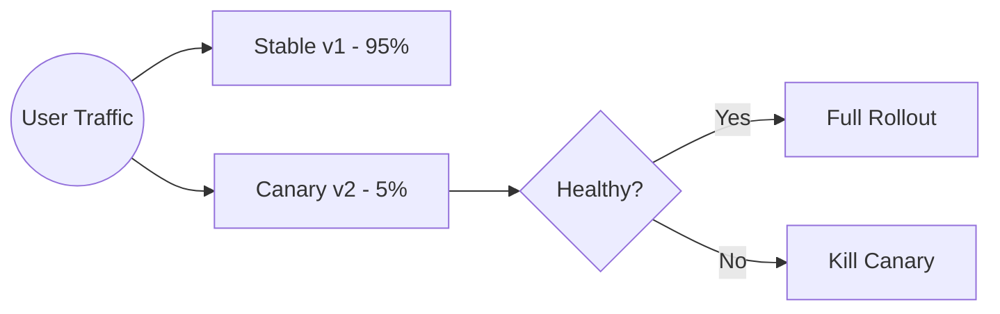
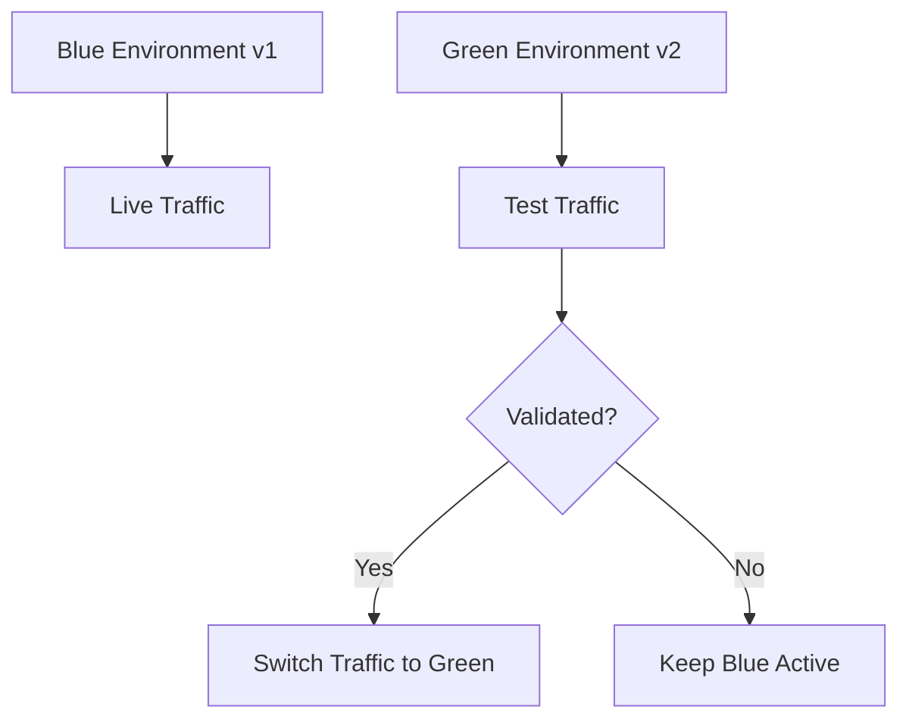

# update-strategy.md

## Kubernetes Update Strategies (Zero-Downtime Deployments)

## 1. Why Update Strategy Matters

When you update an application in Kubernetes, **pods cannot be updated in-place**.
Kubernetes must **replace old pods with new ones**.

An **update strategy** defines:

* How many pods are updated at a time
* Whether downtime is allowed
* How traffic is handled during upgrades

> Wrong strategy = downtime

> Correct strategy = seamless user experience

## 2. Types of Update Strategies in Kubernetes

Kubernetes supports **two main update strategies** for Deployments:

1. **RollingUpdate (default)**
2. **Recreate**

## 3. RollingUpdate Strategy (Recommended)

### What It Does

* Gradually replaces old pods with new pods
* Ensures application stays available
* Supports **zero-downtime deployments**


### RollingUpdate Flow




### RollingUpdate Configuration

```yaml
strategy:
  type: RollingUpdate
  rollingUpdate:
    maxSurge: 1
    maxUnavailable: 1
```

### Key Parameters Explained

| Field            | Meaning                                      |
| ---------------- | -------------------------------------------- |
| `maxSurge`       | Extra pods allowed above desired replicas    |
| `maxUnavailable` | Pods allowed to be unavailable during update |

### Example

```yaml
replicas: 3
maxSurge: 1
maxUnavailable: 1
```

> Kubernetes may run **4 pods temporarily**

> At least **2 pods always stay available**


## 4. Recreate Strategy (Downtime Allowed)

### What It Does

* Terminates **all old pods**
* Then starts **new pods**
* Causes downtime

---

### Recreate Flow




### Recreate Configuration

```yaml
strategy:
  type: Recreate
```

### When to Use Recreate

* Database schema changes
* Single-instance apps
* Legacy workloads
* Apps that cannot run multiple versions

## 5. Full Deployment Example (Rolling Update)

```yaml
apiVersion: apps/v1
kind: Deployment
metadata:
  name: app-deployment
spec:
  replicas: 3
  strategy:
    type: RollingUpdate
    rollingUpdate:
      maxSurge: 1
      maxUnavailable: 0
  template:
    spec:
      containers:
      - name: app
        image: myapp:v2
```

## 6. Observing Update Strategy in Action

### Apply Update

```bash
kubectl apply -f deployment.yaml
```

### Watch Rollout

```bash
kubectl rollout status deployment/app-deployment
```

### Watch Pods Live

```bash
kubectl get pods -w
```

## 7. Common Update Failures

| Issue            | Cause                     |
| ---------------- | ------------------------- |
| Pods stuck       | Readiness probe failing   |
| Downtime         | `maxUnavailable` too high |
| Rollout paused   | Manual pause or failure   |
| CrashLoopBackOff | Bad image or config       |

## 8. Pause & Resume Update Strategy

### Pause Deployment

```bash
kubectl rollout pause deployment/app-deployment
```

### Resume Deployment

```bash
kubectl rollout resume deployment/app-deployment
```

## 9. Update Strategy vs Rollback

| Scenario      | Action               |
| ------------- | -------------------- |
| Slow rollout  | Tune `maxSurge`      |
| Failed update | Rollback             |
| Config issue  | Pause rollout        |
| Bad image     | Rollback immediately |

## 10. Best Practices (Production)

* Always use **RollingUpdate**
* Set `maxUnavailable: 0` for critical apps
* Configure **readiness probes**
* Monitor rollout status
* Keep revision history

```yaml
revisionHistoryLimit: 5
```

## 11. Advanced Update Strategies (Beyond Basics)

Modern production systems rarely rely on simple rolling updates alone.
To reduce risk further, teams use **progressive delivery strategies**.


## 12. Canary Update Strategy (Low-Risk Deployment)

### What is Canary Deployment?

A **Canary deployment** releases the new version to a **small subset of users/pods first**.
If it behaves well, traffic is gradually increased.

> Think of it as **testing in production safely**


### Canary Flow



### Canary Deployment Example

```yaml
apiVersion: apps/v1
kind: Deployment
metadata:
  name: app-canary
spec:
  replicas: 1
  template:
    spec:
      containers:
      - name: app
        image: myapp:v2
```

Stable deployment still runs with higher replicas.

### When to Use Canary

* Critical applications
* New feature rollouts
* Performance-sensitive systems
* Experimentation & A/B testing

## 13. Blue-Green Deployment Strategy (Instant Switch)

### What is Blue-Green?

Two **identical environments** run simultaneously:

* **Blue** → current production
* **Green** → new version

Traffic switches instantly once Green is validated.

### Blue-Green Flow



### Kubernetes Blue-Green (Using Services)

* Both versions run
* Service selector decides traffic

```yaml
selector:
  app: myapp
  version: green
```

### Pros & Cons

| Pros                | Cons                          |
| ------------------- | ----------------------------- |
| Instant rollback    | Higher resource usage         |
| No partial failures | Needs careful traffic control |

---

## 14. Update Strategy Failure Lab (Hands-On)

### Goal

Understand **how bad configurations cause failures**.

### Lab 1: Misconfigured Rolling Update

```yaml
rollingUpdate:
  maxUnavailable: 3
  maxSurge: 0
```

**Result:**
* All pods may go down
* Downtime occurs

### Lab 2: Readiness Probe Failure

```yaml
readinessProbe:
  httpGet:
    path: /health
    port: 8080
```

But app doesn’t expose `/health`.

**Result:**

* Pods never become READY
* Rollout stuck

### Lab 3: Bad Image Tag

```yaml
image: myapp:latest
```

**Result:**

* Non-deterministic deployments
* Unexpected crashes

### Fix Checklist

* Use readiness probes correctly
* Avoid `latest` tag
* Tune `maxUnavailable`
* Monitor rollout status

## 15. Choosing the Right Update Strategy

| Scenario                | Best Strategy |
| ----------------------- | ------------- |
| Stateless web apps      | RollingUpdate |
| Critical production     | Canary        |
| Zero tolerance downtime | Blue-Green    |
| Legacy apps             | Recreate      |

## 16. Interview Cheat Sheet (Must Memorize)

### Concepts

* Pods are **replaced**, not updated
* Rollouts create **new ReplicaSets**
* Services maintain traffic routing
* Rollbacks restore previous ReplicaSet

### Commands

```bash
kubectl rollout status deployment/app
kubectl rollout history deployment/app
kubectl rollout undo deployment/app
kubectl rollout pause deployment/app
kubectl rollout resume deployment/app
```

### One-Liners (Interview Gold)

* **RollingUpdate** → gradual replacement
* **Recreate** → stop then start
* **Canary** → small traffic first
* **Blue-Green** → instant switch
* **Rollback** → restore last stable state

## 17. Final DevOps Takeaway

> **Deployment is not about releasing code — it’s about protecting users.**

Mastering update strategies means:

* Fewer outages
* Faster recovery
* Higher confidence releases


