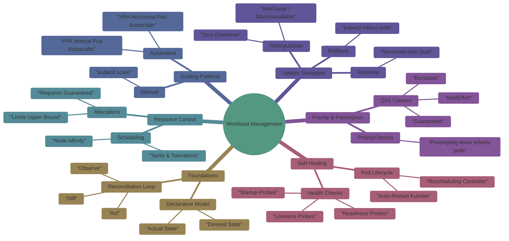

# Workload Overview

```mermaid
%%{init: {'theme': 'base', 'themeVariables': { 'primaryColor': '#a1cbbeff', 'primaryTextColor': '#333', 'primaryBorderColor': '#333', 'lineColor': '#aba0a0ff' }}}%%
mindmap
  root((Workload Management))
    Foundations
      Declarative Model
        "Desired State"
        "Actual State"
      Reconciliation Loop
        "Observe"
        "Diff"
        "Act"
    
    Self-Healing
      Pod Lifecycle
        "Auto-Restart Kubelet"
        "Rescheduling Controller"
      Health Checks
        "Liveness Probes"
        "Readiness Probes"
        "Startup Probes"

    Resource Control
      Allocations
        "Requests Guaranteed"
        "Limits Upper Bound"
      Scheduling
        "Node Affinity"
        "Taints & Tolerations"

    Scaling Patterns
      Manual
        "kubectl scale"
      Automated
        "HPA Horizontal Pod Autoscaler"
        "VPA Vertical Pod Autoscaler"

    Update Strategies
      RollingUpdate
        "Zero Downtime"
        "MaxSurge / MaxUnavailable"
      Recreate
        "Terminate then Start"
      Rollback
        "kubectl rollout undo"

    Priority & Preemption
      QoS Classes
        "Guaranteed"
        "Burstable"
        "BestEffort"
      PriorityClasses
        "Preempting lower priority pods"
```
