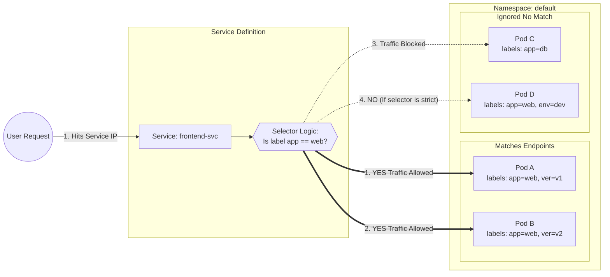
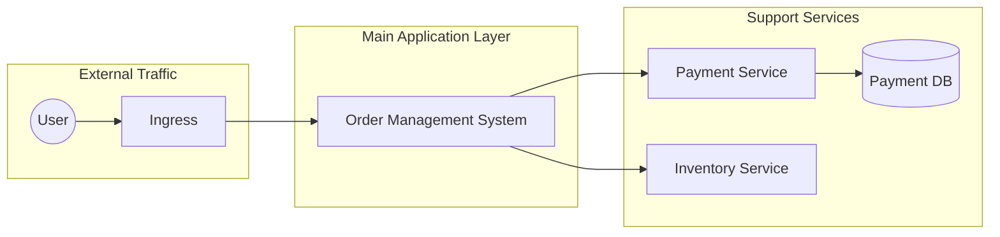
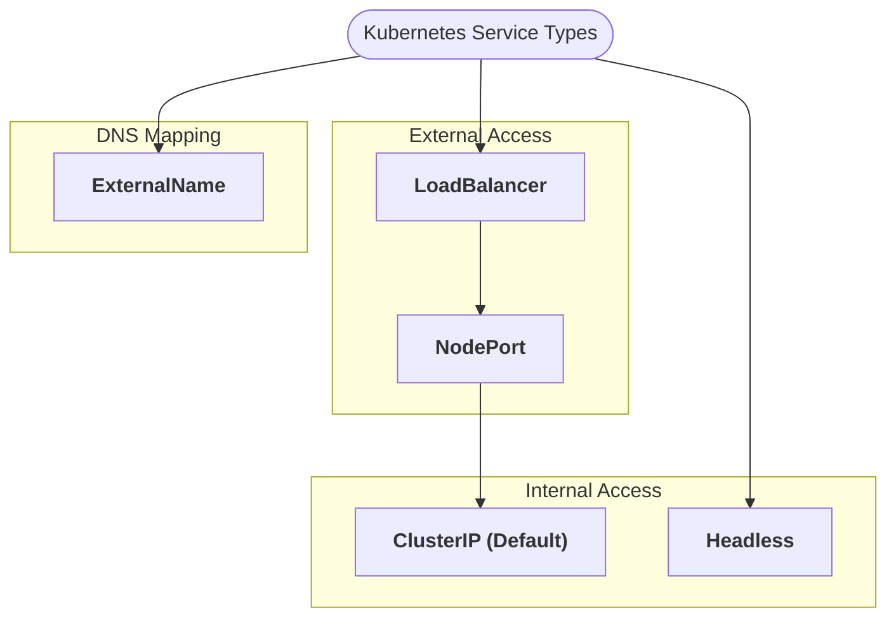
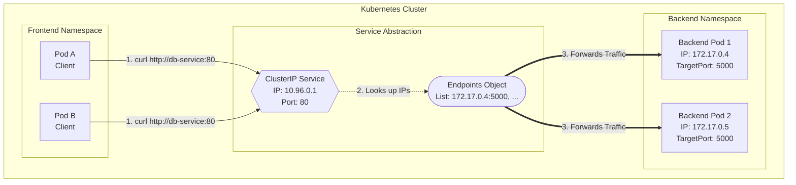
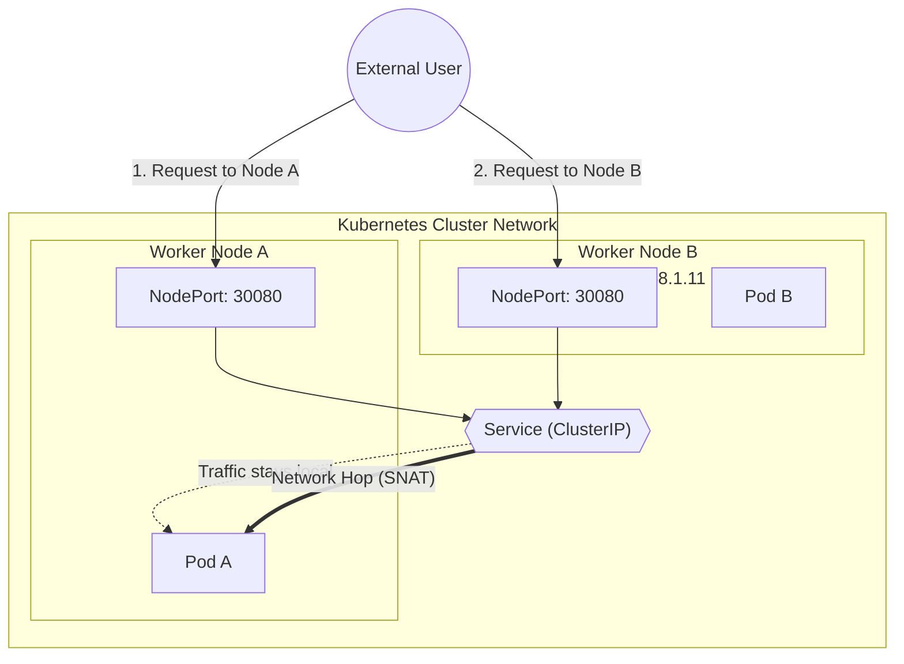
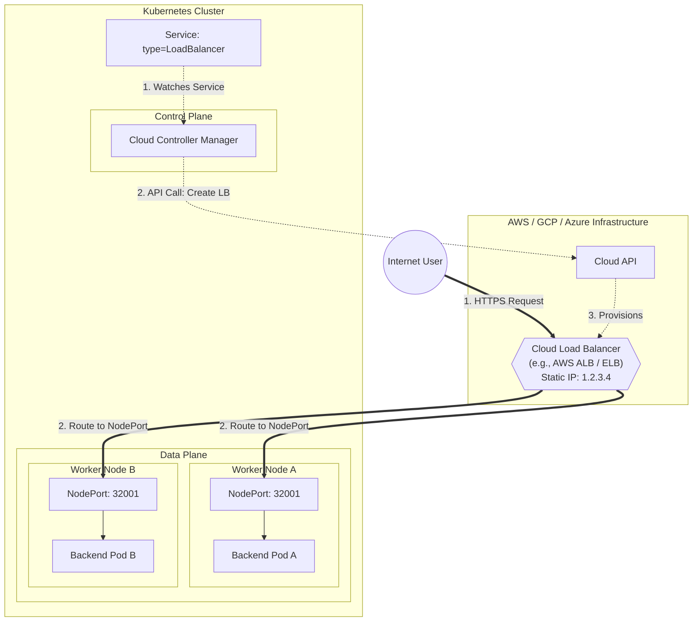
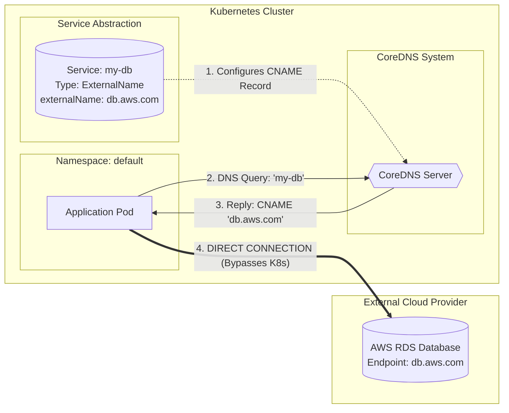
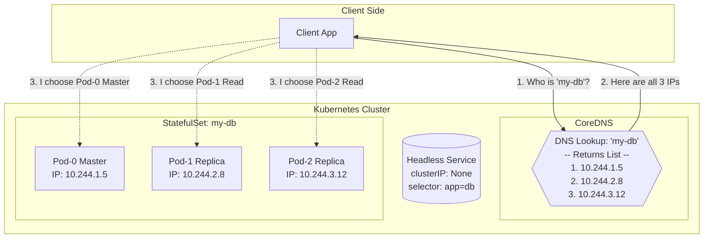
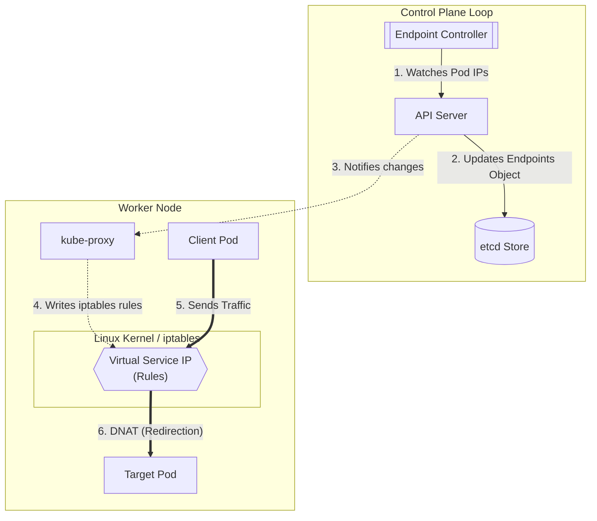

## 1. Kubernetes Service

**Definition :**
  
  In Kubernetes, Pods are **Ephemeral**
  
  > They can restart and change IP addresses.

  But `Service Discovery` provides a **stable way for applications to find and communicate with each other** inside the cluster.

**Core Functions :**

* **Service Discovery:** Allows Pods to find each other without needing to track individual IP addresses.
* **Load Balancing:** Distributes incoming requests evenly across all healthy Pods selected by a label selector.
* **Abstraction:** Decouples the frontend (consumers) from the backend (the actual Pods), ensuring zero downtime during Pod restarts or scaling.

---

---
### Upstream and Downstream in Kubernetes Microservices

In a Kubernetes-based microservices architecture, service interaction defines direction:

* **Upstream service**: The service that sends a request.
* **Downstream service**: The service that receives and processes that request.

### With Kubernetes Service Layer Included

---
## 2. Service Types
1.  **ClusterIP** – Internal service-to-service communication
2.  **NodePort** – External access via node IP and static port
3.  **LoadBalancer** – Production-grade external exposure using cloud LB
4.  **ExternalName** – DNS mapping to external services
5.  **Headless** – Direct Pod-level access without load balancing

### Overall Service types

---

## A. ClusterIP Service (Default – Internal Access)
### ClusterIP Service

**Definition**

A **ClusterIP Service** exposes an application **inside the Kubernetes cluster only** using a **stable internal IP and DNS name**. It is the **default Service type**.

**Functions**

* Provides internal service discovery via DNS
* Load-balances traffic across matching Pods
* Enables secure **east-west (service-to-service)** communication
* Decouples Pod lifecycle from network access

**Limitations**

* Not accessible from outside the cluster
* Requires Ingress, NodePort, or LoadBalancer for external access
* Depends on cluster networking (not reachable from host by default)

---
## B. NodePort Service (External via Node IP)

**Definition**

A **NodePort Service** exposes an application externally by opening a **static port on every cluster node**, allowing access via `<NodeIP>:<NodePort>`.

**Functions**

* Enables external access without a cloud load balancer
* Routes traffic from any node to backend Pods
* Automatically load-balances traffic across Pods
* Useful for testing, demos, and lab environments

**Limitations**

* Limited port range (`30000–32767`)
* Not secure by default (exposes node IPs)
* Not suitable for production at scale
* Requires users to know node IP addresses

---
## C. LoadBalancer Service (Cloud Provider)

**Definition**

A **LoadBalancer Service** exposes an application externally by provisioning a **cloud provider–managed load balancer** that routes internet traffic to Kubernetes Pods.

**Functions**

* Provides a public IP or DNS for external access
* Distributes traffic across backend Pods
* Integrates with cloud provider networking (AWS, GCP, Azure)
* Simplifies production-grade external exposure

**Limitations**

* Requires a supported cloud environment
* Incurs additional cloud cost
* Slower to provision compared to ClusterIP
* Limited control compared to Ingress controllers

---

## D. ExternalName Service (DNS Alias)

**Definition**

An **ExternalName Service** maps a Kubernetes Service name to an **external DNS name**, acting as a **DNS alias** instead of routing traffic to Pods.

**Functions**

* Provides internal DNS-based access to external services
* Avoids hardcoding external URLs in applications
* Simplifies service abstraction and configuration management
* Useful for accessing external databases or APIs

**Limitations**

* No load balancing or proxying by Kubernetes
* Works only at the DNS level
* Does not create Endpoints or a ClusterIP
* Cannot be used for TCP/UDP traffic control

---

## E. Headless Service (No ClusterIP)

### Headless Service

**Definition**

A **Headless Service** is a Service with `clusterIP: None` that **does not provide load balancing** and instead returns **direct DNS records for individual Pod IPs**.

**Functions**

* Enables direct Pod-to-Pod communication
* Provides stable network identity for Pods
* Used with StatefulSets for ordered, predictable Pods
* Supports client-side load balancing and service discovery

**Limitations**

* No built-in load balancing
* Clients must handle Pod selection and failover
* Not suitable for stateless, high-traffic services
* Requires DNS-aware applications

---

## F. Service → Endpoint → Pod Flow (Internal Mechanics)

**Definition**

This flow describes how Kubernetes routes traffic from a **Service** to the actual **Pods** running an application.

**Flow Explanation**

* A **Service** selects Pods using label selectors
* Kubernetes creates an **Endpoints** (or EndpointSlice) object containing Pod IPs and ports
* **kube-proxy** uses these endpoints to route traffic to healthy Pods
* Traffic is load-balanced across available Pods

**Key Points**

* Services never talk to Pods directly
* Endpoints update automatically as Pods scale or restart
* Ensures stable access despite Pod IP changes

---

## 3. When to Use Which Service

| Service Type | Use Case               |
| ------------ | ---------------------- |
| ClusterIP    | Internal microservices |
| NodePort     | Testing / labs         |
| LoadBalancer | Public applications    |
| ExternalName | External DB / API      |
| Headless     | Stateful apps          |
