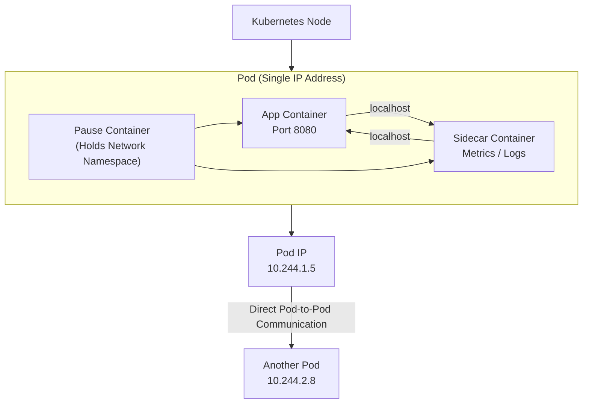

# 04.01 – The Foundation (Internal Pod Networking)

## Introduction

Internal Pod Networking is the core concept that allows containers inside Kubernetes Pods to communicate with each other and with other Pods in the cluster. Kubernetes abstracts networking complexity so that applications can talk to each other using simple IP addresses and ports.

Understanding this foundation is mandatory before learning Services, Ingress, or Network Policies.

---

## What is a Pod in Networking Terms?

A **Pod** is the smallest networked unit in Kubernetes.

Key networking characteristics of a Pod:

* Every Pod gets **one unique IP address**
* All containers inside the Pod **share the same network namespace**
* Containers communicate using **localhost (127.0.0.1)**

This means containers in a Pod behave like processes on the same machine.

---

## Container Communication Inside a Pod

### How it works

* Containers share:

  * IP address
  * Port space
  * Network interfaces

### Live Example

Pod with two containers:

* `nginx` (web server)
* `log-agent` (log collector)

```text
nginx listens on port 80
log-agent accesses nginx via http://localhost:80
```

No Service, no ClusterIP, no DNS required.

---

## Pod-to-Pod Communication

### Default Kubernetes Rule

* Every Pod can communicate with **every other Pod**
* No NAT (Network Address Translation)
* Flat network model

### Live Example

```text
Pod A (10.244.1.5) → Pod B (10.244.2.8)
curl http://10.244.2.8:8080
```

This works automatically without configuration.

---

## Pod IP Lifecycle

Pod IPs are:

* Assigned when Pod starts
* Removed when Pod is deleted
* **Not permanent**

Important:

* Restarting a Pod usually changes its IP
* Never hardcode Pod IPs in applications

This is why Kubernetes introduces **Services** later.

---

## Pause Container (Hidden but Critical)

Every Pod contains a special container called the **pause container**.

Purpose:

* Holds the network namespace
* Other containers join this namespace

You don’t interact with it, but it ensures:

* Stable networking inside the Pod
* Containers can restart without breaking network setup

---

## How Kubernetes Creates Pod Networking

High-level flow:

1. Pod is scheduled to a Node
2. CNI plugin is triggered
3. Pod receives:

   * IP address
   * Network interface
   * Routes

Common CNI plugins:

* Flannel
* Calico
* Weave
* Cilium

Kubernetes does **not** implement networking itself; it delegates to CNI.

---

## Pod Networking Rules (Beginner Safe Assumptions)

* Pods can reach each other directly
* No port conflicts across Pods
* Containers in the same Pod use `localhost`
* Node IP is different from Pod IP

These rules are consistent across all clusters.

---

## Real-World Use Case

### Microservice Pod Design

```text
Pod:
- app-container (business logic)
- sidecar-container (metrics or logging)

Communication:
sidecar → localhost → app
```

Used in:

* Logging agents
* Service mesh sidecars
* Metrics exporters

---

## Common Beginner Mistakes

| Mistake                         | Why It’s Wrong                 |
| ------------------------------- | ------------------------------ |
| Using Pod IP in config          | Pod IP changes                 |
| Exposing ports inside Pod       | Containers already share ports |
| Expecting localhost across Pods | localhost is Pod-scoped        |

---

## Summary

* Pod is the fundamental networking unit
* Containers inside a Pod share the same network
* Pod IP enables direct communication
* CNI plugins handle networking
* Pod IPs are temporary



This foundation enables higher-level networking concepts like Services, Ingress, and Network Policies.
