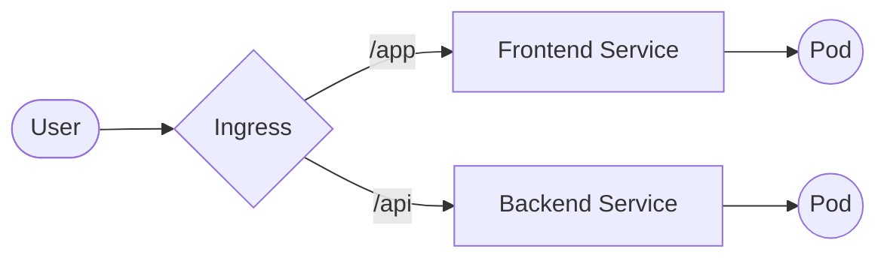

# Ingress and Ingress Controllers – Kubernetes Networking

* Ingress is a set of rules (the "Recipe"), 
* Ingress Controller is the engine that executes them (the "Chef").

## 1. What Is Ingress

**Definition**

**Ingress** is a Kubernetes API object that manages **HTTP and HTTPS access** to services inside a cluster.

**Main Functions of Ingress**

* **Routing Rules** – Defines how HTTP/HTTPS traffic is routed to Services.
* **Host-Based Routing** – Routes traffic using domain names (e.g., `app.example.com`).
* **Path-Based Routing** – Routes traffic using URL paths (e.g., `/api`).
* **TLS Configuration** – Enables HTTPS and manages certificates.
* **Centralized Entry Point** – Exposes multiple Services through a single endpoint.
* **Service Abstraction** – Keeps Services internal while Ingress manages external access.

---

**Real-World Analogy**

* **Ingress** → Traffic rules written on paper
* Ingress defines *what* should happen
* Ingress operates at `Layer 7 (Application Layer)`.

Without an Ingress Controller:

* Ingress rules exist
* But **no traffic flows**



---

## 2. Why Ingress Is Needed

Without Ingress:

* Every application needs a NodePort or LoadBalancer
* Multiple public IPs are required
* SSL certificates are managed per service

Ingress solves this by:

* Using a **single entry point**
* Routing traffic internally
* Centralizing security and TLS

---

## 3. What Is an Ingress Controller

Ingress **does not work by itself**.

An **Ingress Controller** is a component that:

* Watches Ingress resources
* Configures a real load balancer or proxy
* Routes traffic to Services


**Main Functions of Ingress Controller**

1. **Watch Ingress Resources**
   Continuously monitors the Kubernetes API for Ingress objects.

2. **Route External Traffic**
   Accepts incoming HTTP/HTTPS traffic and forwards it to the correct Service.

3. **Load Balance Requests**
   Distributes traffic across Pods behind a Service.

4. **Terminate TLS (HTTPS)**
   Handles SSL certificates and decrypts HTTPS traffic.

5. **Apply Advanced Traffic Rules**
   Supports:

   * Rate limiting
   * URL rewrites
   * Redirects
   * Authentication

6. **Expose the Cluster Entry Point**
   Acts as the main gateway into the cluster.

---
**Real-World Analogy**

* **Ingress** → Traffic rules written on paper.
* **Ingress Controller** → Traffic police enforcing the rules.
* Ingress defines *what* should happen.
* Ingress Controller does *how* it happens.

Without an Ingress Controller:
* Ingress rules exist
* But **no traffic flows**

---

**Ingress vs Ingress Controller**

| Aspect               | Ingress       | Ingress Controller |
| -------------------- | ------------- | ------------------ |
| Role                 | Configuration | Traffic handler    |
| Handles traffic      | No            | Yes                |
| Routing rules        | Defines       | Enforces           |
| TLS handling         | Declares      | Terminates         |
| Required for traffic | No            | Yes                |

---

## 4. Popular Ingress Controllers

| Controller      | Common Use                    |
| --------------- | ----------------------------- |
| NGINX Ingress   | Most popular, general purpose |
| Traefik         | Dynamic, cloud-native         |
| HAProxy         | High performance              |
| AWS ALB Ingress | AWS-managed environments      |

---

## 5. Ingress Traffic Flow

```mermaid

flowchart TD
    User([User / Browser]) -- "HTTPS (Encrypted)" --> ING

    subgraph Ingress_Controller [Ingress Controller: Infrastructure Layer]
        ING{Decrypt & Inspect}
        Cert[(TLS Certificate)]
        ING -.-> Cert
    end

    subgraph Routing_Engine [L7 Rules Engine: Logic Layer]
        ING --> Rules
        
        subgraph Host_Rules [Host-Based Routing]
            Rules -- "app.io" --> H1[Host: app.io]
            Rules -- "api.io" --> H2[Host: api.io]
        end

        subgraph Path_Rules [Path-Based Routing]
            H2 --> P1["path: /static"]
            H2 --> P2["path: /v1"]
        end
    end

    subgraph Service_Layer [Service Layer]
        H1 --> SVC1[Service: Frontend]
        P1 --> SVC1
        P2 --> SVC2[Service: Backend]
    end

    subgraph Pod_Layer [Execution Layer]
        direction LR
        P_UI((UI Pods))
        P_API((API Pods))
    end

    %% Final Connections
    SVC1 --> P_UI
    SVC2 --> P_API
  ```

---

## 6. Ingress vs Service (NodePort / LoadBalancer)

| Feature          | NodePort | LoadBalancer | Ingress |
| ---------------- | -------- | ------------ | ------- |
| OSI Layer        | L4       | L4           | L7      |
| HTTP Routing     | No       | No           | Yes     |
| TLS              | No       | Limited      | Yes     |
| Cost Efficient   | No       | Medium       | High    |
| Production Ready | No       | Yes          | Yes     |

---

## 7. Types of Ingress Routing

### 7.1 Host-Based Routing

```text
app.example.com → frontend service
api.example.com → backend service
```

---

### 7.2 Path-Based Routing

```text
example.com/app → frontend
example.com/api → backend
```

---

## 8. Hands-On: Basic Ingress Setup (Minikube)

### Step 1: Enable Ingress Controller

```bash
minikube addons enable ingress
```

Verify:

```bash
kubectl get pods -n ingress-nginx
```

---

### Step 2: Create ClusterIP Service

```yaml
apiVersion: v1
kind: Service
metadata:
  name: web-service
spec:
  selector:
    app: web
  ports:
  - port: 80
    targetPort: 80
```

---

### Step 3: Create Ingress Resource

```yaml
apiVersion: networking.k8s.io/v1
kind: Ingress
metadata:
  name: web-ingress
spec:
  rules:
  - host: web.local
    http:
      paths:
      - path: /
        pathType: Prefix
        backend:
          service:
            name: web-service
            port:
              number: 80
```

---

### Step 4: Local DNS Entry

Add to `/etc/hosts`:

```text
<minikube-ip> web.local
```

Access:

```text
http://web.local
```

---

## 9. TLS (HTTPS) with Ingress

### Why TLS Matters

* Encrypts traffic
* Protects credentials
* Required for production

---

### TLS Ingress Example

```yaml
apiVersion: networking.k8s.io/v1
kind: Ingress
metadata:
  name: secure-ingress
spec:
  tls:
  - hosts:
    - secure.example.com
    secretName: tls-secret
  rules:
  - host: secure.example.com
    http:
      paths:
      - path: /
        pathType: Prefix
        backend:
          service:
            name: secure-service
            port:
              number: 80
```

---

## 10. Ingress Annotations (Controller-Specific)

Ingress behavior can be extended using annotations.

Examples:

* Rewrite URLs
* Enable rate limiting
* Force HTTPS

Note:
Annotations are **controller-specific**.

---

## 11. Security Considerations

* Use **Ingress + TLS**
* Apply **NetworkPolicies**
* Do not expose services directly
* Limit public endpoints
* Enable authentication at Ingress

---

## 12. Common Mistakes

* Expecting Ingress to work without a controller
* Using NodePort in production
* Exposing databases via Ingress
* Ignoring TLS

---

## 13. Best Practices

* Use **ClusterIP + Ingress**
* One Ingress Controller per cluster (recommended)
* Centralize TLS management
* Monitor ingress traffic

---

## 14. Summary

* Ingress manages **external HTTP/HTTPS traffic**
* Ingress Controllers make Ingress functional
* Provides routing, security, and scalability
* Essential for production Kubernetes clusters
