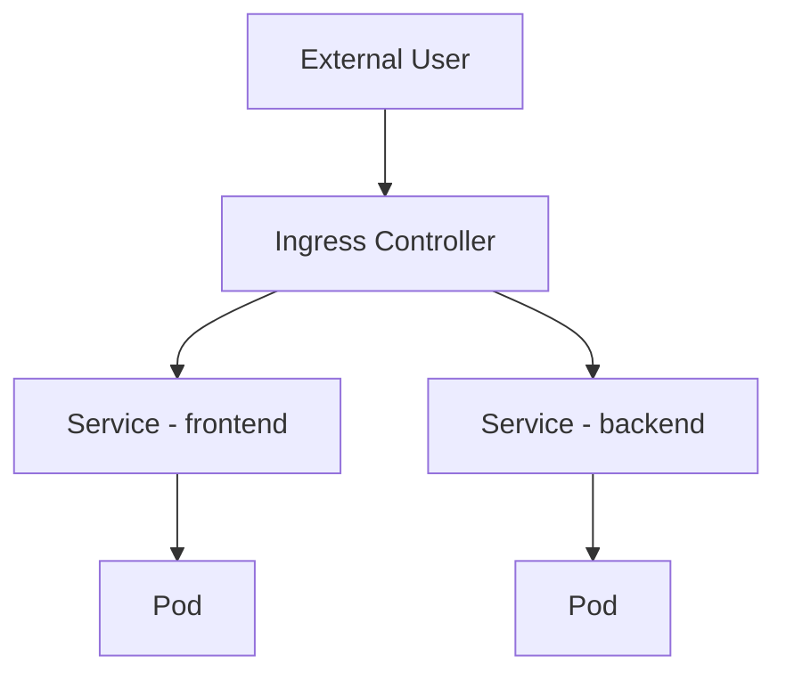

Below is **complete, beginner-to-production ready content** for
**`Ingress_and_Ingress_Controllers.md`**, written to fit perfectly into your Kubernetes networking module.

Includes:

* Clear explanations
* Real-world context
* Mermaid diagrams
* Hands-on YAML
* Best practices

No emojis, clean and structured.

---

# Ingress and Ingress Controllers – Kubernetes Networking

---

## 1. What Is Ingress

**Ingress** is a Kubernetes API object that manages **HTTP and HTTPS access** to services inside a cluster.

It provides:

* URL-based routing
* Host-based routing
* TLS (HTTPS) termination

Ingress operates at **Layer 7 (Application Layer)**.

---

## 2. Why Ingress Is Needed (Real-World Problem)

Without Ingress:

* Every application needs a NodePort or LoadBalancer
* Multiple public IPs are required
* SSL certificates are managed per service

Ingress solves this by:

* Using a **single entry point**
* Routing traffic internally
* Centralizing security and TLS

---

## 3. What Is an Ingress Controller

Ingress **does not work by itself**.

An **Ingress Controller** is a component that:

* Watches Ingress resources
* Configures a real load balancer or proxy
* Routes traffic to Services

---

## 4. Popular Ingress Controllers

| Controller      | Common Use                    |
| --------------- | ----------------------------- |
| NGINX Ingress   | Most popular, general purpose |
| Traefik         | Dynamic, cloud-native         |
| HAProxy         | High performance              |
| AWS ALB Ingress | AWS-managed environments      |

---

## 5. Ingress Traffic Flow



---

## 6. Ingress vs Service (NodePort / LoadBalancer)

| Feature          | NodePort | LoadBalancer | Ingress |
| ---------------- | -------- | ------------ | ------- |
| OSI Layer        | L4       | L4           | L7      |
| HTTP Routing     | No       | No           | Yes     |
| TLS              | No       | Limited      | Yes     |
| Cost Efficient   | No       | Medium       | High    |
| Production Ready | No       | Yes          | Yes     |

---

## 7. Types of Ingress Routing

### 7.1 Host-Based Routing

```text
app.example.com → frontend service
api.example.com → backend service
```

---

### 7.2 Path-Based Routing

```text
example.com/app → frontend
example.com/api → backend
```

---

## 8. Hands-On: Basic Ingress Setup (Minikube)

### Step 1: Enable Ingress Controller

```bash
minikube addons enable ingress
```

Verify:

```bash
kubectl get pods -n ingress-nginx
```

---

### Step 2: Create ClusterIP Service

```yaml
apiVersion: v1
kind: Service
metadata:
  name: web-service
spec:
  selector:
    app: web
  ports:
  - port: 80
    targetPort: 80
```

---

### Step 3: Create Ingress Resource

```yaml
apiVersion: networking.k8s.io/v1
kind: Ingress
metadata:
  name: web-ingress
spec:
  rules:
  - host: web.local
    http:
      paths:
      - path: /
        pathType: Prefix
        backend:
          service:
            name: web-service
            port:
              number: 80
```

---

### Step 4: Local DNS Entry

Add to `/etc/hosts`:

```text
<minikube-ip> web.local
```

Access:

```text
http://web.local
```

---

## 9. TLS (HTTPS) with Ingress

### Why TLS Matters

* Encrypts traffic
* Protects credentials
* Required for production

---

### TLS Ingress Example

```yaml
apiVersion: networking.k8s.io/v1
kind: Ingress
metadata:
  name: secure-ingress
spec:
  tls:
  - hosts:
    - secure.example.com
    secretName: tls-secret
  rules:
  - host: secure.example.com
    http:
      paths:
      - path: /
        pathType: Prefix
        backend:
          service:
            name: secure-service
            port:
              number: 80
```

---

## 10. Ingress Annotations (Controller-Specific)

Ingress behavior can be extended using annotations.

Examples:

* Rewrite URLs
* Enable rate limiting
* Force HTTPS

Note:
Annotations are **controller-specific**.

---

## 11. Security Considerations

* Use **Ingress + TLS**
* Apply **NetworkPolicies**
* Do not expose services directly
* Limit public endpoints
* Enable authentication at Ingress

---

## 12. Common Mistakes

* Expecting Ingress to work without a controller
* Using NodePort in production
* Exposing databases via Ingress
* Ignoring TLS

---

## 13. Best Practices

* Use **ClusterIP + Ingress**
* One Ingress Controller per cluster (recommended)
* Centralize TLS management
* Monitor ingress traffic

---

## 14. Summary

* Ingress manages **external HTTP/HTTPS traffic**
* Ingress Controllers make Ingress functional
* Provides routing, security, and scalability
* Essential for production Kubernetes clusters

---

If you want next, I can:

* Add **Ingress annotations deep dive**
* Create **multi-service routing labs**
* Add **Ingress troubleshooting section**
* Introduce **Gateway API comparison**

Just tell me.
