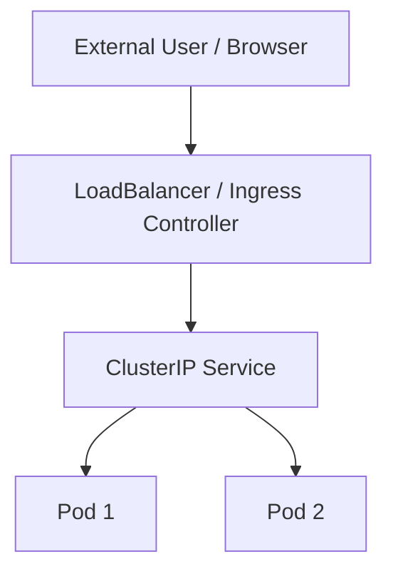

## North–South Traffic Flow (Mermaid Diagram)



**Explanation**

* External users access the cluster
* Traffic enters through **LoadBalancer or Ingress**
* Requests are forwarded to a **Service**
* Service load-balances traffic across Pods

---

## 13. Hands-On Practice: Exposing an Application

This lab uses **Minikube** and covers **NodePort + Ingress**.

---

### Step 1: Create a Sample Deployment

```yaml
apiVersion: apps/v1
kind: Deployment
metadata:
  name: web-app
spec:
  replicas: 2
  selector:
    matchLabels:
      app: web
  template:
    metadata:
      labels:
        app: web
    spec:
      containers:
      - name: nginx
        image: nginx
        ports:
        - containerPort: 80
```

Apply:

```bash
kubectl apply -f deployment.yaml
```

---

### Step 2: Expose Using NodePort

```yaml
apiVersion: v1
kind: Service
metadata:
  name: web-nodeport
spec:
  type: NodePort
  selector:
    app: web
  ports:
  - port: 80
    targetPort: 80
    nodePort: 30080
```

Apply:

```bash
kubectl apply -f service-nodeport.yaml
```

Access:

```bash
minikube ip
```

Open in browser:

```
http://<minikube-ip>:30080
```

---

### Step 3: Enable Ingress in Minikube

```bash
minikube addons enable ingress
```

Verify:

```bash
kubectl get pods -n ingress-nginx
```

---

### Step 4: Create ClusterIP Service (for Ingress)

```yaml
apiVersion: v1
kind: Service
metadata:
  name: web-clusterip
spec:
  type: ClusterIP
  selector:
    app: web
  ports:
  - port: 80
    targetPort: 80
```

---

### Step 5: Create Ingress Resource

```yaml
apiVersion: networking.k8s.io/v1
kind: Ingress
metadata:
  name: web-ingress
spec:
  rules:
  - host: web.local
    http:
      paths:
      - path: /
        pathType: Prefix
        backend:
          service:
            name: web-clusterip
            port:
              number: 80
```

Apply:

```bash
kubectl apply -f ingress.yaml
```

---

### Step 6: Configure Local DNS (For Minikube)

Add entry to `/etc/hosts` (Linux/WSL):

```
<minikube-ip> web.local
```

Access:

```
http://web.local
```

---

## 14. What You Practiced

* Exposed an app using **NodePort**
* Exposed the same app using **Ingress**
* Understood real **North–South traffic flow**
* Learned why **Ingress + ClusterIP** is preferred

---

## 15. Key Takeaway for Beginners

* **NodePort** → simple, not production-ready
* **LoadBalancer** → cloud-native exposure
* **Ingress** → best practice for HTTP/HTTPS traffic
