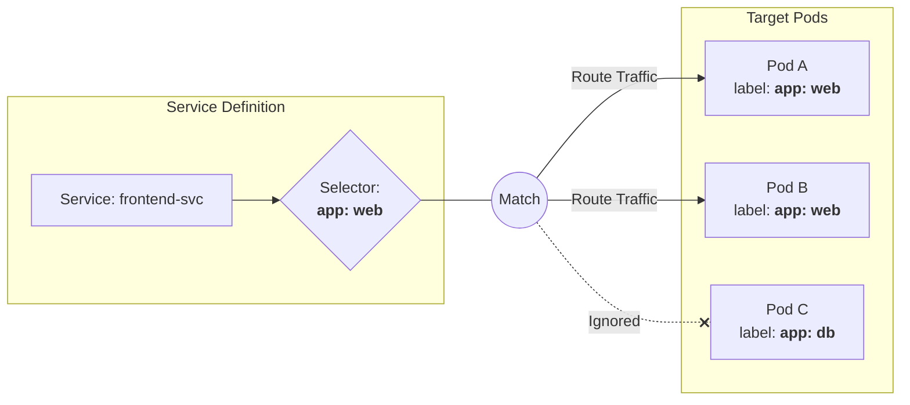
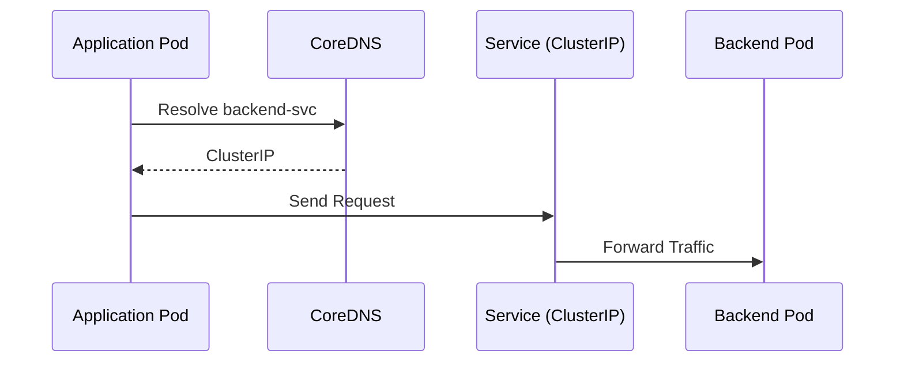
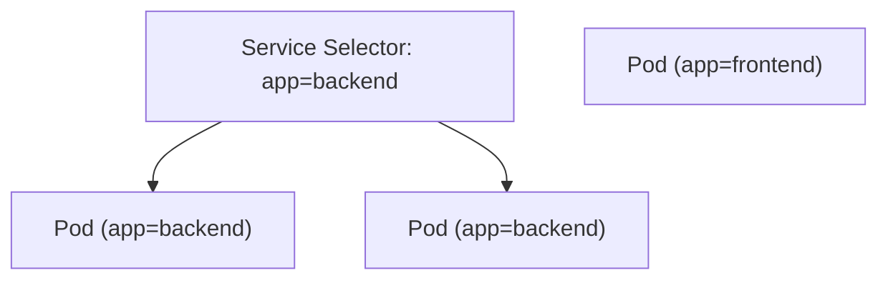
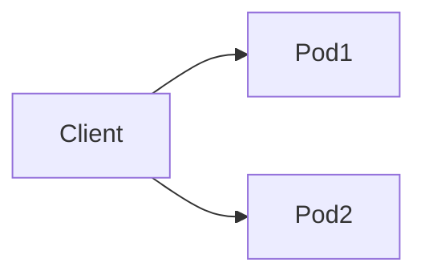
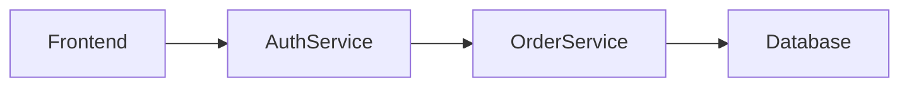

# 04.02 – Service Discovery (East–West Traffic)

## Introduction

In Kubernetes, Pods are **ephemeral**—they can restart and change IP addresses.
Service Discovery provides a **stable way for applications to find and communicate with each other** inside the cluster.

This internal communication is called **East–West Traffic**.

---

## What is East–West Traffic?

East–West traffic means:

* Pod ↔ Pod communication
* Service ↔ Service communication
* Internal microservice calls

It **does not include external user traffic**.

### Example Flow

```text
Frontend Service → Backend Service → Database Service
```

All components are inside the cluster.

---

## Why Service Discovery is Required

### Problem Without Service

* Pods restart
* IP addresses change
* Applications lose connectivity

### Solution

Kubernetes **Service** provides:

* Stable DNS name
* Virtual IP (ClusterIP)
* Automatic load balancing

Applications connect to the **Service**, not individual Pods.

---

## What is a Kubernetes Service?

A Service is a **logical abstraction** that groups Pods using labels and exposes them through a stable network identity.

### Service to Pod Mapping



# Practice
Create the yaml file named `service-selector-lab.yaml` as below  configuration
To practice the **Label and Selector** concept, we will create a "Broken Service" scenario. You will apply a Service and two Pods, but only one Pod will receive traffic because the labels won't match on the second one.

### Practice YAML: `service-selector-lab.yaml`

```yaml
# 1. The Service (The Entry Point)
apiVersion: v1
kind: Service
metadata:
  name: web-service
spec:
  selector:
    app: frontend    # The Service is looking for this exact label
  ports:
    - protocol: TCP
      port: 80
      targetPort: 8080
---
# 2. Matching Pod (Will receive traffic)
apiVersion: v1
kind: Pod
metadata:
  name: pod-match
  labels:
    app: frontend    # Matches the Selector
spec:
  containers:
  - name: nginx
    image: nginxinc/nginx-unprivileged:alpine
    ports:
    - containerPort: 8080
---
# 3. Non-Matching Pod (Will be ignored)
apiVersion: v1
kind: Pod
metadata:
  name: pod-no-match
  labels:
    app: database    # Does NOT match the Selector
spec:
  containers:
  - name: nginx
    image: nginxinc/nginx-unprivileged:alpine
    ports:
    - containerPort: 8080

```

---

### Commands to Understand the Concept

Follow these steps to see the "Selector Brain" in action:

**1. Apply the manifest**

```bash
kubectl apply -f service-selector-lab.yaml

```

**2. Check the "Endpoints" (The most important command)**
The `endpoints` (ep) object shows you which Pod IPs the Service has actually successfully "grabbed" based on the labels.

```bash
kubectl get endpoints web-service

```

* **What to look for:** You will only see **one** IP address here (the IP of `pod-match`), even though you have two pods running.

**3. Use the `--show-labels` flag**
To see why the service picked one and not the other:

```bash
kubectl get pods --show-labels

```

**4. Describe the Service**
This shows you the selector logic and the endpoints together:

```bash
kubectl describe svc web-service

```

---

### Experiment: Fix the Label

To truly understand the concept, change the label of the second pod live:

```bash
# Overwrite the label of pod-no-match to 'frontend'
kubectl label pod pod-no-match app=frontend --overwrite

```

**Now check the endpoints again:**

```bash
kubectl get endpoints web-service

```

* **Result:** You will now see **two** IP addresses. The Service automatically discovered the second pod the moment its label matched the selector!

---

## ClusterIP – Core of East–West Traffic

### ClusterIP Characteristics

* Default Service type
* Reachable only inside the cluster
* Used for internal microservices

### Live Example

```yaml
apiVersion: v1
kind: Service
metadata:
  name: backend-svc
spec:
  selector:
    app: backend
  ports:
    - port: 80
      targetPort: 8080
```

Frontend application accesses backend using:

```text
http://backend-svc
```

---

## DNS-Based Service Discovery

Kubernetes automatically creates DNS records for every Service.

### DNS Naming Format

```text
service-name.namespace.svc.cluster.local
```

### Common Usage

```text
backend-svc
backend-svc.default
```

DNS is handled by **CoreDNS**.

---

## Service Discovery Flow (DNS to Pod)



---

## How Kubernetes Routes Traffic

Traffic flow:

1. Pod sends request to Service name
2. DNS resolves Service name to ClusterIP
3. kube-proxy forwards traffic
4. One matching Pod receives the request

Load balancing is automatic.

---

## Labels and Endpoints

Services use **labels** to identify Pods.



Only Pods with matching labels receive traffic.

---

## Headless Services (Special Case)

A Headless Service:

* Does not get a ClusterIP
* Returns Pod IPs directly via DNS

Used for:

* Databases
* Stateful workloads

```yaml
clusterIP: None
```



---

## Real-World East–West Traffic Example



All traffic:

* Uses Service names
* Stays inside the cluster
* Uses ClusterIP
---
reviewers:
- bprashanth
title: Service
api_metadata:
- apiVersion: "v1"
  kind: "Service"
feature:
  title: Service discovery and load balancing
  description: >
    No need to modify your application to use an unfamiliar service discovery mechanism. Kubernetes gives Pods their own IP addresses and a single DNS name for a set of Pods, and can load-balance across them.
description: >-
  Expose an application running in your cluster behind a single outward-facing
  endpoint, even when the workload is split across multiple backends.
content_type: concept
weight: 10
---

---

## Common Beginner Mistakes

| Mistake                    | Reason                         |
| -------------------------- | ------------------------------ |
| Using Pod IPs              | IPs are temporary              |
| Exposing internal services | ClusterIP is enough            |
| Wrong labels               | Service finds no Pods          |
| Skipping DNS               | Kubernetes already provides it |

---

## Summary

* East–West traffic is internal cluster communication
* Services provide stable discovery
* ClusterIP is the backbone of service communication
* DNS enables name-based access
* Services automatically load balance Pods
