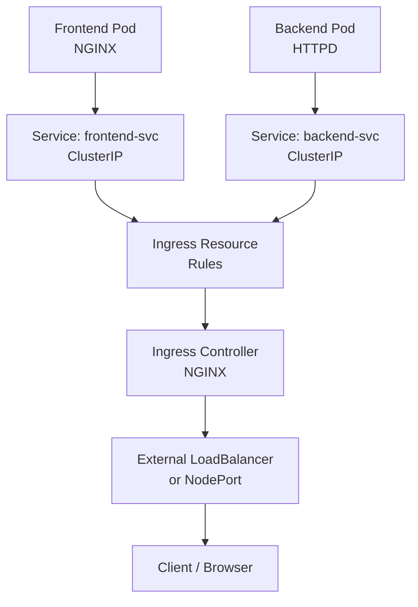
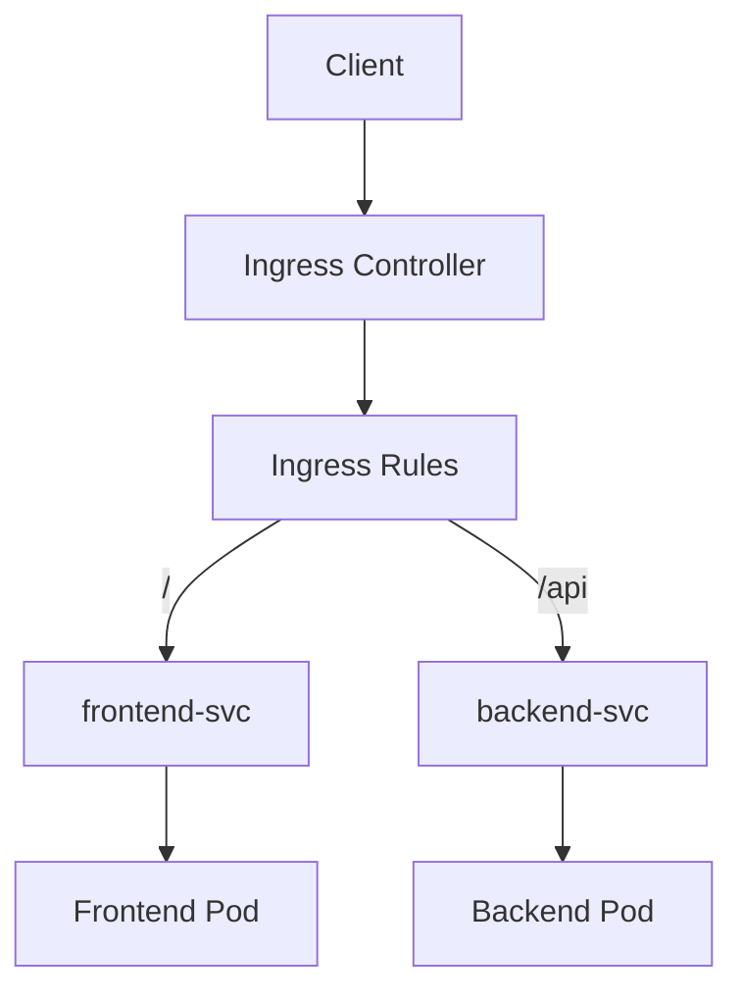

# Kubernetes Ingress & Ingress Controller

## 1 . Infra created as below order





---

## 2. Prerequisite: Sample Applications

We will deploy **two apps**:

* frontend (Pod)
* backend (Pod)

### frontend-pod.yaml

```yaml
apiVersion: v1
kind: Pod
metadata:
  name: frontend-pod
  labels:
    app: frontend
spec:
  containers:
  - name: frontend
    image: nginx
    ports:
    - containerPort: 80
```

### backend-pod.yaml

```yaml
apiVersion: v1
kind: Pod
metadata:
  name: backend-pod
  labels:
    app: backend
spec:
  containers:
  - name: backend
    image: httpd
    ports:
    - containerPort: 80
```

Apply:

```bash
kubectl apply -f frontend-pod.yaml
kubectl apply -f backend-pod.yaml
```

---

## 3. Create ClusterIP Services

Ingress always routes to **Services**, not Pods directly.

### frontend-service.yaml

```yaml
apiVersion: v1
kind: Service
metadata:
  name: frontend-svc
spec:
  type: ClusterIP
  selector:
    app: frontend
  ports:
  - port: 80
    targetPort: 80
```

### backend-service.yaml

```yaml
apiVersion: v1
kind: Service
metadata:
  name: backend-svc
spec:
  type: ClusterIP
  selector:
    app: backend
  ports:
  - port: 80
    targetPort: 80
```

Apply:

```bash
kubectl apply -f frontend-service.yaml
kubectl apply -f backend-service.yaml
```

---

## 4. Install Ingress Controller

Ingress **will not work** without a controller.

### For Minikube

```bash
minikube addons enable ingress
```

Verify:

```bash
kubectl get pods -n ingress-nginx
```

---

### For Cloud / Generic Cluster

```bash
kubectl apply -f https://raw.githubusercontent.com/kubernetes/ingress-nginx/main/deploy/static/provider/cloud/deploy.yaml
```

---

## 5. Create Ingress Resource (Path-Based Routing)

### ingress.yaml

```yaml
apiVersion: networking.k8s.io/v1
kind: Ingress
metadata:
  name: app-ingress
spec:
  rules:
  - host: app.example.com
    http:
      paths:
      - path: /
        pathType: Prefix
        backend:
          service:
            name: frontend-svc
            port:
              number: 80
      - path: /api
        pathType: Prefix
        backend:
          service:
            name: backend-svc
            port:
              number: 80
```

Apply:

```bash
kubectl apply -f ingress.yaml
```

---

## 6. Mermaid Diagram – Ingress Flow



---

## 7. Verify Ingress

```bash
kubectl get ingress
kubectl describe ingress app-ingress
```

---

## 8. Access the Application

### Minikube

```bash
minikube ip
```

Add to `/etc/hosts`:

```text
<MINIKUBE-IP> app.example.com
```

Test:

```bash
curl http://app.example.com
curl http://app.example.com/api
```

---

## 9. Host-Based Routing Example

### ingress-host.yaml

```yaml
apiVersion: networking.k8s.io/v1
kind: Ingress
metadata:
  name: host-ingress
spec:
  rules:
  - host: frontend.example.com
    http:
      paths:
      - path: /
        pathType: Prefix
        backend:
          service:
            name: frontend-svc
            port:
              number: 80
  - host: backend.example.com
    http:
      paths:
      - path: /
        pathType: Prefix
        backend:
          service:
            name: backend-svc
            port:
              number: 80
```

---

## 10. TLS (HTTPS) Example

### Create TLS Secret

```bash
kubectl create secret tls app-tls \
  --cert=cert.pem \
  --key=key.pem
```

### ingress-tls.yaml

```yaml
apiVersion: networking.k8s.io/v1
kind: Ingress
metadata:
  name: tls-ingress
spec:
  tls:
  - hosts:
    - app.example.com
    secretName: app-tls
  rules:
  - host: app.example.com
    http:
      paths:
      - path: /
        pathType: Prefix
        backend:
          service:
            name: frontend-svc
            port:
              number: 80
```

---

## 11. Real-Time Example (Production Scenario)

### Scenario

You are hosting:

* UI at `/`
* APIs at `/api`
* Single domain
* HTTPS enabled
* No multiple LoadBalancers

### Architecture

```
Internet
  ↓
Cloud LoadBalancer
  ↓
Ingress Controller
  ↓
Ingress Rules
  ↓
ClusterIP Services
  ↓
Pods
```

### Why Ingress Is Used

* Cost reduction (single LB)
* Central TLS management
* Clean URLs
* Easier scaling

---

## 12. Common Troubleshooting

```bash
kubectl get ingress
kubectl describe ingress
kubectl logs -n ingress-nginx <controller-pod>
kubectl get svc -n ingress-nginx
```

Common issues:

* No Ingress Controller
* Wrong service name
* Incorrect pathType
* DNS not mapped

---

## 13. Beginner Takeaways

* Ingress does routing, not traffic handling
* Ingress Controller is mandatory
* Ingress always routes to Services
* Best way to expose HTTP/HTTPS apps
* Production-standard approach

