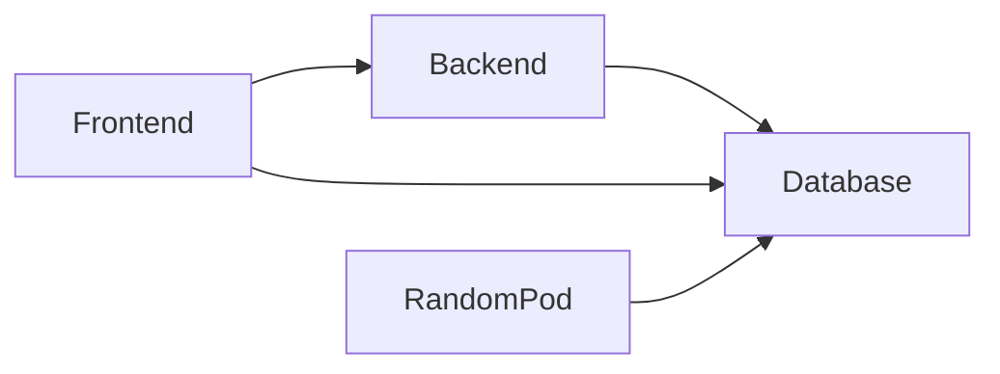
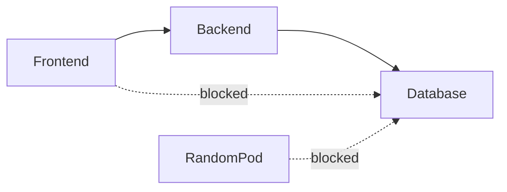
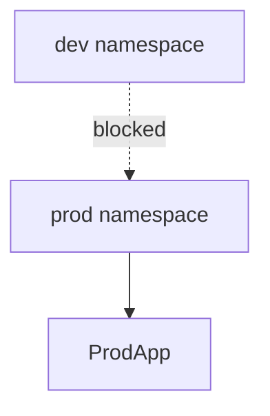
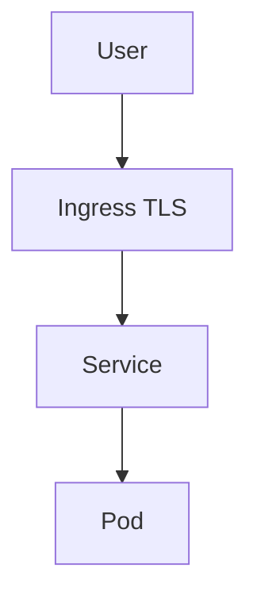
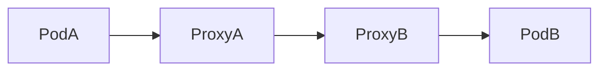
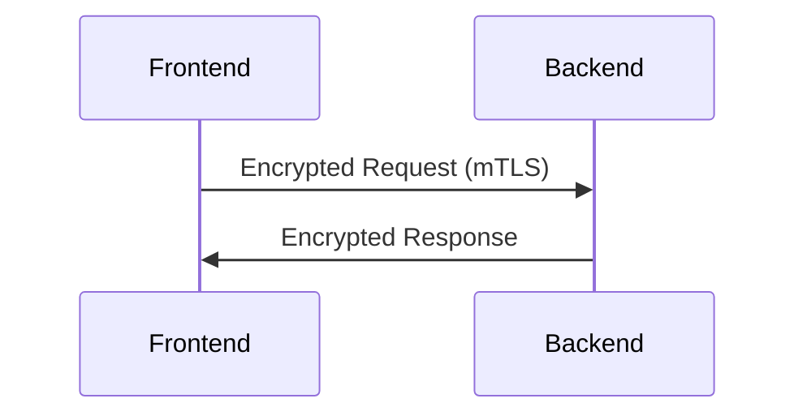
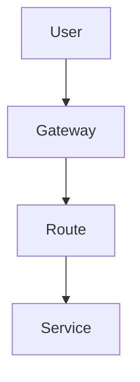
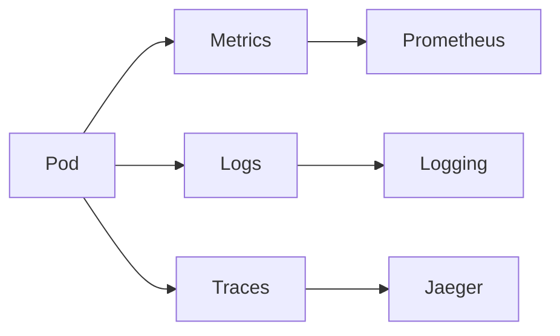

## Why Networking Security Matters

### Real-time scenario

You deploy:

* `frontend` (public)
* `backend` (internal API)
* `database` (critical)

Without security:

* Any Pod can access the database
* A compromised Pod can laterally move across the cluster

Kubernetes networking is **open by default**, so **security must be enforced intentionally**.

---

## 2. Default Traffic Flow (Before Security)



### Problem

* No isolation
* No access control
* High blast radius

---

## 3. NetworkPolicy – Pod Firewall

### What It Solves (Real Time)

NetworkPolicy answers:

> “Which Pods can talk to which Pods, on which ports?”

---

### Secure Traffic Flow (After NetworkPolicy)



---

## 4. Hands-On Lab: Default Deny All Traffic

### Scenario

You want **zero trust networking**.

### Step 1: Deny All Ingress Traffic

```yaml
apiVersion: networking.k8s.io/v1
kind: NetworkPolicy
metadata:
  name: deny-all-ingress
spec:
  podSelector: {}
  policyTypes:
  - Ingress
```

### What Happens

* No Pod can receive traffic
* Cluster is locked down
* Traffic must be explicitly allowed

---

## 5. Hands-On Lab: Allow Frontend → Backend Only

### Real-World Use Case

* Frontend calls backend API
* Backend must not be exposed to others

```yaml
apiVersion: networking.k8s.io/v1
kind: NetworkPolicy
metadata:
  name: allow-frontend-to-backend
spec:
  podSelector:
    matchLabels:
      app: backend
  ingress:
  - from:
    - podSelector:
        matchLabels:
          app: frontend
    ports:
    - protocol: TCP
      port: 80
```

### Result

* Frontend → Backend allowed
* Everything else blocked

---

## 6. Namespace Isolation (Production Reality)

### Real-World Structure

* `dev`
* `qa`
* `prod`

Without policies:

* Dev Pods can access Prod Pods

---

### Namespace Isolation Flow



---

### Hands-On: Allow Only Same Namespace Traffic

```yaml
apiVersion: networking.k8s.io/v1
kind: NetworkPolicy
metadata:
  name: namespace-isolation
spec:
  podSelector: {}
  ingress:
  - from:
    - podSelector: {}
```

---

## 7. Ingress Security – Real-World Gateway Protection

### Real-World Scenario

* Public traffic enters only via HTTPS
* Pods never see the internet directly

---

### Secure Ingress Flow



---

### Hands-On: TLS-Enabled Ingress (Basic)

```yaml
apiVersion: networking.k8s.io/v1
kind: Ingress
metadata:
  name: secure-ingress
spec:
  tls:
  - hosts:
    - app.example.com
    secretName: tls-secret
  rules:
  - host: app.example.com
    http:
      paths:
      - path: /
        pathType: Prefix
        backend:
          service:
            name: app-service
            port:
              number: 80
```

---

## 8. Service Mesh – Advanced Security Control

### Real-World Need

In large systems:

* Hundreds of services
* Manual NetworkPolicies become hard

Service Mesh automates:

* mTLS
* Identity
* Traffic control

---

### Service Mesh Flow



### Benefits

* Automatic encryption
* Service identity
* Zero-trust networking

---

## 9. mTLS – Zero Trust Communication

### Real-World Example

* Backend verifies frontend identity
* Encrypted communication
* No IP-based trust



---

## 10. Gateway API – Next-Gen Traffic Control

### Why It Matters

Ingress becomes complex in production.

Gateway API provides:

* Separation of duties
* Better role-based access
* Standardized networking

---

### Gateway API Flow



---

## 11. Observability – Detecting Attacks & Failures

### Real-World Monitoring

* Spike in traffic → possible attack
* High latency → network issue

---

### Observability Stack Flow



---

## 12. Production Best Practices (Reality-Driven)

* Apply **default-deny NetworkPolicies**
* Use **Ingress + TLS only**
* Never expose databases
* Prefer **service mesh for large systems**
* Continuously monitor traffic

---

## 13. Real-World Mapping (What Companies Do)

| Layer             | Tool                |
| ----------------- | ------------------- |
| Pod Security      | NetworkPolicy       |
| Edge Security     | Ingress + TLS       |
| Internal Security | mTLS / Service Mesh |
| Advanced Routing  | Gateway API         |

---

## 14. Final Takeaway

Kubernetes networking security is:

* **Not automatic**
* **Layered**
* **Critical for production**

Strong networking security reduces:

* Attack surface
* Lateral movement
* Production outages
