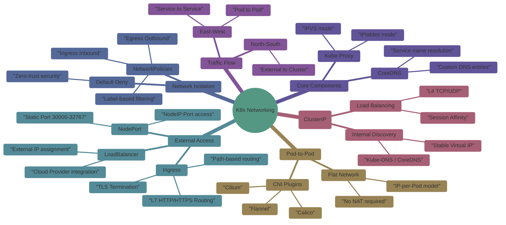

# K8s networking Overview

```mermaid
%%{init: {'theme': 'base', 'themeVariables': { 'primaryColor': '#a1cbbeff', 'primaryTextColor': '#333', 'primaryBorderColor': '#333', 'lineColor': '#aba0a0ff' }}}%%
mindmap
  root((K8s Networking))
    Pod-to-Pod
      Flat Network
        "IP-per-Pod model"
        "No NAT required"
      CNI Plugins
        "Calico"
        "Flannel"
        "Cilium"
    
    Service (ClusterIP)
      Internal Discovery
        "Stable Virtual IP"
        "Kube-DNS / CoreDNS"
      Load Balancing
        "L4 TCP/UDP"
        "Session Affinity"

    External Access
      NodePort
        "Static Port 30000-32767"
        "NodeIP:Port access"
      LoadBalancer
        "Cloud Provider integration"
        "External IP assignment"
      Ingress
        "L7 HTTP/HTTPS Routing"
        "Path-based routing"
        "TLS Termination"

    Network Isolation
      NetworkPolicies
        "Egress Outbound"
        "Ingress Inbound"
        "Label-based filtering"
      Default Deny
        "Zero-trust security"

    Core Components
      Kube-Proxy
        "IPtables mode"
        "IPVS mode"
      CoreDNS
        "Service name resolution"
        "Custom DNS entries"

    Traffic Flow
      North-South
        "External to Cluster"
      East-West
        "Pod to Pod"
        "Service to Service"
```
