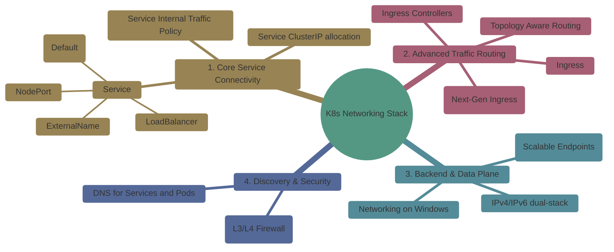

```mermaid
%%{init: {'theme': 'base', 'themeVariables': { 'primaryColor': '#a1cbbeff', 'primaryTextColor': '#333', 'primaryBorderColor': '#333', 'lineColor': '#aba0a0ff' }}}%%
mindmap
  root((K8s Networking Stack))
    1. Core Service Connectivity
      Service
        ClusterIP (Default)
        NodePort
        LoadBalancer
        ExternalName
      Service ClusterIP allocation
      Service Internal Traffic Policy
    
    2. Advanced Traffic Routing
      Ingress
      Ingress Controllers
      Gateway API (Next-Gen Ingress)
      Topology Aware Routing
    
    3. Backend & Data Plane
      EndpointSlices (Scalable Endpoints)
      IPv4/IPv6 dual-stack
      Networking on Windows
    
    4. Discovery & Security
      DNS for Services and Pods
      Network Policies (L3/L4 Firewall)
```
