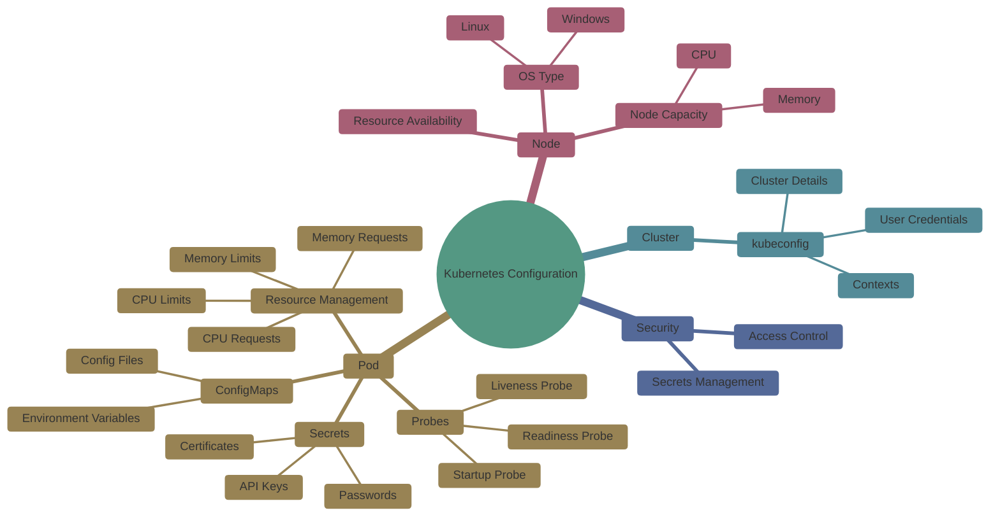

# Introduction to Configuration in Kubernetes

## What Does “Configuration” Mean in Kubernetes?

In Kubernetes, **configuration** means *how we control the behavior of applications without changing their code*.

Think of configuration as:

* Settings
* Rules
* Limits
* Access details

Kubernetes provides **special objects and mechanisms** to manage these settings safely and efficiently.

### Mind-Map

---

## Simple Real-Life Analogy

Imagine running a restaurant:

* The **recipe** is your application code
* The **ingredients and instructions** are configuration
* You can change:
  * Spice level
  * Serving size
  * Opening time
    without rewriting the recipe

Kubernetes configuration works the same way.

---

## Why Configuration Is Important in Kubernetes

Without proper configuration:

* Applications become hard-coded
* Secrets leak into source code
* Resource usage goes out of control
* Health of apps cannot be monitored

With Kubernetes configuration:

* Apps become reusable
* Environments stay consistent
* Systems become stable and scalable

---

## Kubernetes Configuration Building Blocks

Kubernetes provides multiple **configuration resources**, each solving a specific problem.

---

## 1. ConfigMaps

### What Is a ConfigMap?

A **ConfigMap** stores **non-sensitive configuration data** such as:

* Environment variables
* Configuration files
* Application settings

### Real-Life Example

Think of a **whiteboard** in an office:

* Everyone can read it
* It contains instructions like:
  * Office timings
  * Wi-Fi name
  * Meeting room rules

That whiteboard is a ConfigMap.

### Kubernetes Example Use

* Database host name
* Application mode (dev, test, prod)
* Feature flags

ConfigMaps allow you to change behavior **without rebuilding the application image**.

---

## 2. Secrets

### What Is a Secret?

A **Secret** stores **sensitive information**, such as:

* Passwords
* API keys
* Tokens
* Certificates

### Real-Life Example

Think of a **locked drawer**:

* Only authorized people can open it
* Sensitive documents are stored inside

Secrets are like that locked drawer.

### Why Secrets Matter

* Keeps credentials out of code
* Reduces risk of accidental leaks
* Integrates securely with Pods

Secrets can be injected into Pods as:

* Environment variables
* Files
* Mounted volumes

---

## 3. Liveness, Readiness, and Startup Probes

Kubernetes needs to know **if your application is healthy**.

Probes are health checks.

---

### Liveness Probe

**Question it answers:**
“Is the application still alive?”

### Real-Life Example

A heart-beat monitor:

* If heartbeat stops, action is taken

If liveness probe fails:

* Kubernetes restarts the container

---

### Readiness Probe

**Question it answers:**
“Is the application ready to receive traffic?”

### Real-Life Example

A restaurant:

* Open building does not mean kitchen is ready
* Food should be served only when ready

If readiness probe fails:

* Traffic is stopped
* Pod is removed from Service endpoints

---

### Startup Probe

**Question it answers:**
“Has the application finished starting up?”

### Real-Life Example

Warming up a car engine:

* You do not drive immediately after starting

Startup probes prevent premature restarts during slow startups.

---

## 4. Resource Management for Pods and Containers

Kubernetes allows you to **control CPU and memory usage**.

### What Can Be Configured?

* CPU requests and limits
* Memory requests and limits

---

### Real-Life Example

Think of apartment electricity:

* You request a certain power capacity
* If you exceed it, the breaker trips

Similarly:

* Requests = guaranteed minimum
* Limits = maximum allowed usage

---

### Why Resource Management Matters

* Prevents one app from consuming all resources
* Improves cluster stability
* Helps scheduler place Pods efficiently

---

## 5. Organizing Cluster Access Using kubeconfig Files

### What Is kubeconfig?

A **kubeconfig file** defines:

* Which cluster to connect to
* Which user is accessing
* Which namespace is used

---

### Real-Life Example

Think of a **remote control**:

* One remote can control multiple TVs
* You select which TV to operate

kubeconfig lets you:

* Switch between clusters
* Use different user credentials
* Control access safely

---

### Why kubeconfig Is Important

* Supports multiple environments (dev, prod)
* Enables secure access control
* Used by kubectl and CI/CD tools

---

## 6. Resource Management for Windows Nodes

Kubernetes supports **Windows worker nodes**.

### Why Windows Configuration Is Different

* Windows handles resources differently
* Some Linux features are unavailable
* Configuration must respect OS limitations

---

### Real-Life Example

Think of driving:

* Same traffic rules
* Different vehicles (car vs bike)
* Different handling behavior

Kubernetes adapts configuration based on node OS.

---

## Summary: Configuration in Kubernetes

| Configuration Type    | Purpose                       |
| --------------------- | ----------------------------- |
| ConfigMaps            | Store non-sensitive settings  |
| Secrets               | Store sensitive data securely |
| Probes                | Monitor application health    |
| Resource Management   | Control CPU and memory        |
| kubeconfig            | Manage cluster access         |
| Windows Configuration | OS-specific resource handling |

---

## Beginner Takeaway

* Configuration separates **code from behavior**
* Kubernetes provides safe and scalable configuration tools
* Each configuration object solves a real-world problem
* Mastering configuration is key to production-ready Kubernetes
