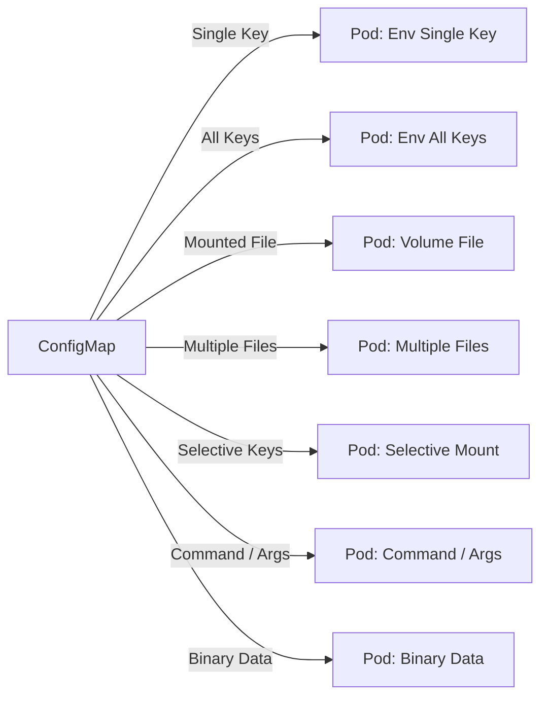

# ConfigMap – All Possible Usage Patterns (Hands-on)

Handson flow diagram


## 1. Basic ConfigMap (Key–Value Pairs)

### ConfigMap YAML

```yaml
apiVersion: v1
kind: ConfigMap
metadata:
  name: app-config
data:
  APP_ENV: production
  LOG_LEVEL: info
```

### Short Explanation of `data` in ConfigMap

`data` holds settings that change application behavior without changing the code.

```yaml
data:
  APP_ENV: production
  LOG_LEVEL: info
```

* **`data`** stores non-sensitive configuration as key–value pairs.
* **`APP_ENV`** tells the application which environment it is running in (production, dev, test).
* **`LOG_LEVEL`** controls how much information the application logs.

---

## 2. Using ConfigMap as Environment Variables (Single Key)

### Pod YAML

```yaml
apiVersion: v1
kind: Pod
metadata:
  name: env-single-key
spec:
  containers:
  - name: app
    image: nginx
    env:
    - name: APP_ENV
      valueFrom:
        configMapKeyRef:
          name: app-config
          key: APP_ENV
```

### Explanation


* This Pod runs an **nginx container**.
* `env` sets **APP_ENV** from the **app-config ConfigMap**.
* Kubernetes reads the ConfigMap key and injects it as an environment variable.
* Allows the app to **use configuration without changing the container image**.

---

## 3. Using ConfigMap as Environment Variables (All Keys)

### Pod YAML

```yaml
apiVersion: v1
kind: Pod
metadata:
  name: env-all-keys
spec:
  containers:
  - name: app
    image: nginx
    envFrom:
    - configMapRef:
        name: app-config
```

### Explanation

* Imports all key–value pairs
* Each key becomes an environment variable

---

## 4. ConfigMap Used as Command Arguments

### ConfigMap YAML

```yaml
apiVersion: v1
kind: ConfigMap
metadata:
  name: args-config
data:
  START_DELAY: "10"
```

### Pod YAML

```yaml
apiVersion: v1
kind: Pod
metadata:
  name: args-example
spec:
  containers:
  - name: app
    image: busybox
    command: ["sh", "-c"]
    args:
      - echo "Starting after $(START_DELAY) seconds"; sleep $(START_DELAY)
    envFrom:
    - configMapRef:
        name: args-config
```

### Explanation

* ConfigMap values influence startup behavior
* Common in scripts and jobs

---

## 5. ConfigMap as Configuration File (Volume Mount)

### ConfigMap YAML

```yaml
apiVersion: v1
kind: ConfigMap
metadata:
  name: file-config
data:
  app.conf: |
    server {
      listen 80;
      server_name example.com;
    }
```

---

### Pod YAML

```yaml
apiVersion: v1
kind: Pod
metadata:
  name: volume-config
spec:
  containers:
  - name: nginx
    image: nginx
    volumeMounts:
    - name: config-volume
      mountPath: /etc/nginx/conf.d
  volumes:
  - name: config-volume
    configMap:
      name: file-config
```

### Explanation

* ConfigMap becomes files inside the container
* Most common for app configs

---

## 6. Mount Specific Keys as Files

### Pod YAML

```yaml
apiVersion: v1
kind: Pod
metadata:
  name: selective-file
spec:
  containers:
  - name: app
    image: nginx
    volumeMounts:
    - name: config
      mountPath: /etc/config
  volumes:
  - name: config
    configMap:
      name: file-config
      items:
      - key: app.conf
        path: nginx.conf
```

### Explanation

* Rename files
* Mount only required config

---

## 7. ConfigMap with Multiple Configuration Files

### ConfigMap YAML

```yaml
apiVersion: v1
kind: ConfigMap
metadata:
  name: multi-file-config
data:
  app.properties: |
    app.name=demo
    app.port=8080
  logging.properties: |
    log.level=DEBUG
```

### Explanation

* One ConfigMap can hold multiple files
* Mounted as multiple files

---

## 8. Binary Data in ConfigMap (Rare but Valid)

### ConfigMap YAML

```yaml
apiVersion: v1
kind: ConfigMap
metadata:
  name: binary-config
binaryData:
  sample.bin: SGVsbG8gS3ViZXJuZXRlcw==
```

### Explanation

* Used for binary or encoded data
* Not common; Secrets preferred for sensitive data

---

## 9. ConfigMap Used by Multiple Pods

### Pod YAML (Example)

```yaml
envFrom:
- configMapRef:
    name: app-config
```

### Explanation

* One ConfigMap reused by many Pods
* Centralized configuration management

---

## 10. Optional ConfigMap Reference (Safe Startup)

### Pod YAML

```yaml
envFrom:
- configMapRef:
    name: optional-config
    optional: true
```

### Explanation

* Pod starts even if ConfigMap is missing
* Useful for optional features

---

## Common Commands

```bash
kubectl apply -f configmap.yaml
kubectl get configmap
kubectl describe configmap app-config
kubectl delete configmap app-config
```

---

## Beginner Mental Model

```
ConfigMap
  ├── Environment Variables
  ├── Command Arguments
  ├── Config Files
  └── Shared Settings
```

---

## Important Notes for Beginners

* ConfigMaps are NOT encrypted
* Use Secrets for sensitive data
* Changes may require Pod restart
* Best practice: small, focused ConfigMaps

---

## Summary Table

| Usage Type       | Supported |
| ---------------- | --------- |
| Env (single key) | Yes       |
| Env (all keys)   | Yes       |
| Volume files     | Yes       |
| Multiple files   | Yes       |
| Command/Args     | Yes       |
| Binary data      | Yes       |
| Selective mount  | Yes       |

---

# Kubernetes ConfigMap Limitations

| Limitation                      | Details / Explanation                                                                    | Notes / Workarounds                                                           |
| ------------------------------- | ---------------------------------------------------------------------------------------- | ----------------------------------------------------------------------------- |
| **Size Limit**                  | Each ConfigMap can store up to **1 MiB** of data.                                        | For larger configs, consider using **Volumes, external storage, or Secrets**. |
| **Key Size Limit**              | Maximum **253 characters** for each key.                                                 | Keep keys short and descriptive.                                              |
| **Value Size Limit**            | Maximum **1 MiB per ConfigMap** (includes all keys and values).                          | Split into multiple ConfigMaps if needed.                                     |
| **Number of Keys**              | No hard limit, but **total size must remain <1 MiB**.                                    | Avoid creating thousands of keys in one ConfigMap.                            |
| **Not Encrypted**               | ConfigMaps are stored as **plain text** in etcd.                                         | Never store secrets or sensitive data; use **Secrets** instead.               |
| **No Versioning**               | Updating a ConfigMap **does not automatically update running Pods**.                     | Use rolling updates, restart Pods, or mount with `subPath` carefully.         |
| **Binary Data Limit**           | Binary data can be stored in `binaryData`, but **total size still counts toward 1 MiB**. | Use external storage for large binaries.                                      |
| **Cluster-Level Storage Limit** | etcd stores ConfigMaps; large numbers of ConfigMaps can impact **etcd performance**.     | Keep ConfigMaps small and tidy.                                               |
| **Key Naming Restrictions**     | Keys must be valid **DNS subdomain names** or strings with no special characters.        | Avoid special characters like `/` or spaces.                                  |

---

### Important Notes for Beginners

1. **ConfigMaps are for configuration, not secrets**.
2. **Keep it small**: 1 MiB is often enough for most configs.
3. **Multiple ConfigMaps** are better than one huge one.
4. **Use environment variables or mounted volumes** wisely depending on the application.
