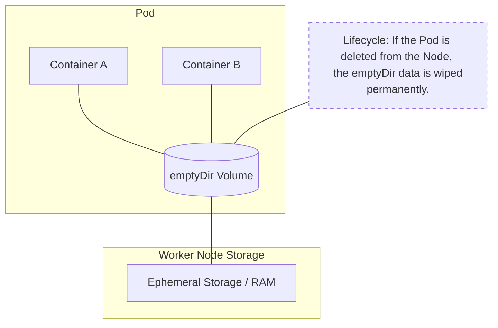
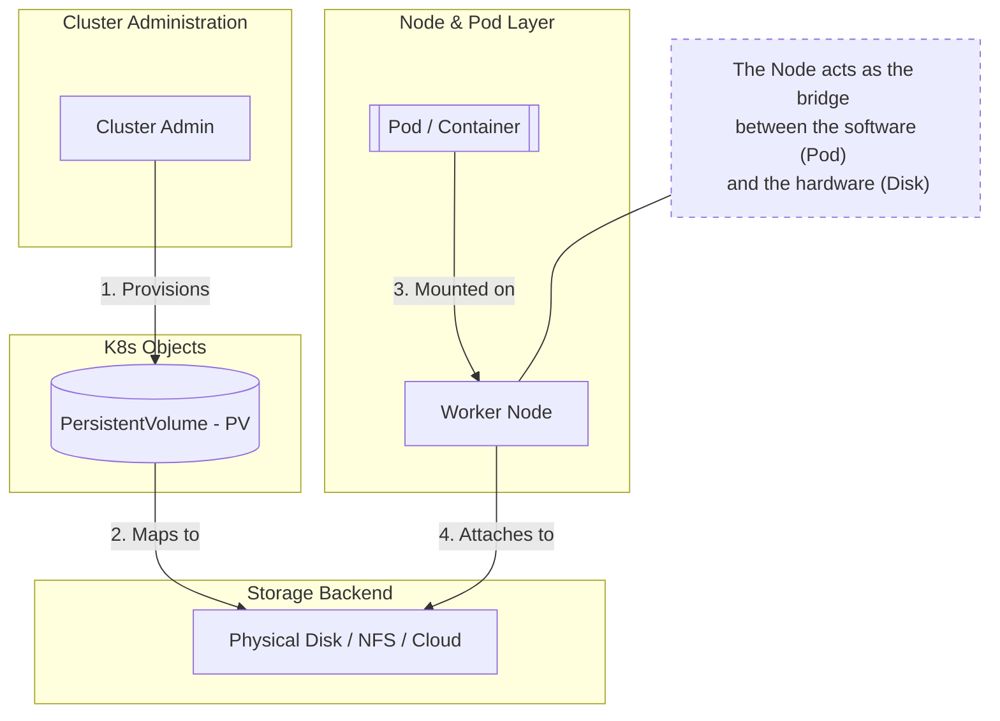
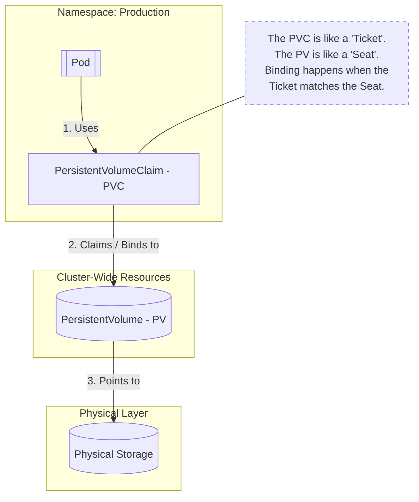
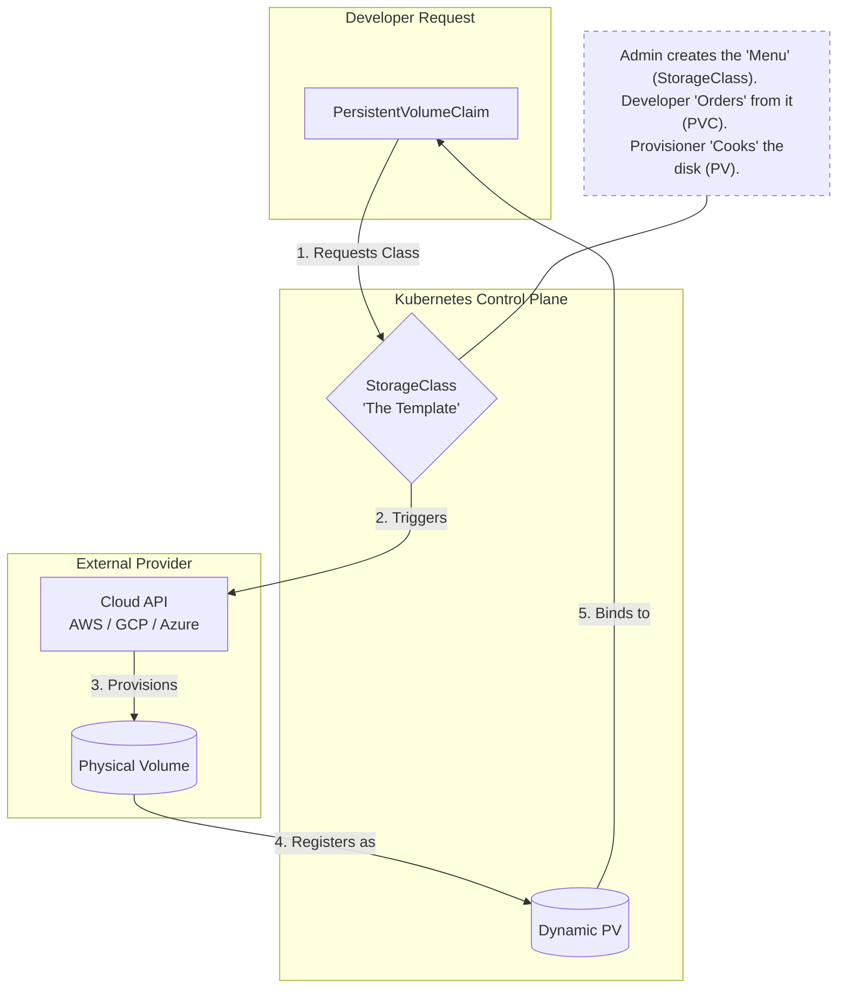
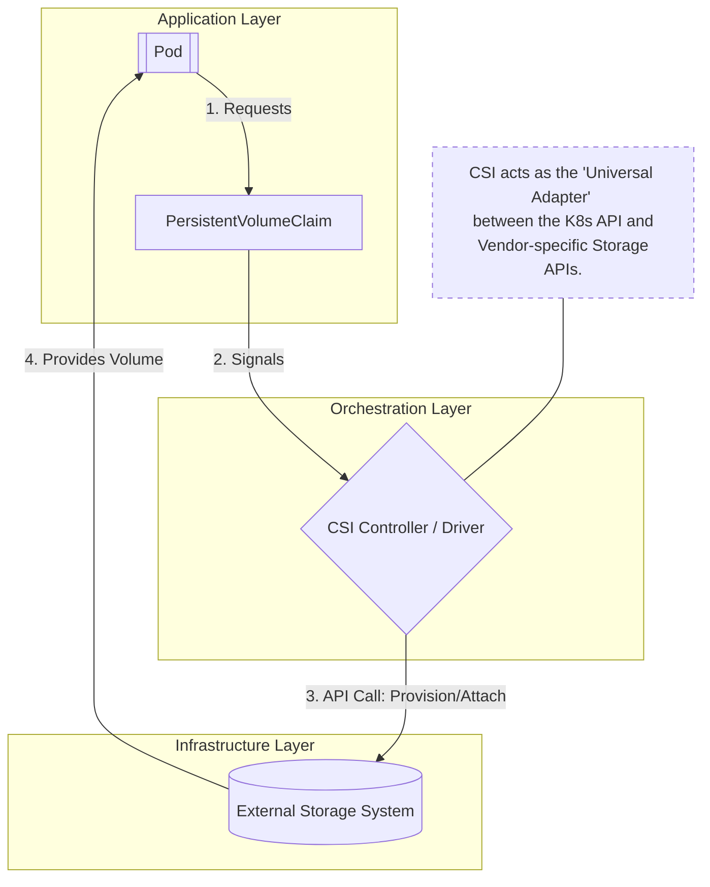

# Kubernetes Storage – Introduction

## 1. Definitions (Core Concepts)

### What is Storage in Kubernetes?

**Kubernetes storage** is a mechanism that allows containers and pods to **store and persist data**, independent of the container lifecycle.

By default:

* Containers are **ephemeral**
* When a pod dies → data is lost
  Storage solves this problem.

---

### Why Storage is Needed?

* To persist application data (DBs, logs, uploads)
* To share data between containers
* To decouple application lifecycle from data lifecycle

---

## 2. Functions of Kubernetes Storage

Kubernetes storage provides the following functions:

1. **Data Persistence**

   * Data survives pod restarts

2. **Data Sharing**

   * Multiple containers can access the same data

3. **Abstraction**

   * Application does not care about backend storage (NFS, EBS, Disk, etc.)

4. **Dynamic Provisioning**

   * Automatically create storage when required

5. **Access Control**

   * ReadWriteOnce, ReadOnlyMany, ReadWriteMany

---

## 3. Types of Storage in Kubernetes

Kubernetes storage can be classified as:

1. **Ephemeral Storage**

   * EmptyDir
   * ConfigMap
   * Secret

2. **Persistent Storage**

   * PersistentVolume (PV)
   * PersistentVolumeClaim (PVC)

3. **Storage Abstraction Layer**

   * StorageClass

4. **External Storage Interface**

   * CSI (Container Storage Interface)

---

## 4. Detailed Explanation of Each Storage Type

## 4.1 Ephemeral Storage – emptyDir

### Definition

 `emptyDir` is a temporary storage volume that is created when a Pod is scheduled onto a node and exists for the entire lifetime of that Pod. All data stored in an `emptyDir` volume is deleted permanently when the Pod is terminated or removed from the node.

Here is a **shortened, clean version** that you can **directly insert into your existing `emptyDir` section** without changing structure or flow:

---

### Where does `emptyDir` exist?

`emptyDir` is a **node-local ephemeral volume**. By default, it is created on the **node’s disk** (HDD/SSD). When configured with `medium: Memory`, it is stored in the **node’s RAM (tmpfs)**.
The Pod only mounts the volume; the **node physically hosts and manages it**. All data is **deleted when the Pod is removed**.

---

### Functions

* Temporary data storage
* Cache files
* Inter-container file sharing inside a pod

---

### Limitations

* Data lost when pod is deleted
* Not suitable for databases
* Node-dependent

---

### Sample YAML

```yaml
apiVersion: v1
kind: Pod
metadata:
  name: emptydir-pod
spec:
  containers:
  - name: app
    image: nginx
    volumeMounts:
    - mountPath: /data
      name: temp-storage
  volumes:
  - name: temp-storage
    emptyDir: {}
```

---

### Mermaid Diagram



---

### Commands

```bash
kubectl apply -f emptydir-pod.yaml
kubectl exec -it emptydir-pod -- ls /data
kubectl delete pod emptydir-pod
```

---

## 4.2 PersistentVolume (PV)

### Definition

A **PersistentVolume** is a **cluster-level storage resource** provisioned by an administrator or dynamically via StorageClass.

Here is a **short, clear, and add-ready explanation** for **PersistentVolume (PV) storage location**, matching the same standard as your `emptyDir` content.

---

### Where is a PersistentVolume (PV) stored?

A **PersistentVolume (PV)** is **stored outside the Pod and usually outside the Kubernetes node**.
It represents **actual physical storage** provided by a backend such as **NFS, SAN, cloud disks (EBS, Azure Disk, GCE PD), or local node disks**. Kubernetes only **manages metadata and access**, not the data itself.


### Key Points 
* PV data **does not live inside the Pod**
* Storage exists **independently of Pod lifecycle**
* Data remains even if:

  * Pod is deleted
  * Node restarts
* Kubernetes only **attaches and mounts** the storage

---

### Functions

* Represents actual storage (NFS, Disk, Cloud volume)
* Independent of pods
* Reusable across applications

---

### Limitations

* Cannot be directly used by pods
* Needs PVC
* Manual management if static

---

### Sample YAML

```yaml
apiVersion: v1
kind: PersistentVolume
metadata:
  name: pv-demo
spec:
  capacity:
    storage: 1Gi
  accessModes:
    - ReadWriteOnce
  hostPath:
    path: /mnt/data
```

---

### Mermaid Diagram



---

### Commands

```bash
kubectl apply -f pv.yaml
kubectl get pv
kubectl describe pv pv-demo
```

---

## 4.3 PersistentVolumeClaim (PVC)

### Definition

A `PersistentVolumeClaim (PVC)` is a storage request made by a Pod that specifies the required size, access mode, and storage class, allowing Kubernetes to bind the Pod to an appropriate PersistentVolume.

Here is a **clear, concise, and interview-ready comparison** of **PV vs PVC**, aligned with your storage notes style.

---

### Difference Between PersistentVolume (PV) and PersistentVolumeClaim (PVC)

| Aspect     | PersistentVolume (PV)                 | PersistentVolumeClaim (PVC)        |
| ---------- | ------------------------------------- | ---------------------------------- |
| Definition | A **storage resource** in the cluster | A **request for storage** by a Pod |
| Created by | Cluster administrator or dynamically  | Application / Pod owner            |
| Represents | Actual physical storage               | Storage requirements               |
| Lifecycle  | Independent of Pods                   | Bound to Pod usage                 |
| Usage      | Cannot be used directly by Pods       | Mounted by Pods                    |
| Scope      | Cluster-level object                  | Namespace-level object             |
| Binding    | Binds **to a PVC**                    | Binds **to a PV**                  |
| Example    | NFS, cloud disk, SAN                  | Request for 10Gi RWO               |

---

### Simple Explanation

* **PV** = *What storage exists*
* **PVC** = *How much storage is needed*
* **PV** → Warehouse (actual space)
* **PVC** → Storage request form
* **Pod** → Customer using the space
---

### Functions

* Abstracts storage from application
* Binds to matching PV
* Enables portability

---

### Limitations

* Depends on PV availability
* Size cannot be reduced
* Binding rules must match

---

### Sample YAML

```yaml
apiVersion: v1
kind: PersistentVolumeClaim
metadata:
  name: pvc-demo
spec:
  accessModes:
    - ReadWriteOnce
  resources:
    requests:
      storage: 1Gi
```

---

### Mermaid Diagram



---

### Commands

```bash
kubectl apply -f pvc.yaml
kubectl get pvc
kubectl describe pvc pvc-demo
```

---

## 4.4 Pod Using PVC

### Definition

A Pod mounts a PersistentVolumeClaim (PVC) as a volume, enabling the application to read and write data that persists beyond the Pod’s lifecycle.


### Types Involved in Pod → PVC → PV Storage Flow

1. **Pod**

   * Consumes storage by mounting a volume
   * Does not directly interact with the storage backend

2. **PersistentVolumeClaim (PVC)**

   * Defines storage requirements (size, access mode, StorageClass)
   * Acts as the interface between Pod and storage

3. **PersistentVolume (PV)**

   * Represents the actual physical storage
   * Bound to a PVC based on matching criteria

4. **Storage Backend**

   * Real storage system (NFS, SAN, cloud disk, local disk)
   * Holds the actual data

5. **StorageClass (Optional)**

   * Used for dynamic provisioning of PVs
   * Defines how and where storage is created
---

### Sample YAML

```yaml
apiVersion: v1
kind: Pod
metadata:
  name: pvc-pod
spec:
  containers:
  - name: app
    image: nginx
    volumeMounts:
    - mountPath: /usr/share/nginx/html
      name: storage
  volumes:
  - name: storage
    persistentVolumeClaim:
      claimName: pvc-demo
```

---

### Commands

```bash
kubectl apply -f pvc-pod.yaml
kubectl exec -it pvc-pod -- df -h
```

---

## 4.5 StorageClass

### Definition

A **StorageClass** defines **how storage is dynamically provisioned**.

---

### Functions

* Automatic PV creation
* Cloud-native integration
* Performance tuning (SSD, HDD)

---

### Limitations

* Backend specific
* Incorrect parameters cause failures

---

### Sample YAML

```yaml
apiVersion: storage.k8s.io/v1
kind: StorageClass
metadata:
  name: standard
provisioner: kubernetes.io/no-provisioner
volumeBindingMode: WaitForFirstConsumer
```

---

### Mermaid Diagram



---

### Commands

```bash
kubectl get storageclass
kubectl describe storageclass standard
```

---

## 4.6 CSI (Container Storage Interface)

### Definition

CSI is a **standard interface** that allows Kubernetes to work with **any storage vendor**.

---

### Functions

* Vendor-neutral storage
* Supports snapshots and resizing
* Decouples storage from core Kubernetes

---

### Limitations

* Requires CSI drivers
* Operational complexity

---

### Mermaid Diagram



---

## 5. Summary – Kubernetes Storage Concepts

| Component    | Purpose              | Persistent | Used By |
| ------------ | -------------------- | ---------- | ------- |
| emptyDir     | Temporary storage    | No         | Pod     |
| PV           | Actual storage       | Yes        | Cluster |
| PVC          | Storage request      | Yes        | Pod     |
| StorageClass | Dynamic provisioning | Yes        | PVC     |
| CSI          | Storage integration  | Yes        | Cluster |

---

### Final Key Points

* Pods are ephemeral, storage is not
* PVC is what applications interact with
* PV is the actual storage
* StorageClass enables automation
* CSI makes Kubernetes storage vendor-neutral
