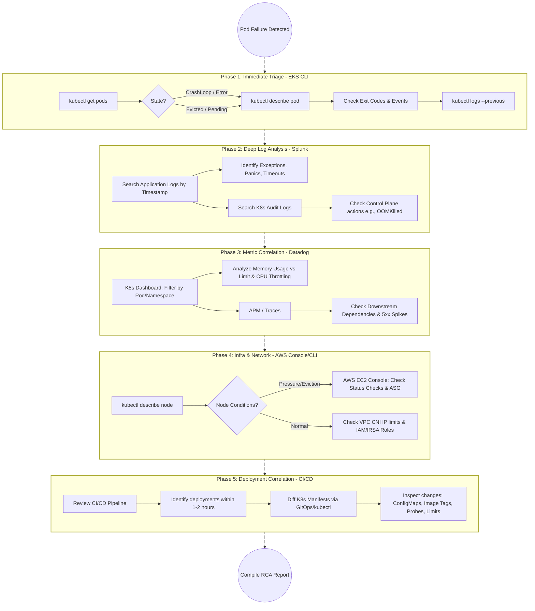

# Root Cause Analysis in Pods

In a high-velocity DevOps environment with daily deployments, a structured Root Cause Analysis (RCA) process is critical to minimize downtime and prevent recurring issues. Since pods in EKS are ephemeral, relying solely on standard Kubernetes commands isn't always enough once a pod is gone. 

Here is a detailed, step-by-step procedure leveraging your specific toolset (EKS CLI, Splunk, Datadog, and AWS Console) to decode the RCA of a failed pod.


## Detail Flow chart of Pod RCA


## Phase 1: Immediate Triage (EKS CLI / `kubectl`)
*Your goal here is to determine the exact exit code, pod status, and whether the failure was caused by the*
 > a. application or 

 > b. the cluster.

**1. Identify the Pod State**

Run a command to see the current status of the pods in the affected namespace.
```bash
kubectl get pods -n <namespace> | grep -v Running
```
*Look for states like `CrashLoopBackOff`, `OOMKilled`, `Error`, `Evicted`, or `Pending`.*

**2. Describe the Pod for Events and Exit Codes**

The description contains the most critical immediate clues.
```bash
kubectl describe pod <failed-pod-name> -n <namespace>
```
*   **Check the "State" section:** Look for the `Reason` and `Exit Code` of the terminated container.
    *   **Exit Code 1:** Application error (code bug, unhandled exception).
    *   **Exit Code 137:** `SIGKILL` (Typically OOMKilled – the pod exceeded its memory limit).
    *   **Exit Code 143:** `SIGTERM` (Pod was gracefully terminated, perhaps by a deployment or node scale-down).
*   **Check the "Events" section:** Look at the bottom of the output for warning events like `FailedScheduling`, `FailedCreatePodSandBox`, `Liveness probe failed`, or `Readiness probe failed`.

**3. Grab Immediate Ephemeral Logs**

If the pod is in a `CrashLoopBackOff`, you can check the logs of the *previous* failed instance before it restarts.
```bash
kubectl logs <failed-pod-name> --previous -n <namespace>
```

---

## Phase 2: Deep Log Analysis (Splunk)
*Since pods restart or get evicted, `kubectl logs` might be empty or unavailable. Splunk is your source of truth for historical application behavior.*

**1. Query Application Logs**

Search Splunk around the exact timestamp the pod failed (use the timestamp from the `kubectl describe` output).
```text
index=<your-k8s-index> cluster=<your-eks-cluster> namespace=<namespace> pod=<failed-pod-name>
| sort - _time
```
*   **Look for:** Unhandled exceptions, database connection timeouts, missing environment variable errors, or fatal panic stack traces just before the crash.

**2. Query Kubernetes Audit/Event Logs**

If the application logs show no errors but the pod died, check the cluster events in Splunk to see if the Kubernetes control plane killed it.
```text
index=<k8s-audit-index> objectRef.name=<failed-pod-name> verb=delete
```

---

### Phase 3: Metric and Performance Correlation (Datadog)
*Datadog will tell you if the failure was a resource exhaustion issue, a sudden traffic spike, or a downstream dependency failure.*

**1. Check for OOMKilled / Resource Throttling**
*   Navigate to the **Kubernetes Dashboard** in Datadog.
*   Filter by your `kube_namespace` and `pod_name`.
*   Look at the **Memory Usage vs. Memory Limit** graph. If the usage hits a flat line at the limit and drops, you have a memory leak or undersized pod.
*   Look at **CPU Throttling** metrics. Heavy throttling can cause Liveness probes to time out, leading EKS to kill the pod.

**2. Check APM (Application Performance Monitoring)**
*   Navigate to the **APM / Traces** section for the specific service.
*   Look for a spike in **5xx Error Rates** or **Latency** right before the pod crash.
*   Check the Service Map to see if a downstream dependency (e.g., RDS database, external API, ElastiCache) experienced a spike in latency, causing your pod's connection pool to exhaust and the app to crash.

---

### Phase 4: Infrastructure and Network Investigation (AWS Console / CLI)
*If the app is healthy and resources are fine, the underlying AWS infrastructure might be the culprit.*

**1. Check the Underlying EC2 Node**
Find out which node the pod was running on:
```bash
kubectl get pod <failed-pod-name> -n <namespace> -o wide
```
Then describe the node:
```bash
kubectl describe node <node-name>
```
*   Look for Node Conditions: `MemoryPressure`, `DiskPressure`, or `PIDPressure`. If any are `True`, the node evicted your pod to save itself.

**2. Verify Node Health in AWS Console**
*   Log into the **AWS EC2 Console**.
*   Search for the Instance ID of the node.
*   Check the **Status Checks** tab. Did the instance fail a System or Instance status check? 
*   Check AWS Auto Scaling Groups (ASG) to see if the instance was randomly terminated by an ASG scale-in event or a Spot Instance interruption.

**3. Network & IAM Checks**
*   **VPC CNI Issues:** If the pod was stuck in `ContainerCreating`, check if your subnet ran out of available IP addresses (ENI exhaustion).
*   **IAM Roles for Service Accounts (IRSA):** If the pod logs show AWS API `AccessDenied` errors, verify the IAM role attached to the pod's service account hasn't been modified.

---

### Phase 5: Deployment Correlation (The "DevOps" Check)
*Since you deploy every day, the most statistically likely cause of a new failure is a recent change.*

**1. Correlate with CI/CD Pipelines**
*   Check your CI/CD tool (Jenkins, GitLab CI, GitHub Actions, etc.).
*   Did a deployment occur within 1-2 hours of the pod crashing? 

**2. Compare Manifest Changes**
*   Use `kubectl` or your GitOps tool (ArgoCD/Flux) to diff the current configuration against the previous successful one.
*   **Check for:**
    *   Changes to `ConfigMaps` or `Secrets` (e.g., a typo in a database URL).
    *   Changes to Liveness/Readiness probe timeouts.
    *   Reductions in CPU/Memory `requests` or `limits`.
    *   A bad container image tag being pushed.

### Summary RCA Checklist Template
When documenting the RCA for stakeholders, compile your findings into this format:
*   **Incident Time & Duration:** 
*   **Impact:** (e.g., Service X was down, causing 500 errors for users).
*   **Root Cause:** (e.g., A memory leak introduced in yesterday's deployment caused EKS to issue a SIGKILL/Exit Code 137).
*   **Trigger:** (e.g., A spike in user traffic hit the new, unoptimized API endpoint).
*   **Resolution (Short Term):** (e.g., Reverted deployment to previous image tag / Increased memory limits).
*   **Action Items (Long Term):** (e.g., Developers to patch memory leak; DevOps to set up Datadog alerts for memory utilization > 85%).
